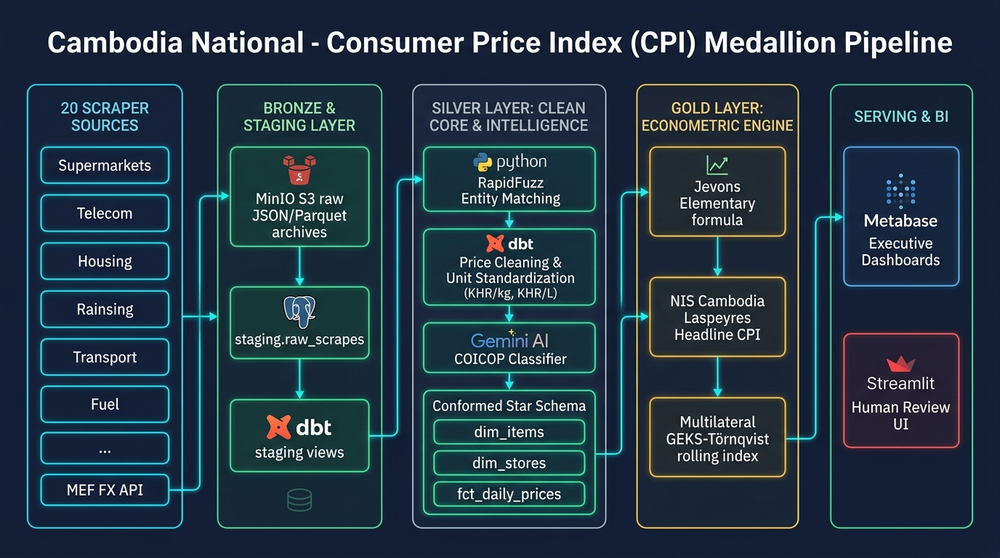

# Cambodia National Consumer Price Index (CPI) Pipeline Architecture



---

## 1. End-to-End Architectural Flow

The pipeline executes daily across 5 interconnected layers:

### 1. 20 Scraper Sources
- **Retail & E-commerce:** AEON 1 Phnom Penh, AEON 3 Mean Chey, Delishop Cambodia, L192 Marketplace.
- **Healthcare & Consumer Tech:** Community Pharmacy, Khmer Samnang Phone Shop, Ary Store Phone.
- **Telecom & Housing:** Cellcard Mobile & WiFi, Smart Mobile & WiFi, Khmer24 Real Estate, Realestate.com.kh.
- **Intercity Transport & Travel:** redBus Cambodia (Multi-Operator Portal), BookMeBus Cambodia (Multi-Operator Booking Platform).
- **Hospitality & Dining:** Sokha Phnom Penh Hotel, Hyatt Regency Phnom Penh, Bayon Restaurant BKK I.
- **Macroeconomic Fuel & Official FX:** MOC Petroleum Gasoline (Live GraphQL), Ministry of Economy & Finance (MEF USD/KHR official daily rate).

### 2. Bronze & Staging Layer
- **MinIO Object Storage:** Raw JSON snapshots (`raw.json`) and Snappy Parquet archives.
- **PostgreSQL Staging (`staging.raw_scrapes`):** Append-only raw JSONB payloads with unique `run_id`.
- **dbt Staging Views (`stg_raw_scrapes`):** Unpacks JSONB into structured columns.

### 3. Silver Layer: Clean Core & Intelligence
- **Python RapidFuzz Entity Matching:** Deduplicates products across stores into canonical UUID5 identities (`silver.canonical_items`, `silver.item_match_log`).
- **dbt Price Cleaning & Unit Standardization:** Converts USD $\to$ KHR via MEF rates, clamps discounts ($0\%$–$95\%$), standardizes unit prices (`KHR/kg`, `KHR/L`), and flags outliers.
- **Gemini AI COICOP Classifier:** Multi-stage division ladder (Overrides $\to$ AI cache $\to$ Regex traps $\to$ Keyword ladder $\to$ Category map $\to$ Store defaults). The keyword ladder runs **before** the category map because store-native categories are too broad; a personal-care guard + word-boundaried traps prevent food/material words from stealing cosmetics, and medical/protective masks are pinned to 06.
- **Conformed Star Schema & Analytical Views:**
  - `silver.dim_items` (Master product catalog)
  - `silver.dim_stores` (20 Cambodian retailers/sources)
  - `silver.fct_daily_prices` (Clean daily price observations)
  - `silver.fct_daily_prices_imputed` (<= 7-day forward price carry for temporarily missing items)
  - `silver.fct_jevons_daily` (Stage 1 Elementary Jevons geometric mean prices & item relatives $P_t / P_0 \times 100$)
  - `silver.fct_laspeyres_daily` (Stage 2 Higher-Level category aggregation across 12 COICOP divisions)
  - `silver.fct_laspeyres_headline_daily` (Stage 3 National headline CPI in Silver)
  - `silver.classification_queue` (Active triage queue for unclassified products)

### 4. Gold Layer: Econometric Engine & 12 Division Tables
- **Strict 2-Stage Sequence (Jevons $\to$ Laspeyres):**
  1. **Stage 1 (Elementary Jevons):** Unweighted geometric mean price per canonical item across all stores (`gold.fct_daily_price_stats`).
  2. **Stage 2 (Higher-Level Laspeyres):** Category and headline weighted roll-up using official Cambodia NIS 2004 expenditure weights (`gold.cpi_category_daily`, `gold.cpi_headline_daily`).
- **12 Dedicated Division Analytical Tables:**
  - `gold.cpi_div01_food` through `gold.cpi_div12_misc` exposing full item-level price trends, base indices, and metrics per division.
- **Multilateral GEKS-Törnqvist:** 13-period rolling window transitive index eliminating product churn & chain drift (`gold.cpi_geks_multilateral`).

### 5. Serving & BI
- **Metabase Executive Dashboards (:3000):** Visual charts for headline CPI, 12 COICOP division indices, inflation curves, top movers, and promo depth.
- **Streamlit Human Review UI (:8501):** Human-in-the-loop triage for low-confidence matches and review queues.

### 6. Airflow 2.9.3 Master Orchestration Flow
```
start_cpi_pipeline
  ──► [20 Scraper DAGs in Parallel]
  ──► bronze_layer_complete (Barrier Gate)
  ──► trigger_silver_dag (Item Matching + dbt Silver)
  ──► silver_layer_complete (Barrier Gate)
  ──► trigger_coicop_classification_dag (Gemini AI Classification)
  ──► coicop_layer_complete (Barrier Gate)
  ──► trigger_gold_dag (sp_calculate_daily_cpi + dbt Gold Models & DQ Tests)
  ──► cpi_pipeline_success
```
