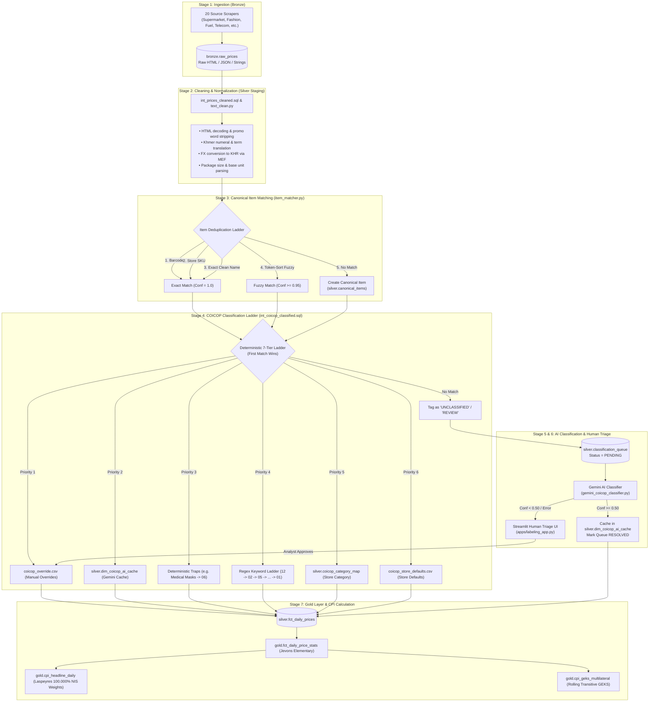
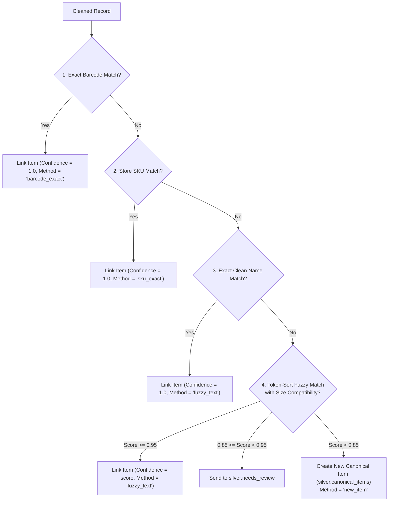
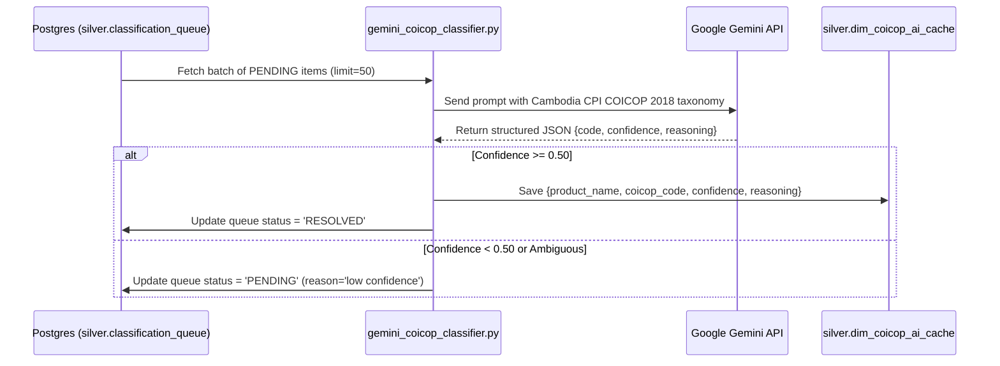

# End-to-End Product Classification & Ingestion Architecture

This document provides a comprehensive, step-by-step specification of how raw product data is scraped, cleaned, deduplicated, classified into the **United Nations COICOP (Classification of Individual Consumption According to Purpose)** hierarchy, and aggregated into the official **Cambodia Consumer Price Index (CPI)**.

---

## 1. Architectural Overview & Philosophy

The Cambodia CPI Pipeline follows a **hybrid, multi-tier classification architecture**:



### Core Design Principles
1. **SQL-First & High Performance**: 95%+ of daily observations match deterministically via SQL lateral joins and pre-cached keys at sub-millisecond speeds without external API calls.
2. **Zero Recurring LLM Cost**: Once Gemini classifies a long-tail product, the result is permanently cached in PostgreSQL (`silver.dim_coicop_ai_cache`).
3. **Statistical Safety**: Unclassified products are automatically excluded from elementary index calculations to prevent index contamination, while coverage is audited daily via `gold.v_coverage`.
4. **Official NIS Compliance**: Weights sum to exactly **100.000%** across the 12 COICOP divisions per National Institute of Statistics (NIS) standards.

---

## 2. Stage 1: Bronze Ingestion

### Implementation Files:
- [`pipeline/bronze_scraper.py`](file:///D:/CPI%20PIPELINE/pipeline/bronze_scraper.py)
- [`scrapers/sources.py`](file:///D:/CPI%20PIPELINE/scrapers/sources.py)
- Database Table: `bronze.raw_prices`

### Process:
1. **Multi-Source Fetching**: 20 distinct scrapers run daily covering retail supermarkets (`aeon`, `delishop`), fashion marketplaces (`aeon3`), e-commerce (`l192`), pharmacies (`communitypharma`), electronics (`samnangshop`, `arystore`), telecoms (`cellcard`, `smart`), real estate (`khmer24`, `realestate`), intercity transit (`redbus`, `bookmebus`), petroleum stations (`tela`, `ptt`, `caltex`, `total`, `new_gasoline`), and official exchange rates (`mef_fx`).
2. **Raw Storage**: Observations are stored without mutation into `bronze.raw_prices`:
   - `raw_price_id` (BIGSERIAL)
   - `store_id` / `source_name` (e.g. `aeon`, `Delishop Cambodia`)
   - `item_description_raw` (original raw title string)
   - `price` (scraped price number)
   - `currency` (`KHR` or `USD`)
   - `raw_payload` (JSONB capturing barcodes, brands, categories, package sizes, promo flags)
   - `scraped_at` (timestamp)

---

## 3. Stage 2: Data Cleaning & Text Normalization

### Implementation Files:
- [`dbt/models/silver/intermediate/int_prices_cleaned.sql`](file:///D:/CPI%20PIPELINE/dbt/models/silver/intermediate/int_prices_cleaned.sql)
- [`pipeline/text_clean.py`](file:///D:/CPI%20PIPELINE/pipeline/text_clean.py)

### Cleaning Steps:
1. **Promo Buzzword & Noise Stripping**:
   Removes SEO spam and marketing keywords that confuse matching engines:
   `SALE`, `PROMO`, `PROMOTION`, `DISCOUNT`, `CLEARANCE`, `HOT DEAL`, `BEST SELLER`, `NEW ARRIVAL`, `LIMITED`, `SPECIAL OFFER`, `FLASH SALE`, `FREE SHIPPING`, `BUNDLE`.
2. **Price & Currency Removal from Title**:
   Strips embedded price tokens (e.g. `$10.50`, `15,000 KHR`, `4500 Riel`).
3. **HTML & Symbol Cleanup**:
   Decodes entities (`&amp;` $\to$ `&`, `&#39;` $\to$ `'`) and collapses excessive whitespace.
4. **Khmer Numeral Normalization**:
   Converts Khmer digits `០, ១, ២, ៣, ៤, ៥, ៦, ៧, ៨, ៩` $\to$ `0, 1, 2, 3, 4, 5, 6, 7, 8, 9`.
5. **Domain Vocabulary Expansion**:
   Translates key Khmer grocery and commodity nouns to standard English terms:
   - `សាំង` $\to$ `GASOLINE`
   - `ស្រា` $\to$ `BEER`
   - `អង្គរ` $\to$ `RICE`
   - `ត្រី` $\to$ `FISH`
   - `ទឹក` $\to$ `WATER`
   - `មាន់` $\to$ `CHICKEN`
   - `ជ្រូក` $\to$ `PORK`
   - `គោ` $\to$ `BEEF`
6. **Package Size Extraction**:
   Extracts numeric size and unit into standardized fields (`size_value`, `size_unit`), normalizing variants like `gm`, `gram` $\to$ `g`; `millilitres`, `ltr` $\to$ `ml`/`l`; `pks`, `pack` $\to$ `pack`.
7. **Single-Point FX Currency Conversion**:
   - Converts USD prices to KHR using the official daily MEF rate (`coalesce(er.rate, 4044.0)`).
   - Computes `original_price_khr` once here to prevent downstream double-multiplication bugs.
   - Derives `unit_price_khr` (KHR per kg / KHR per liter).

---

## 4. Stage 3: Canonical Item Matching & Deduplication

### Implementation Files:
- [`pipeline/item_matcher.py`](file:///D:/CPI%20PIPELINE/pipeline/item_matcher.py)
- Database Tables: `silver.canonical_items`, `silver.item_match_log`, `silver.needs_review`

### Matching Ladder:
When an observation is processed, the system searches for an existing canonical product using a multi-step ladder:



### Key Technical Details:
- **Token-Sort Fuzzy Ratio (`rapidfuzz.fuzz.token_sort_ratio`)**: Splits long, word-reordered titles into sorted word tokens before comparing, making it invariant to word order changes.
- **Relative Size Tolerance**: Package sizes are checked with `_is_size_compatible()`, allowing $\le 10\%$ numeric tolerance for same-unit variations while rejecting cross-unit mismatches (e.g. 500g vs 5kg).

---

## 5. Stage 4: Deterministic 7-Tier COICOP Classification Ladder

### Implementation Files:
- [`dbt/models/silver/intermediate/int_coicop_classified.sql`](file:///D:/CPI%20PIPELINE/dbt/models/silver/intermediate/int_coicop_classified.sql)
- Seed: [`dbt/seeds/coicop_override.csv`](file:///D:/CPI%20PIPELINE/dbt/seeds/coicop_override.csv)
- Seed: [`dbt/seeds/coicop_store_defaults.csv`](file:///D:/CPI%20PIPELINE/dbt/seeds/coicop_store_defaults.csv)

The SQL model runs an ordered, priority-based evaluation where the **first non-null match wins**:

| Priority | Tier Name | Source / Mechanism | Confidence | Example / Purpose |
| :--- | :--- | :--- | :--- | :--- |
| **1** | **Manual Override** | `dbt/seeds/coicop_override.csv` | `1.000` | Human curator rules for edge cases (`SUNPLAY SKIN AQUA` $\to$ `12`) |
| **2** | **Gemini AI Cache** | `silver.dim_coicop_ai_cache` | `0.900`–`0.990` | Normalized key lookup of past Gemini AI classifications |
| **3** | **Deterministic Traps** | Pre-ladder SQL regex exceptions | `0.990` | Disambiguations: Medical masks $\to$ `06`, Cooking wine $\to$ `01`, Pet food $\to$ `09` |
| **4** | **Keyword Ladder** | Regex hierarchy (`12` $\to$ `02` $\to$ ... $\to$ `01`) | `0.950` | Word-bounded keyword ladder covering all 12 COICOP divisions |
| **5** | **Category Map** | `silver.coicop_category_map` | `0.900` | Retailer native category string mapping |
| **6** | **Store Default** | `dbt/seeds/coicop_store_defaults.csv` | `0.800` | Fallback store specialization (e.g. `tela` $\to$ `07`, `pharmacy` $\to$ `06`) |
| **7** | **Unclassified Fallback** | Unmatched rows | `0.000` | Tagged as `'UNCLASSIFIED'` / `'REVIEW'`, routed to AI queue |

### Keyword Ladder Priority Ordering:
The keyword ladder is ordered deliberately to prevent material and ingredient names from stealing products:
1. **Division 12 (Personal Care & Miscellaneous)**: Evaluated first so shampoo, soaps, and lotions with oil/herb ingredients are not stolen by food rules.
2. **Division 02 (Alcohol & Tobacco)**: Matches beers, spirits, wines, cigarettes, vapes.
3. **Division 05 (Furnishings & Household Maintenance)**: Matches appliances, detergents, cookware, furniture (cup noodles explicitly protected $\to$ `01`).
4. **Division 03 (Clothing & Footwear)**: Matches apparel, shoes, fabrics, laundry services.
5. **Division 06 (Health)**: Matches pharmaceuticals, vitamins, medical consultations, surgical masks.
6. **Division 09 (Recreation, Culture & Pets)**: Matches pet food (`09.3.4`), tech gadgets, fitness, sports, toys.
7. **Division 07 (Transport)**: Matches fuels, lubricants, automotive parts, bus tickets.
8. **Division 08 (Communication)**: Matches mobile phones, SIM cards, data plans, Wi-Fi packages.
9. **Division 11 (Restaurants & Hotels)**: Matches prepared dining meals, accommodation rooms.
10. **Division 10 (Education)**: Matches school exercise books, textbooks, stationery kits.
11. **Division 04 (Housing & Utilities)**: Matches electricity, water tariffs, LPG gas, rent.
12. **Division 01 (Food & Non-Alcoholic Beverages)**: Last resort for groceries, fresh produce, meats, cooking oils.

---

## 6. Stage 5: Asynchronous AI Resolution (Gemini)

### Implementation Files:
- [`pipeline/gemini_coicop_classifier.py`](file:///D:/CPI%20PIPELINE/pipeline/gemini_coicop_classifier.py)
- Model: `silver.classification_queue`
- Cache: `silver.dim_coicop_ai_cache`



### Structured Output Schema:
Gemini responds with strict JSON adherence:
```json
{
  "product_name": "TREsemme Keratin Smooth Conditioner 400ml",
  "coicop_code": "12.1.1",
  "confidence_score": 0.98,
  "reasoning": "Conditioner is a hair hygiene product falling under COICOP 12.1.1 (Personal care and hygiene)."
}
```

---

## 7. Stage 6: Human-in-the-Loop Triage Dashboard

### Implementation Files:
- [`apps/labeling_app.py`](file:///D:/CPI%20PIPELINE/apps/labeling_app.py)

### Workflow:
1. **Review Dashboard**: Analysts access a Streamlit web application showing all items in `silver.classification_queue` where `status = 'PENDING'` or confidence is low.
2. **Context Inspection**: The UI displays raw scraped title, store slug, price in KHR, native store category, and Gemini's suggested code and explanation.
3. **Action**:
   - **One-Click Accept**: Confirms Gemini's recommendation.
   - **Manual Reclassification**: Selects the true COICOP division (01–12) from a dropdown.
4. **Persistence**: Saves the decision into [`dbt/seeds/coicop_override.csv`](file:///D:/CPI%20PIPELINE/dbt/seeds/coicop_override.csv). All future scrapes of this SKU are classified at Priority 1.

---

## 8. Stage 7: Fact Table & Gold CPI Aggregation

### Implementation Files:
- [`dbt/models/silver/fct_daily_prices.sql`](file:///D:/CPI%20PIPELINE/dbt/models/silver/fct_daily_prices.sql)
- [`dbt/models/silver/dim_items.sql`](file:///D:/CPI%20PIPELINE/dbt/models/silver/dim_items.sql)
- [`sql/gold_procedures.sql`](file:///D:/CPI%20PIPELINE/sql/gold_procedures.sql) (or dbt Gold models `base_prices`, `fct_daily_price_stats`, `cpi_category_daily`, `cpi_headline_daily`)
- [`pipeline/geks_calculator.py`](file:///D:/CPI%20PIPELINE/pipeline/geks_calculator.py)
- Seed: [`dbt/seeds/category_weights.csv`](file:///D:/CPI%20PIPELINE/dbt/seeds/category_weights.csv)

### Index Calculation Hierarchy:

1. **Daily Fact Table (`silver.fct_daily_prices`)**:
   Combines canonical items with confirmed COICOP division, converted KHR price, unit price, promo status, and quality flags.

2. **Elementary Price Relatives (Jevons Formula)**:
   In `gold.sp_calculate_daily_cpi`, elementary prices are calculated per canonical item using the geometric mean:
   $$\bar{P}_{i, t} = \exp\left( \frac{1}{K} \sum_{k=1}^K \ln(P_{i, k, t}) \right)$$

3. **Division Price Index**:
   For each division $d \in \{01, \dots, 12\}$, the price index relative to base period $0$ is computed:
   $$I_{d, t} = \exp\left( \frac{1}{N_d} \sum_{i \in d} \ln\left(\frac{\bar{P}_{i, t}}{\bar{P}_{i, 0}}\right) \right) \times 100$$

4. **Headline CPI (Laspeyres Weighted Aggregate)**:
   Aggregated across all 12 divisions using the exact NIS weights:
   $$\text{CPI}_t = \sum_{d=1}^{12} I_{d, t} \times \left( \frac{w_d}{100.0} \right)$$
   Where $\sum_{d=1}^{12} w_d = 100.000\%$.

5. **Rolling Multilateral GEKS-Törnqvist Index**:
   For churn-heavy e-commerce categories, `pipeline/geks_calculator.py` computes multilateral GEKS:
   $$\ln \text{GEKS}(t) = \frac{1}{M} \sum_{j=1}^M \ln T(j, t) - \frac{1}{M} \sum_{j=1}^M \ln T(j, \text{base})$$
   Eliminates chain drift and guarantees transitivity across the estimation window.

---

## 9. Quality Assurance, Anomaly Detection & Monitoring

1. **Outlier Detection**: Flagged in `int_prices_cleaned.sql` if price deviates $> 3\sigma$ from the store-level mean.
2. **Price Anomalies ($> 15\%$ Day-on-Day)**: Stored in `gold.price_anomalies` matching on `curr.item_id = prev.item_id`.
3. **Data Quality View (`gold.v_coverage`)**: Monitors daily quote count, unique product count, classification rate $\%$, and review queue size.
4. **Automated Test Suite**: 95 unit and integration tests executed via `pytest` validating parsing, matching, classification, and index math.
