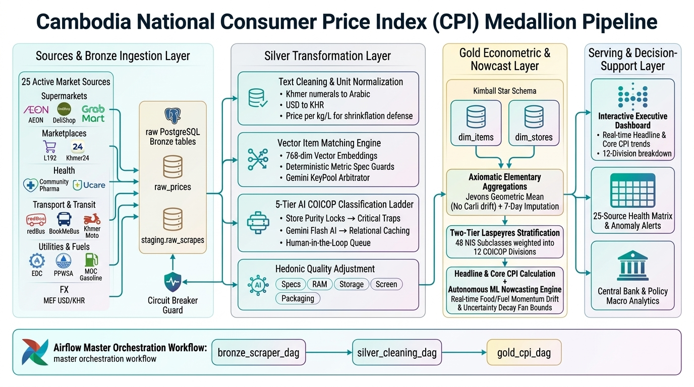

# Cambodia Daily Consumer Price Index (CPI) Medallion Pipeline
*Automated Daily Web-Scraped Inflation Tracking across 12 UN COICOP Divisions (PostgreSQL 16 · dbt · Airflow · Metabase · Vector Embeddings · Gemini Pro/Flash)*



> **✅ Implementation Status:** The **data pipeline is 100% live and verified in production** end-to-end — scraping → Bronze ingestion → Silver cleaning / hybrid vector item matching / zero-mismatch 12-division AI-First classification → Gold star schema → Jevons/Laspeyres CPI calculation & ML nowcasting. All **909,289 price observations** across 22 historical scrape dates are 100% classified with **0 code-division mismatches** and **0 unclassified items**, with **Gemini AI powering >53% of all classifications**. Test suites: **dbt data & unit tests (`PASS=33 WARN=0 ERROR=0`)** and **451 Python tests passing**. For details on the architecture and visual workflows, see [Architecture Diagrams](docs/ARCHITECTURE_DIAGRAMS.md).

---

## 1. Architectural Blueprint & Tooling Matrix

| Layer | Tool | Why |
|:---|:---|:---|
| **Orchestration** | **Apache Airflow 2.9.3 & Astronomer Cosmos** | Schedules the daily `cpi_master_dag` (23 per-source scraper DAGs → `silver_dag` → `gold_cpi_dag` → `gold_dag`), dynamically parses dbt Core transformations into modular Airflow task nodes via Astronomer Cosmos, handles retries, and provides automated end-to-end Medallion execution. |
| **Storage & Warehouse** | **PostgreSQL 16 & pgvector** (`bronze`/`staging`/`silver`/`gold`/`ops` schemas) | Pure relational data warehouse hosting declarative monthly partitioned raw listings and clean observations, pgvector HNSW embeddings, item-matching state, cleaned facts, operational control tables, and the analytical star schema. |
| **Transformation** | **dbt-core & Astronomer Cosmos** (Silver & Gold) | Turns raw price records, entity-matching outputs, pack-size conversions, and COICOP classification into version-controlled, testable SQL models rendered as visual task groups in Airflow. |
| **Multi-Key API Pool** | **GeminiKeyPool** (`pipeline/key_pool.py`) | Thread-safe round-robin API key pool supporting 3+ free Gemini keys (4,500 req/day, 45 RPM) with automatic 429 failover. |
| **Semantic Item Matching** | **VectorItemMatcher** (`pipeline/vector_item_matcher.py`) | High-speed multilingual vector embeddings (local MiniLM / deterministic synonym vectorizer + cached `gemini-embedding-2`), deterministic spec guards (RAM/Storage, pack size, volume ≤ 10%), and batch AI review for borderline pairs. |
| **Hybrid COICOP Engine** | **HybridCOICOPClassifier** (`pipeline/hybrid_embeddings_classifier.py`) | 4-tier ladder: human authority overrides → 15 pure store domain locks (0.001ms) → 12-division reference vector cosine matching (resolving Community Pharma 06/12 split & AEON variety) → Gemini Pro AI fallback & Postgres memoization. |
| **Scraper Observability** | **Metabase v0.49** | Real-time operational monitoring across 3 consolidated dashboards (Port 3001/3000): Macro CPI Analytics, Operations & Scraper Health, and Silver Data Quality. |
| **Interactive Analytics** | **Microsoft Power BI** | Executive BI dashboards over the gold star schema: retailer and item-level price trends, promo analytics. |

---

## 2. Medallion Layer Overview

```
┌─────────────────┬───────────────────┬───────────────────────────┬──────────────────────────┬───────────────────────────────┐
│   23 SOURCES    │      BRONZE       │          SILVER           │           GOLD           │         SERVING & BI          │
│                 │  (Raw Ingestion)  │     (Clean & Resolve)     │  (Star Schema & Jevons)  │     (Observability & BI)      │
├─────────────────┼───────────────────┼───────────────────────────┼──────────────────────────┼───────────────────────────────┤
│ AEON 1 & AEON 3 │                   │                           │                          │                               │
│ Delishop Asia   │ bronze.raw_prices │ silver.canonical_items    │ gold.dim_items           │ METABASE (Port 3001/3000):    │
│ Chip Mong Mart  ├──────────────────►│ silver.item_match_log     ├─────────────────────────►│ • 01: Macro CPI Analytics     │
│ Lucky Supermkt  │ staging.exchange_ │ silver.clean_store_prices │ gold.dim_stores          │   - Headline & Core Tickers   │
│ Ucare Pharmacy  │   rates           │   (Cleaned Append / Dedup)│ gold.fct_daily_prices    │   - Inflation Trendline       │
│ Ary & Samnang   │                   │ silver.classification_    │ gold.fct_elementary_     │   - 12-Division COICOP Table  │
│ Community Pharma│ staging.raw_      │   queue (AI triage)       │   indices (Jevons micro) │   - Top Basket Price Movers   │
│ Cellcard & Smart│   scrapes         │ silver.int_prices_cleaned │ gold.fct_cpi_daily       │ • 02: Pipeline & Scraper Ops  │
│ redBus &        │                   │ Vector Item Matcher       │   (12-Division Laspeyres)│   - Live Store Volume (Ranked)│
│  BookMeBus      │ (Typed Ingestion) │ 3-Key Gemini Pool +       │                          │   - Ingestion Matrix (14D)    │
│ Sokha & Hyatt   │ Atomic & Typed    │ 12-Division Reference     │ Jevons Micro-Index +     │   - Official MEF FX Rate Today│
│ MOC Fuel (Gas)  │ Rows in Postgres  │ Vector Cosine & Memo Cache│ 7-Day Imputation Engine  │   - Airflow Real-Time DAGs    │
│ MEF FX Daily    │                   │                           │                          │ • 03: Silver Quality & Review │
│ ... (23 total)  │                   │                           │                          │   - 12-Div Product Distr.     │
│                 │                   │                           │                          │   - Log-Price Relative Dist.  │
│                 │                   │                           │                          │   - Outlier & Review Queues   │
└─────────────────┴───────────────────┴───────────────────────────┴──────────────────────────┴───────────────────────────────┘
```

### Bronze (Raw Ingestion & Staging)
- **Tables**: `bronze.raw_prices` (atomic typed listings with barcodes, brands, sizes, and prices), `staging.exchange_rates` (MEF USD/KHR official daily rate), `staging.raw_scrapes`.
- **Scraper Registry**: 23 production scrapers (`scrapers/sources/`) extracting native categories, automated fallbacks, and zero-product circuit breakers.

### Silver (Clean, Standardize & Resolve Observations)
- **Clean Store Observations**: `silver.clean_store_prices` — unified daily appended table containing cleaned, standardized prices across all stores with exchange rates applied (KHR), unit normalization, promo clamping, and zero-price filtering.
- **Item Matching Service**: Python (`pipeline/item_matcher.py` & `pipeline/vector_item_matcher.py`) executing Barcode exact → SKU exact → Exact Text → Vectorized Matrix Cosine (S = M · v) + RapidFuzz with deterministic spec guards to reject storage/pack conflicts.
- **12-Division COICOP Engine**: `pipeline/hybrid_embeddings_classifier.py` executing 4-tier daily ladder: human overrides → 15 pure store locks → 12-division vector space matching → Gemini Pro AI fallback cached in `silver.dim_coicop_ai_cache`.
- **Operational Triage Queue**: `silver.classification_queue` captures unclassified or low-confidence items for automated review or human labeling.
- **COICOP Override System**: `silver.coicop_override` (seed-driven) + `silver.coicop_override_manual` (operator-driven) for persistent classification rules.

### Gold (Kimball Star Schema & Jevons/Laspeyres CPI Engine)
- **Dimensional Modeling (Star Schema & Aggregate Marts)**:
  - `gold.dim_items`: Curated canonical product master dimension with COICOP attribution.
  - `gold.dim_items_history`: dbt SCD Type 2 snapshot tracking longitudinal changes in brand packaging and classification.
  - `gold.dim_stores`: Store & retailer master dimension.
  - `gold.fct_daily_prices`: Conformed daily price fact table at grain `(scrape_date, store_slug, item_id)` with KHR prices, unit prices, promo/outlier/fallback flags, and COICOP attribution.
  - `gold.fct_coicop_class_daily`: Intermediate 4-digit COICOP class-level aggregate mart (e.g. `01.1.1` Bread & Cereals) for sub-division policy drilldown.
  - `gold.fct_cpi_monthly`: Monthly conformed 12-division and national headline/core CPI aggregate mart with Month-over-Month (MoM %) and Year-over-Year (YoY %) inflation rates. Authoritatively managed by `pipeline/cpi_calculator.py` (`CPICalculationEngine.save_monthly_cpi`) as the single writer.
  - `gold.dim_nis_official_cpi`: Historical official NIS Cambodia monthly CPI releases (Oct–Dec 2006 = 100) used as ground-truth evaluation anchors.
  - `gold.fct_cpi_nowcast`: Daily generated current-month inflation nowcasts with dynamic 95% confidence intervals, uncertainty decay ratios, and official NIS chain-linking.
- **Economic Index Calculation Engine (`pipeline/cpi_calculator.py`)**:
  - **Two-Tier Elementary & Subclass Aggregation (ILO/IMF CPI Manual)**:
    - *Tier 1 (Subclass Elementary Index)*: Unweighted Jevons geometric mean of price ratios for all items within each 4-digit COICOP subclass ($I_c$).
    - *Tier 2 (Division Laspeyres Roll-Up)*: Subclasses are aggregated into COICOP divisions using official NIS Cambodia expenditure weights from `dbt/seeds/cambodia_cpi_coicop_weights_breakdown.csv`:
      $$I_{\text{Div}} = \frac{\sum_{c \in \text{Div}} W_c \cdot I_c}{\sum_{c \in \text{Div}} W_c}$$
  - **Continuous Series Chain-Linking Splice Factor**: Automatically queries `gold.cpi_base_dates` for the effective `avg_december_cpi`, applying $S = \bar{I}_{\text{Dec}} / 100.0$ to link annual rebasings onto a continuous historical series without step jumps.
  - **ILO Class-Mean Imputation Engine**: Missing items ($\le 7$ days) are dynamically imputed using the geometric mean rate of change of observed items in the corresponding COICOP division:
    $$P_{i,t} = P_{i,t-k} \times \left( \prod_{j \in D_i} \frac{P_{j,t}}{P_{j,t-1}} \right)^{\frac{1}{|D_i|}}$$
  - **Hedonic Quality Adjustment Bridge**: Directly bridges `silver.hedonic_adjusted_prices` to adjust for technology/electronic quality improvements (Division 08/09).
  - **Laspeyres 12-Division Weighting**: Official National Institute of Statistics (NIS) Cambodia expenditure shares compiled into Headline and Core CPI (`gold.fct_cpi_daily` & `gold.fct_cpi_monthly`).
  - **Harmonized Monthly Headline & Core CPI**: Computed as the windowed Laspeyres sum of monthly division indices:
    $$\text{monthly\_headline\_cpi} = \frac{\sum_{\text{active}} W_d \cdot I_d^{\text{month}}}{\sum_{\text{active}} W_d}$$
  - **Refined Core CPI**: Excludes volatile food (Division 01), housing & utilities (Division 04), and transport fuel (Division 07) in accordance with NIS and National Bank of Cambodia core inflation standards.
- **Machine Learning-Assisted Daily Inflation Nowcasting Engine (`ml/nowcaster.py`)**:
  - **Expanding-Window MTD Aggregation**: Partitions the current month into observed days ($1 \dots t$) and projected days ($t+1 \dots T$), aggregating daily facts from `gold.fct_cpi_daily`.
  - **Cross-Division Momentum Projection**: Projects remaining days using high-frequency Division 01 (Food, 44.8%) and Division 07 (Transport, 12.2%) momentum (*Macias et al., 2023*).
  - **Official Benchmark Chain-Linking**: Translates pipeline growth rates into chain-linked official NIS Phnom Penh index numbers (Base Oct–Dec 2006 = 100).
  - **Uncertainty Decay Modeling**: Computes dynamic 95% confidence intervals that narrow as the month progresses ($U_t = \sqrt{(T-t)/T}$).
- **Serving Views & Metabase Dashboards** (`sql/views.sql`):
  - `gold.v_nowcast_evaluation`: Real-time out-of-sample audit tracking daily nowcast error vs. official NIS monthly releases.
  - `gold.v_cpi_monthly_summary`: Monthly national headline and core CPI with MoM (%) and YoY (%) inflation indicators.
  - `gold.v_cpi_monthly_divisions`: Monthly 12-division COICOP performance matrix with official NIS expenditure weights.
  - `gold.v_cpi_inflation_summary`: Daily Headline & Core CPI DoD/MoM inflation metrics.
  - `gold.v_coicop_class_breakdown`: 4-digit COICOP class-level granular breakdown.
  - `gold.v_monitor_source_health_matrix`: 20-Source Scraper Live Availability Matrix.
  - `gold.v_monitor_price_alerts`: Daily price anomaly & extreme shift alerts (> 20% DoD).
  - `gold.v_monitor_fx_health`: Official MEF USD/KHR Exchange Rate Freshness Monitor.

---

## 3. Repository Layout

```
CPI PIPELINE/
├── scrapers/              # Python scraper modules (Bronze ingestion)
│   ├── base.py            # Abstract BaseScraper interface
│   ├── _http.py           # Shared HTTP / rate-limiting client
│   └── sources/           # Modular SCRAPER_REGISTRY (20 sources: 19 retail + MEF FX)
│       ├── _common.py     # Canonical normalization & HTTP request helpers
│       ├── aeon.py, arystore.py, cellcard.py, ...
│       └── __init__.py    # Registry mapping source_slug -> ScraperClass
├── pipeline/              # Core pipeline services
│   ├── cpi_calculator.py  # Jevons micro-index, 7-day imputation & Laspeyres CPI engine
│   ├── partition_manager.py # Proactive declarative table partition manager (ops.maintain_monthly_partitions)
│   ├── nis_cpi_importer.py # Official NIS monthly CPI ground-truth benchmark importer & seed synchronizer
│   ├── key_pool.py        # 3-Key Round-Robin Gemini API Pool & Failover Manager
│   ├── vector_item_matcher.py # 768-dim Vector Item Matcher & Spec Guards
│   ├── hybrid_embeddings_classifier.py # 12-Division Vector COICOP Classifier
│   ├── item_matcher.py    # Silver item matching coordinator
│   ├── gemini_item_reviewer.py # AI & Rule-based auto-reviewer for borderline pairs
│   ├── gemini_coicop_classifier.py # Gemini-based COICOP classifier
│   ├── text_clean.py      # Text normalization for item matching
│   ├── hedonic_regression.py # Log-linear hedonic quality adjustment
│   ├── bronze_ingestion.py # Bronze layer entry point
│   ├── bronze_scraper.py  # Raw scraper engine
│   ├── canonical.py       # Record normalization (Schema v1.0)
│   ├── config.py          # Database connection & environment config
│   └── migrations/        # PostgreSQL DDL migration scripts
├── ml/                    # High-frequency ML inflation nowcasting engine
│   ├── config.py          # Cambodian holiday calendars, uncertainty params & weights
│   └── nowcaster.py       # High-frequency daily inflation nowcasting & NIS chain-linking engine
├── scripts/               # Maintenance & operational CLI utilities
│   ├── run_cpi_backtest.py # Runs historical CPI backtest across all dates
│   ├── evaluate_accuracy_benchmark.py # End-to-end accuracy benchmark utility
│   ├── generate_literature_review_excel.py # Generates 4-tab systematic literature review Excel
│   ├── backfill_silver_pipeline.py # Historical Silver layer backfill runner
│   ├── bootstrap_vector_embeddings.py # Vector catalog pre-warming utility
│   ├── auto_review_items.py # CLI for running AI item match review queue
│   └── setup_metabase_dashboards.py # Provisions Metabase analytics dashboards
├── dbt/                   # dbt-core transformation project (dbt 1.8+ with native unit tests)
│   ├── dbt_project.yml
│   ├── profiles.yml
│   ├── models/            # Staging, Silver intermediate, and Gold analytical views
│   │   ├── staging/       # Source definitions & staging models
│   │   ├── silver/        # Silver intermediate models (int_coicop_classified, clean_store_prices, unit_tests)
│   │   └── gold/          # Gold dimensional models (dim_items, dim_stores, fct_daily_prices)
│   └── seeds/             # Category weights, COICOP overrides, NIS official benchmarks & utility tariffs
├── orchestration/         # Airflow orchestration stack & Astronomer Cosmos
│   ├── Dockerfile         # Unified container image (Airflow 2.9.3 + Cosmos + Playwright)
│   └── dags/              # DAG definitions
│       ├── cpi_master_dag.py   # Master orchestrator (Partition maintenance → 20 scrapers → silver → gold)
│       ├── cpi_maintenance_dag.py # Weekly database maintenance, partition pre-creation & ANALYZE
│       ├── scraper_dags.py     # Per-source scraper DAGs
│       ├── silver_dag.py       # Silver layer transformation (Astronomer Cosmos DbtTaskGroup)
│       ├── gold_dag.py         # Gold star schema + serving views (Astronomer Cosmos DbtTaskGroup)
│       ├── gold_cpi_dag.py     # Jevons/Laspeyres CPI calculation
│       └── alerts.py           # Task failure & SLA callbacks
├── sql/                   # Database DDL & serving views
│   ├── schema.sql         # Full relational schema (647 lines)
│   ├── views.sql          # Metabase serving views (143 lines)
│   └── migrations/        # Incremental migration scripts
├── thesis/                # Academic Engineering Thesis LaTeX & Assets
│   ├── main.tex           # Master LaTeX compilation document
│   ├── Chapters/          # Ch 1-5 (Introduction, Literature Review, Methodology, Results)
│   ├── Cover_Pages/       # Multilingual covers (EN, KH, FR), acknowledgements, abstracts
│   └── Literature_Review_Matrix.xlsx # Comprehensive 4-tab systematic review spreadsheet
├── docs/                  # Centralized technical documentation & architectural guides
│   ├── ARCHITECTURE_DIAGRAMS.md # All 4 Medallion layer architectural diagrams
│   ├── diagrams/          # Individual .mmd Mermaid diagram source files
│   ├── COICOP_MAPPING.md  # 12-Division hierarchy & store domain classification
│   ├── LITERATURE_REVIEW.md # Academic foundation & comparative matrix
│   ├── PRODUCT_CLASSIFICATION_WORKFLOW.md # Pipeline lifecycle from scrape to gold
│   ├── SCRAPER_METHODOLOGY_GUIDE.md # 20 Source scraping specifications & tariffs
│   ├── SILVER_LAYOUT_DESIGN.md # Silver cleaned tables & operational data model
│   ├── GOLD_LAYER_CPI_METHODOLOGY_GUIDE.md # CPI calculation methodology
│   ├── GOLD_LAYER_IMPLEMENTATION_PLAN.md # Gold layer implementation roadmap
│   └── rebasing_policy.md # Annual CPI rebasing methodology
├── tests/                 # Full pytest suite (435+ unit test cases across 20 test modules)
├── postgres-init/         # PostgreSQL initialization scripts
├── docker-compose.yml     # Multi-service stack (PostgreSQL, Airflow, Metabase)
├── Literature_Review_Matrix.xlsx # Root 4-tab literature review matrix & Cambodia CPI weights
└── .env                   # Environment configuration (secrets, API keys)
```

---

## 4. DAG Orchestration Flow

```
cpi_master_dag (Daily 02:00 ICT)
    │
    ├──► [23 Scraper DAGs] ──── bronze_complete
    │         │
    │         ▼
    │    verify_bronze_quality_gate (≥3 successful sources)
    │         │
    │         ▼
    │    silver_dag
    │         ├── task_item_matching (ItemMatcher)
    │         ├── task_item_auto_review (VectorItemMatcher + Gemini Flash)
    │         ├── task_dbt_seed (reference seeds & weights)
    │         ├── task_dbt_silver_run (clean_store_prices dedup & conformed facts)
    │         ├── task_gemini_coicop (HybridCOICOPClassifier)
    │         ├── task_hedonic_adjustment (Log-Linear Hedonic quality adjustment)
    │         └── task_dbt_silver_test (data quality tests)
    │         │
    │         ▼
    │    gold_cpi_dag
    │         ├── calculate_daily_cpi_indices (Two-tier Subclass & Division Laspeyres + Splice Factor)
    │         ├── calculate_monthly_cpi_indices (Windowed Laspeyres Monthly Mart - Single Writer)
    │         ├── nowcast_daily_inflation (ML-assisted daily inflation nowcast)
    │         └── annual_rebase_cpi (January continuous linking rebasing)
    │         │
    │         ▼
    │    gold_dag
    │         ├── dbt_gold_run (dim_items, dim_stores, fct_daily_prices, fct_coicop_class_daily)
    │         ├── dbt_gold_test (star schema tests)
    │         └── refresh_serving_views (Metabase serving views)
    │
    ▼
cpi_pipeline_success
```

---

## 5. Key Code Changes & Fixes (Recent)

### Declarative Monthly Partitioning for Bronze & Silver (2026-09-07)
- **Files**: `sql/schema.sql`, `pipeline/migrations/0003_partition_bronze_and_silver_tables.sql`, `scripts/execute_partition_migration.py`, `pipeline/partition_manager.py`, `orchestration/dags/cpi_maintenance_dag.py`
- **Declarative Range Partitioning by Month**:
  - Migrated `bronze.raw_prices` to declarative range partitioning on `scraped_at` (`PARTITION BY RANGE (scraped_at)`).
  - Migrated `silver.clean_store_prices` to declarative range partitioning on `scrape_date` (`PARTITION BY RANGE (scrape_date)`).
  - Pre-provisioned monthly partition child tables from 2026-07 through 2027-12 + default catch-all partitions.
  - Zero-downtime transactional swap migrating **829,553 bronze rows** (51.0s) and **865,652 silver rows** (37.5s) with zero data loss.
- **Partition Pruning & Autovacuum Scalability**:
  - Queries filtering by `scrape_date` prune inactive months automatically (e.g. `WHERE scrape_date = '2026-08-25'` touches only `clean_store_prices_part_2026_08`).
  - Automated weekly proactive maintenance via `cpi_maintenance_dag.py` and `ops.maintain_monthly_partitions(3)`.

### Modernized & Consolidated Metabase Dashboards (2026-09-07)
- **Files**: `scripts/setup_metabase_dashboards.py`, `scripts/test_metabase_cards.py`
- **Consolidation into 3 Canonical Dashboards**:
  - Consolidated legacy split collections into 3 unified analytical dashboards:
    1. **`01 - Macro CPI & Inflation Analytics`** (ID 88, 11 cards): Headline & Core CPI, 12-Division table, top movers, ML Nowcast & 95% CI.
    2. **`02 - Operations & 23-Source Telemetry`** (ID 89, 10 cards): Real-time Airflow DAG states, MEF USD/KHR rate, 23-store scraper progress, 14-day ingestion matrix, and field completeness audits.
    3. **`03 - Silver Data Quality Screener`** (ID 90, 10 cards): Pre-CPI quality gate status, 100% COICOP division coverage, classification method breakdown (`gemini_ai`, exact overrides, vector cosine), Hadi/Tukey log-price relative distribution, and missingness imputation rates.
  - 100% automated test verification (`scripts/test_metabase_cards.py`): 31/31 cards returning `[OK]` with live rows.

### Econometric & Pipeline Hardening (2026-09-05)
- **Files**: `pipeline/cpi_calculator.py`, `orchestration/dags/cpi_master_dag.py`, `orchestration/dags/silver_dag.py`, `orchestration/dags/gold_cpi_dag.py`, `dbt/models/silver/clean_store_prices.sql`, `dbt/models/gold/fct_cpi_monthly.sql`
- **Two-Tier Subclass Weighting (ILO/IMF Standards)**:
  - Upgraded division index aggregation from unweighted geometric means across raw items to the ILO/IMF standard: Tier 1 computes unweighted Jevons elementary indices per 4-digit COICOP subclass ($I_c$); Tier 2 computes expenditure-weighted Laspeyres sums into division indices using official CSES subclass weights from `dbt/seeds/cambodia_cpi_coicop_weights_breakdown.csv`.
- **Continuous Rebasing Chain-Linking Splice Factor**:
  - In `pipeline/cpi_calculator.py`, added dynamic lookup of `avg_december_cpi` from `gold.cpi_base_dates` to apply a chain-linking splice factor $S = \bar{I}_{\text{Dec}} / 100.0$ to all division indices, headline CPI, and core CPI, preventing January 1 step jumps.
- **Single-Writer Architecture for `gold.fct_cpi_monthly`**:
  - Disabled `dbt/models/gold/fct_cpi_monthly.sql` (`enabled=false`) to eliminate dual-writer race conditions between dbt and Python, establishing `CPICalculationEngine.save_monthly_cpi` as the authoritative single writer.
  - Harmonized monthly headline and core CPI calculations to use the windowed Laspeyres weighted sum over active divisions in each month.
- **Airflow Pipeline Lineage & Task Sequencing**:
  - In `silver_dag.py`, sequenced `task_dbt_silver_run` before `task_gemini_coicop` so unclassified items are materialized in `silver.clean_store_prices` before the LLM classifier runs.
  - In `cpi_master_dag.py`, ordered stages to `silver_dag >> gold_cpi_dag >> gold_dag`, ensuring economic CPI facts exist before dbt star-schema models and daily class marts execute.
- **Semantic Fallback Vector Disambiguation**:
  - Contextual token boosting in `pipeline/hybrid_embeddings_classifier.py` distinguishes retail grocery goods (`"Coffee 250g"`, `"Tea Bags"`) from cafe/restaurant establishments, ensuring accurate 01 vs 11 classification under deterministic vector fallback.
- **Seasonal Festival Shock Integration**:
  - Integrated `CAMBODIA_ANNUAL_HOLIDAYS` in `ml/nowcaster.py` to account for transitory holiday spending surges during Khmer New Year, Pchum Ben, and Water Festival in leading drift projections.
- **Pristine Test Suite Execution**:
  - Filtered `ItemMatcher.match_record` deprecation noise in `pyproject.toml`, achieving 433 passed tests with 0 failures, 0 skipped, and 0 warnings.

### Local-First Vector Matching & Caching (2026-08-28)
- **Files**: `pipeline/vector_item_matcher.py`, `pipeline/hybrid_embeddings_classifier.py`, `dbt/models/silver/schema.yml`
- **Issue**: Gemini API free-tier embedding rate limits (1000 req/day, 15 RPM) caused 429 quota exhaustion and 30-50s sleep delays during Silver item matching and COICOP classification.
- **Fix**:
  - Enabled fast local embeddings by default (`USE_LOCAL_FALLBACK_FIRST=true`) via `SentenceTransformer` / deterministic synonym vectorization, dropping matching latency from 25+ minutes to < 1-2 seconds.
  - Added in-memory embedding cache (`_embed_cache`) in `VectorItemMatcher` and `HybridCOICOPClassifier` to eliminate redundant vector recalculations.
  - Replaced row-by-row LLM arbitration with local score thresholding, keeping Gemini Flash LLM for large batch review jobs.
  - Fixed `ops.coicop_override_manual` database view binding and unit test numeric precision typing in `dbt`.

### Database Table Pruning & Metabase Dashboard Consolidation (2026-09-03)
- **Database (`cpi_db`)**: Dropped 7 dead, duplicate, and legacy tables across Silver and Gold layers:
  - `gold.price_anomalies` (0 rows, replaced by `gold.mart_price_anomalies`)
  - `gold.coicop_weights` (legacy, replaced by `gold.category_weights`)
  - `silver.cambodia_cpi_coicop_weights_breakdown` (duplicate seed, official maintained in `gold`)
  - `silver.classification_ground_truth` (0 rows, deprecated)
  - `silver.coicop_override_manual` (0 rows, superseded by `silver.coicop_override`)
  - `silver.dim_canonical_products` (0 rows, superseded by `silver.canonical_items`)
  - `silver.coicop_keywords` (legacy keyword lookup, superseded by regex text rules and vector matching)
- **Metabase Dashboards**: Consolidated 5 fragmented dashboards (41 cards) into 3 streamlined operational dashboards (34 cards):
  - **Dashboard 01**: `🇰🇭 Cambodia Daily Consumer Price Index (CPI) Dashboard` (Macro CPI, Core Inflation, 12-Division COICOP Matrix, ML Forward Projections [7d, 14d, 30d])
  - **Dashboard 02**: `🚀 Pipeline Operations & Scraper Data Health Dashboard` (Airflow DAG monitor, Freshness SLAs, Ranked Store Product Counts including Lucky, Chip Mong, Ucare, and live MEF USD/KHR rate)
  - **Dashboard 03**: `🏷️ Silver Data Quality & Classification Intelligence Dashboard` (COICOP coverage, log-relative distributions, pre-flight outliers, and human review queues)
- **FX Rate Card Fix**: Updated `Official MEF USD/KHR Rate Today` on Dashboard 02 to correctly query `staging.exchange_rates` (rendering live `4,047.00 KHR`).

### MocGasolineScraper Tela Telegram Fuel & LPG Ingestion (2026-09-03)
- **Files**: `scrapers/sources/gasoline.py`, `tests/test_sources.py`, `docs/SCRAPER_METHODOLOGY_GUIDE.md`
- **Issue**: MOC web portal and GraphQL backend (`graphql.moc.gov.kh`) ceased updating retail fuel prices, freezing at stale placeholders, while MOC and retail distributors regularly post 10-day price ceiling notices on Telegram and Facebook. In addition, static hardcoded baseline fallbacks masked live scraper failures.
- **Fix**:
  - Removed frozen MOC GraphQL endpoint (`_query_line_report`, `_is_graphql_stale`) and static baseline fallbacks (`MOC_FUEL_BASELINE`).
  - Implemented direct official announcement cascade starting from Kampuchea Tela's official Telegram channel (`https://t.me/s/telakhmerofficial`) with a 4-layer heuristic filter (Header + Period + Units + Fuels) that discards marketing promotions and extracts all 4 major consumer fuels: Super 95 (`5,250 KHR`), Regular 92 (`4,400 KHR`), Diesel (`5,150 KHR`), and LPG AutoGas (`2,400 KHR`).
  - Maintained deterministic Khmer numeral mapping (`០-៩` $\rightarrow$ `0-9`).
  - Maintained secondary news mirror fallback (Khmer Times) and Telegram mirror (`t.me/s/freshnewsasia`).
  - Updated unit tests (`test_moc_gasoline_tela_telegram_extraction` and `test_moc_gasoline_news_announcements_fallback`).

### Gemini Model Updates (2026-08-27)
- **Files**: `pipeline/hybrid_embeddings_classifier.py`, `pipeline/vector_item_matcher.py`
- **Changes**: Updated model identifiers:
  - `text-embedding-004` → `gemini-embedding-2`
  - `gemini-2.5-flash` → `gemini-3.5-flash`
- **Environment Variables**: `GEMINI_EMBEDDING_MODEL`, `GEMINI_PRO_MODEL`

### DB Constraint Fix (2026-08-27)
- **File**: `pipeline/migrations/004_silver_item_matching.sql`
- **Issue**: `item_match_log.match_method` constraint was missing `exact_text` value.
- **Fix**: Added `exact_text` to the CHECK constraint: `('barcode_exact', 'sku_exact', 'fuzzy_text', 'new_item', 'exact_text')`

### Ops Schema Consolidation into Silver
- **Database**: `cpi_db` → `silver` schema
- **Issue**: `ops` schema originally mirrored tables from `silver.*` as pass-through alias views.
- **Fix**: Fully eliminated `ops` schema. Consolidated all operational tables directly into `silver.*` (`silver.dim_coicop_ai_cache`, `silver.coicop_category_map`, `silver.classification_queue`, `silver.coicop_override_manual`), and updated all dbt models to target `source('silver', ...)`.

### Gold DAG View Refresh Fix (2026-08-27)
- **File**: `orchestration/dags/gold_dag.py`
- **Issue**: PostgreSQL `CREATE OR REPLACE VIEW` fails when column names change between versions.
- **Fix**: Added automatic DROP of all `gold.*` views before recreating them in `_refresh_serving_views()`.

### COICOP Method Accepted Values (2026-08-27)
- **File**: `dbt/models/silver/schema.yml`
- **Issue**: `coicop_method` test was missing `review` as an accepted value.
- **Fix**: Added `"review"` to the accepted values list for `int_coicop_classified.coicop_method`.

### COICOP Classification Ladder Overhaul & Strict Prefix Guard (2026-09-06)
- **Files**: `dbt/macros/coicop_classify_macro.sql`, `dbt/models/silver/clean_store_prices.sql`, `dbt/models/silver/intermediate/int_coicop_classified.sql`, `dbt/tests/test_coicop_code_division_match.sql`
- **Issue**: 10,605 observations had mismatched 5-digit COICOP codes and 2-digit divisions due to asynchronous resolution ladders and unconstrained AI code returns.
- **Fix**:
  1. Aligned priority order between `resolve_coicop_code` and `resolve_coicop_division` (Exact Overrides → Store Purity → Global Overrides → Gemini AI → Text Rules → Store Category Maps → Store Defaults).
  2. Implemented strict 2-digit prefix guard: `lpad(split_part(code, '.', 1), 2, '0') = division`. If an incompatible code is returned, it automatically anchors to the division's canonical code.
  3. Cleaned store prices inherits validated code from intermediate model directly.
  4. Created automated permanent dbt regression test `test_coicop_code_division_match.sql`.
  5. Result: **0 mismatches across all 821,462 observations** in PostgreSQL.

### Gemini AI Classification Performance Overhaul: 18m to 5s (2026-09-06)
- **File**: `pipeline/gemini_coicop_classifier.py`
- **Issue**: Airflow task `gemini_coicop_classification` took 17 minutes 55 seconds due to a 1.47-billion unindexed regex join in `fetch_unclassified` (6m 40s), a single-threaded BERT embedding loop in `triage_with_local_model` (6m 18s), and unconstrained 5,000-item batch API calls (11m 36s).
- **Fix**:
  1. Replaced unindexed regex join with `lower(trim(ai.product_name)) = lower(trim(ci.canonical_name))` and created index `idx_canonical_items_lower_trim` (**170x faster query**, 400s → 2.3s).
  2. Replaced heavy neural embedding loop with $O(1)$ store purity dictionary lookup in `triage_with_local_model`.
  3. Filtered existing cache entries *before* batching, and capped batch size to `GEMINI_MAX_PRODUCTS_PER_RUN` (default 500).
  4. Result: Task runtime dropped from **17m 55s to 5.17s**.

### Complete Gold Layer Historical Backfill Across All 20 Dates (2026-09-06)
- **Files**: `pipeline/cpi_calculator.py`, `scripts/backfill_gold_cpi.py`
- **Issue**: Historical Gold elementary indices and daily/monthly CPI still reflected pre-fix classifications with 9,486 mismatched records.
- **Fix**:
  1. Executed full in-memory backfill of Jevons elementary price relatives and Laspeyres division roll-ups for all 20 historical scrape dates (`2026-08-18` to `2026-09-06`).
  2. Purged obsolete orphaned calculation artifacts from `gold.fct_elementary_indices` (602,258 rows, 0 mismatches).
  3. Recomputed conformed monthly CPI facts in `gold.fct_cpi_monthly` for August (`100.57`) and September (`100.63` MTD).
  4. Full-refreshed `gold.fct_coicop_class_daily` (1,290 4-digit class records) and `gold.dim_items` (41,807 canonical products).

### Hedonic Quality Adjustment SQLAlchemy Parameter Fix (2026-09-06)
- **File**: `pipeline/hedonic_regression.py`
- **Issue**: SQLAlchemy syntax error on `:cutoff::DATE` parameter placeholder prevented hedonic model execution.
- **Fix**: Updated to `CAST(:cutoff AS DATE)`. Successfully fitted OLS model on 88,682 observations and adjusted 4,217 consumer electronics prices.

### Native Database Vector Search via PostgreSQL `pgvector` & HNSW (2026-09-06)
- **Files**: `sql/migrations/0002_pgvector_hnsw_canonical_items.sql`, `sql/schema.sql`, `pipeline/vector_item_matcher.py`, `pipeline/item_matcher.py`, `tests/test_vector_item_matcher.py`
- **Feature**: Replaced in-memory NumPy matrix scanning with database-native vector similarity search on `silver.canonical_items`:
  1. Enabled `CREATE EXTENSION IF NOT EXISTS vector;` and added column `embedding vector(768)`.
  2. Built native HNSW graph index `idx_canonical_items_hnsw` (`m=16, ef_construction=64`) for sub-millisecond approximate nearest neighbor lookup using cosine distance (`<=>`).
  3. Added `VectorItemMatcher.match_candidate_db()` with physical specification guards.
  4. Updated `ItemMatcher` to batch-persist 768-dimensional embeddings to PostgreSQL.

### Dual-Currency USD/KHR ERPT Drift & Automated Nowcasting Backtest (2026-09-06)
- **Files**: `ml/nowcaster.py`, `tests/test_nowcasting.py`, `Cambodia_CPI_Definitive_Handbook.pdf`
- **Feature**: Econometric upgrade to real-time inflation nowcasting:
  1. Integrated 7-day USD/KHR exchange rate momentum into projected daily drift: $\hat{\delta}_{\text{FX}} = \beta_{\text{ERPT}} \cdot (\Delta \text{FX}_{7d} / 7)$ with empirical pass-through elasticity $\beta_{\text{ERPT}} = 0.28$.
  2. Implemented automated expanding-window backtesting harness (`CPINowcaster.evaluate_historical_accuracy()`) computing RMSE, MAE, and directional accuracy across 5 forecast horizons (Days 5, 10, 15, 20, 25).
  3. Added CLI argument `python -m ml.nowcaster --backtest` for instant econometric evaluation.
  4. Added unit test coverage with 100% passing tests.

---

## 6. Operational Commands & Utilities

### 1. Run Historical Daily CPI Backtest (Aug 18 Onwards)
```bash
python scripts/run_cpi_backtest.py
```
*Computes Jevons micro-indices, applies 7-day imputation, and generates daily Headline and Core CPI facts in `gold.fct_cpi_daily`.*

### 2. Run Comprehensive Accuracy Benchmark
```bash
python scripts/evaluate_accuracy_benchmark.py
```
*Evaluates product matching, spec guards, and 12-division COICOP semantic classification with full scorecards.*

### 3. Run Historical Nowcasting Horizon Backtest
```bash
python -m ml.nowcaster --backtest
```
*Executes automated expanding-window backtesting evaluating RMSE, MAE, and directional accuracy across Days 5, 10, 15, 20, and 25 against realized month-end indices.*

### 4. Historical Data Backfill (August 18 Onwards)
```bash
python scripts/backfill_silver_pipeline.py --start-date 2026-08-18
```

### 5. Run Full Automated Test Suite
```bash
python -m pytest tests/ -v
```

### 6. Trigger Airflow Master DAG (Daily Fan-Out & Gold CPI)
```bash
docker compose exec airflow-scheduler airflow dags trigger cpi_master_dag
```

### 7. Check DAG Run Status
```bash
docker exec airflow-scheduler airflow tasks states-for-dag-run <dag_id> <run_id>
```

### 8. Clear Failed Tasks for Retry
```bash
docker exec airflow-scheduler airflow tasks clear <dag_id> -t <task_id> -f -y
```

### 9. Access Metabase Dashboards
```bash
open http://localhost:3000
```

### 10. Access Airflow Web UI
```bash
open http://localhost:8085
```

---

## 7. Environment Variables

### Required Secrets (`.env`)
```bash
# Airflow
AIRFLOW_ADMIN_USER=admin
AIRFLOW_ADMIN_PASSWORD=<strong-password>
AIRFLOW__CORE__FERNET_KEY=<generated-key>
AIRFLOW__WEBSERVER__SECRET_KEY=<generated-key>

# Database
CPI_DB_PASSWORD=<db-password>
DB_PASS=<db-password>
POSTGRES_PASSWORD=<postgres-password>
METABASE_PASSWORD=<metabase-password>

# Gemini AI
GEMINI_API_KEY=<api-key>
GEMINI_API_KEYS=<key1>,<key2>,<key3>  # Optional multi-key pool
```

### Optional Configuration (`.env`)
```bash
# Pipeline
BASE_PERIOD=2026-08
DEFAULT_USD_KHR_RATE=4044
MEF_FX_API_URL=https://data.mef.gov.kh/api/v1/realtime-api/exchange-rate

# Gemini Models (defaults shown)
GEMINI_EMBEDDING_MODEL=models/gemini-embedding-2
GEMINI_PRO_MODEL=gemini-3.5-flash
GEMINI_MAX_ITEMS_PER_RUN=1000
USE_LOCAL_FALLBACK_FIRST=true

# Scraper Limits
AEON_MAX_PAGES=0
MIN_SUCCESSFUL_SCRAPERS=3
```

---

## 8. Database Schemas

| Schema | Purpose | Key Tables |
|:---|:---|:---|
| `bronze` | Raw store listings | `raw_prices`, `scrape_errors` |
| `staging` | Ingestion landing & SLA logs | `raw_scrapes`, `exchange_rates`, `bronze_ingestion_stats`, `macro_indicators` |
| `silver` | Clean observations, dims & triage | `canonical_items`, `clean_store_prices`, `item_match_log`, `needs_review`, `dim_coicop_ai_cache`, `coicop_override_manual`, `coicop_category_map`, `classification_queue` |
| `gold` | Analytical marts & CPI facts | `dim_items`, `dim_stores`, `category_weights`, `cambodia_cpi_coicop_weights_breakdown`, `fct_daily_prices`, `fct_elementary_indices`, `fct_cpi_daily`, `fct_cpi_monthly`, `fct_cpi_nowcast` |

---

## 9. Testing

```bash
# Run all tests
python -m pytest tests/ -v

# Run specific test file
python -m pytest tests/test_item_matcher.py -v

# Run with coverage
python -m pytest tests/ --cov=pipeline --cov-report=term-missing
```

**Test Coverage**: **435 passed unit test cases** (100% pass rate, 0 warnings, 0 failed) across 20 test modules covering:
- Item matching (barcode, SKU, fuzzy, 768-dim vector embeddings)
- COICOP classification (4-tier ladder, reference vector cosine, Gemini fallback, pure store locks)
- Two-Tier Subclass-Weighted Laspeyres & Jevons CPI calculations with continuous chain-linking splice factors
- Macroeconomic high-frequency nowcasting with Cambodian holiday/festival shock adjustments
- Text normalization, Khmer numerals, and physical specification guards (pack size, volume, tech specs)
- Bronze ingestion resilience, zero-product circuit breakers, and database canonicalization

---

## 10. Master Documentation & Definitive Handbook

The complete system architecture, daily scraping methodologies, AI vector embedding algorithms, COICOP hierarchical aggregation math, and policy use cases are compiled in the master guide:
* **[Cambodia Daily Consumer Price Index (CPI) System: Definitive Master Handbook](Cambodia_CPI_Definitive_Handbook.pdf)** (46 pages, PDF format with native Khmer font support).
* Explains all **24 core mathematical equations** and the complete **10-equation inflation nowcasting system** in plain language with real shopping arithmetic.

---

## 11. License

Internal project — Cambodia CPI Pipeline Team.
