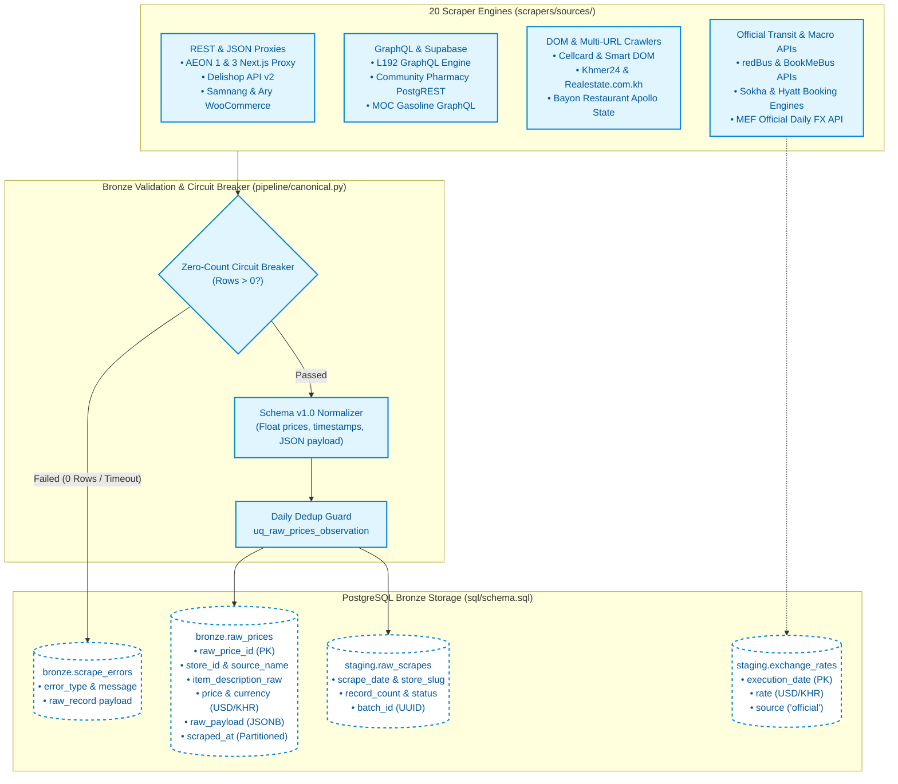
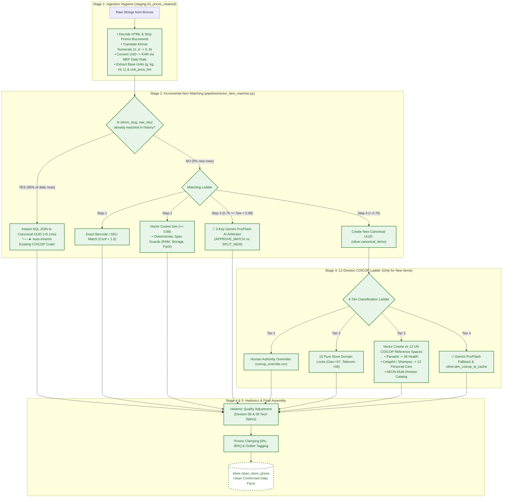
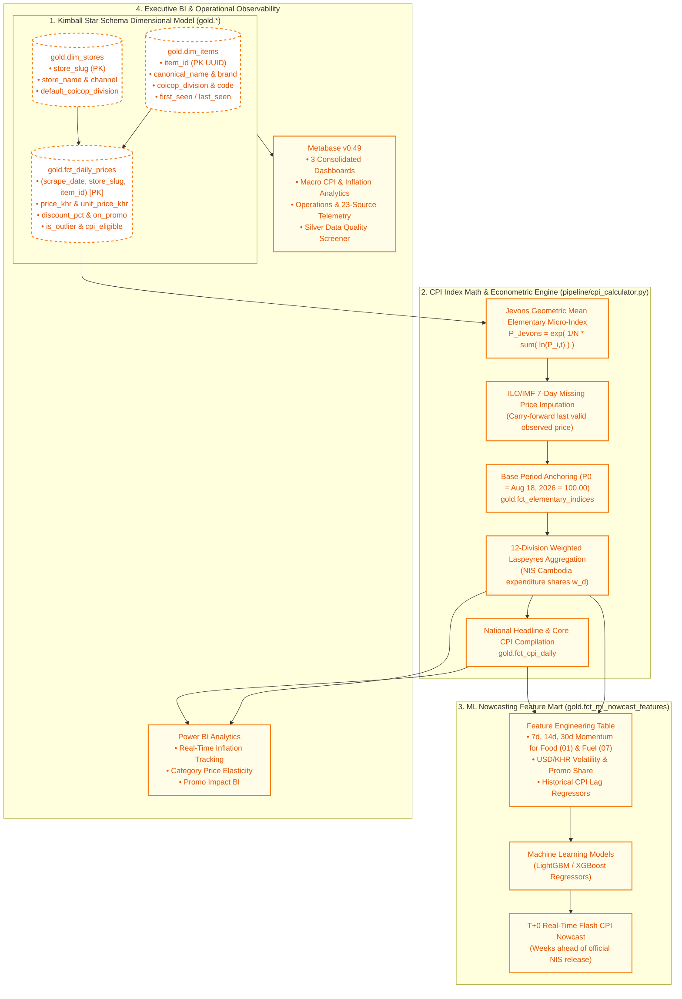

# Cambodia Daily Consumer Price Index (CPI) — Architecture & Layer Diagrams

This document contains the complete set of architecture diagrams for the Cambodia Daily CPI Medallion Pipeline across the **Bronze**, **Silver**, and **Gold** layers.

---

## 🌐 1. High-Level End-to-End Pipeline Overview

This macro-level diagram illustrates the full data journey from 20 external Cambodian retail sources through the Medallion architecture to executive dashboards and real-time ML inflation nowcasting.

```mermaid
flowchart LR
    subgraph S0["23 SOURCES"]
        A1["Supermarkets & Malls\n(AEON 1 & 3, Delishop, Lucky, Chip Mong, L192)"]
        A2["Pharmacies & Tech\n(Community Pharma, Ucare, Samnang, Ary)"]
        A3["Telecom & Utilities\n(Cellcard, Smart, Fuel, Housing)"]
        A4["Transit & Hotels\n(redBus, Sokha, MEF FX)"]
    end

    subgraph S1["BRONZE LAYER (Raw)"]
        B1[("bronze.raw_prices\nImmutable Raw JSON & Tables")]
        B2[("staging.raw_scrapes\nBatch Health & Validation Logs")]
    end

    subgraph S2["SILVER LAYER (Clean & Resolve)"]
        C1["Data Hygiene & MEF FX to KHR"]
        C2["Vector Item Matcher + Spec Guards"]
        C3["4-Tier 12-Division COICOP AI Ladder"]
        C4[("silver.clean_store_prices\nCanonical Daily Observations")]
    end

    subgraph S3["GOLD LAYER (Star Schema & Index)"]
        D1[("gold.dim_items & gold.dim_stores")]
        D2[("gold.fct_daily_prices")]
        D3["Jevons Geometric Mean & Imputation"]
        D4[("gold.fct_cpi_daily & gold.fct_cpi_monthly\n12-Division & National CPI")]
    end

    subgraph S4["SERVING & ANALYTICS"]
        E1["Metabase v0.49\n(3 Streamlined Dashboards:\nMacro, Ops, Quality)"]
        E2["Power BI DirectQuery\n(Executive Inflation Dashboards)"]
        E3["ML Nowcasting Engine\n(Hybrid ADL + GBRT Nowcasts)"]
    end

    S0 --> S1
    S1 --> S2
    S2 --> S3
    S3 --> S4

    classDef src fill:#f8f9fa,stroke:#adb5bd,stroke-width:2px,color:#212529;
    classDef brz fill:#e3f2fd,stroke:#1e88e5,stroke-width:2px,color:#0d47a1;
    classDef slv fill:#e8f5e9,stroke:#43a047,stroke-width:2px,color:#1b5e20;
    classDef gld fill:#fff8e1,stroke:#fbc02d,stroke-width:2px,color:#f57f17;
    classDef srv fill:#f3e5f5,stroke:#8e24aa,stroke-width:2px,color:#4a148c;

    class A1,A2,A3,A4 src;
    class B1,B2 brz;
    class C1,C2,C3,C4 slv;
    class D1,D2,D3,D4 gld;
    class E1,E2,E3 srv;
```

---

## 🥉 2. Bronze Layer Detail (Raw Ingestion & Circuit Breakers)

The Bronze layer ingests unstructured and semi-structured payloads across 20 stores daily, applying strict schema enforcement, zero-count circuit breakers, and raw PostgreSQL persistence.

---

## 🥈 3. Silver Layer Detail (Vector Matching & COICOP Classification)

The Silver layer transforms noisy, multilingual raw data into standardized observations via 768-dim multilingual vector embeddings, deterministic spec guards, 3-key load balancing, and 12-division UN COICOP classification.

---

## 🥇 4. Gold Layer Detail (Star Schema, Jevons Math & ML Nowcast)

The Gold layer structures data into a Kimball dimensional star schema, applies Jevons geometric mean elementary aggregation, 7-day missing price imputation, 12-division Laspeyres compilation, and produces real-time ML inflation nowcasts.

