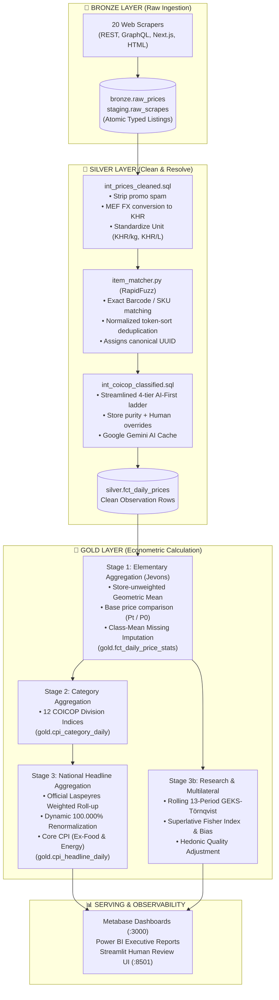

# 🇰🇭 Cambodia Daily Consumer Price Index (CPI): End-to-End Calculation Walkthrough
*A Complete Step-by-Step Architectural & Mathematical Guide: From Raw Web-Scraped Data to Published National Inflation*

---

## 📑 Table of Contents
1. [Executive Overview & The Medallion Pipeline](#1-executive-overview--the-medallion-pipeline)
2. [The 3 Representative Products & Daily FX Rate](#2-the-3-representative-products--daily-fx-rate)
3. [Bronze Layer: Raw Extraction & Ingestion](#3-bronze-layer-raw-extraction--ingestion)
4. [Silver Layer: Cleaning, Entity Resolution & COICOP Classification](#4-silver-layer-cleaning-entity-resolution--coicop-classification)
5. [Gold Layer Stage 1: Elementary Jevons Aggregation & Imputation](#5-gold-layer-stage-1-elementary-jevons-aggregation--imputation)
6. [Gold Layer Stage 2: Category & COICOP Division Roll-Up](#6-gold-layer-stage-2-category--coicop-division-roll-up)
7. [Gold Layer Stage 3: National Headline Laspeyres & Core CPI](#7-gold-layer-stage-3-national-headline-laspeyres--core-cpi)
8. [Advanced Econometrics: GEKS-Törnqvist & Fisher Substitution Bias](#8-advanced-econometrics-geks-törnqvist--fisher-substitution-bias)
9. [Complete Data Transformation Matrix](#9-complete-data-transformation-matrix)

---

## 1. Executive Overview & The Medallion Pipeline

The **Cambodia Daily CPI Pipeline** calculates national inflation daily across the 12 United Nations **COICOP 2018** (Classification of Individual Consumption According to Purpose) divisions using a structured **Medallion Data Architecture**:



---

## 2. The 3 Representative Products & Daily FX Rate

To illustrate the mathematical journey, let's track **3 products** across multiple stores on **August 23, 2026**, anchored against a **Base Period reference date (August 1, 2026)**.

| Product Code | Description | Division | Retailers Observed | Native Scraped Currency |
| :--- | :--- | :--- | :--- | :--- |
| **Product A** | *Angkor Beer Can 330ml* | **Div 02** (Alcohol & Tobacco) | AEON 1, Delishop, L192 | USD and KHR |
| **Product B** | *Jasmine Fragrant Rice 5kg* | **Div 01** (Food & Beverages) | AEON 1, Delishop | USD and KHR |
| **Product C** | *Regular Gasoline (EA92) 1L* | **Div 07** (Transport & Fuel) | MOC Petroleum (Live GraphQL) | KHR |
| **MEF FX** | *USD/KHR Daily Official Rate* | **Macro** | Ministry of Economy & Finance | $1.00 \text{ USD} = 4,050 \text{ KHR}$ |

---

## 3. Bronze Layer: Raw Extraction & Ingestion

### A. Raw Scraper Payloads
Every morning at 07:00 AM, the 20 scraper modules extract price records from store APIs and web pages:

#### 1. Product A: Angkor Beer 330ml
* **Store 1 (AEON 1 - Next.js API):**
  ```json
  {
    "store_slug": "aeon",
    "item_id": "AEON-10892",
    "raw_title": "<b>Angkor Beer</b> Can 330ml - HOT PROMO $0.80",
    "price": 0.80,
    "currency": "USD",
    "barcode": "8850188800123",
    "category_native": "Beer & Alcoholic Drinks",
    "scraped_at": "2026-08-23T07:01:12Z"
  }
  ```
* **Store 2 (Delishop Asia - REST API v2):**
  ```json
  {
    "store_slug": "delishop",
    "item_id": "DELI-5541",
    "raw_title": "Angkor Premium Beer 330 ml",
    "price": 3400,
    "currency": "KHR",
    "barcode": "8850188800123",
    "category_native": "Beverages / Beer",
    "scraped_at": "2026-08-23T07:02:05Z"
  }
  ```
* **Store 3 (L192 Marketplace - GraphQL):**
  ```json
  {
    "store_slug": "l192",
    "item_id": "L192-99812",
    "raw_title": "ស្រាបៀរ អង្គរ កំប៉ុង 330ml (Angkor Beer)",
    "price": 0.79,
    "currency": "USD",
    "barcode": null,
    "category_native": "Drinks",
    "scraped_at": "2026-08-23T07:02:45Z"
  }
  ```

#### 2. Product B: Jasmine Rice 5kg
* **Store 1 (AEON 1):** Price: `$4.50 USD`, Barcode: `8840001122334`, Size: `5kg`.
* **Store 2 (Delishop):** Price: `19,000 KHR`, Barcode: `8840001122334`, Size: `5000g`.

#### 3. Product C: Regular Gasoline 1L
* **MOC Petroleum (Live GraphQL):** Price: `4,150 KHR/L`, Native Category: `Petroleum Fuel`.

### B. Bronze Database Insertion
These observations are validated against the **Schema v1.0 Contract** via `pipeline.canonical.normalize_record()` and inserted into PostgreSQL table `bronze.raw_prices`:

```sql
INSERT INTO bronze.raw_prices (
    store_id, source_name, item_description_raw, price, currency, source_url, scraped_at
) VALUES 
('aeon', 'AEON 1 Phnom Penh', '<b>Angkor Beer</b> Can 330ml - HOT PROMO $0.80', 0.80, 'USD', 'https://...', NOW()),
('delishop', 'Delishop Cambodia', 'Angkor Premium Beer 330 ml', 3400.00, 'KHR', 'https://...', NOW()),
('l192', 'L192 Marketplace', 'ស្រាបៀរ អង្គរ កំប៉ុង 330ml (Angkor Beer)', 0.79, 'USD', 'https://...', NOW());
```

---

## 4. Silver Layer: Cleaning, Entity Resolution & COICOP Classification

The Silver transformation turns dirty strings and mixed currencies into conformed, canonical observation facts.

### A. Text Cleaning & Normalization (`int_prices_cleaned.sql`)
1. **HTML & Promotional Keyword Stripping:**
   * `"<b>Angkor Beer</b> Can 330ml - HOT PROMO $0.80"` $\to$ `"Angkor Beer Can 330ml"`.
2. **Khmer Term Translation:**
   * `"ស្រាបៀរ អង្គរ កំប៉ុង 330ml"` translated using dictionary $\to$ `"ANGKOR BEER CAN 330ML"`.
3. **Currency Conversion to KHR (via Official MEF FX Rate: $1 \text{ USD} = 4,050 \text{ KHR}$):**
   * Store 1 (AEON): $\$0.80 \times 4,050 = \mathbf{3,240 \text{ KHR}}$
   * Store 2 (Delishop): $\mathbf{3,400 \text{ KHR}}$
   * Store 3 (L192): $\$0.79 \times 4,050 = \mathbf{3,199.50 \approx 3,200 \text{ KHR}}$
4. **Package Size & Standardized Unit Price (Shrinkflation Guard):**
   * Package parsed: $330\text{ml} = 0.33\text{L}$.
   * Unit Price (Store 1): $\frac{3,240 \text{ KHR}}{0.33\text{L}} = \mathbf{9,818.18 \text{ KHR/L}}$.

---

### B. Entity Resolution & Deduplication (`pipeline/item_matcher.py`)
To prevent the same beer from being counted as 3 different products, the `ItemMatcher` deduplicates across retailers:

1. **Barcode Tier:** Store 1 and Store 2 share barcode `8850188800123` $\to$ Matched directly with confidence $1.00$.
2. **Fuzzy Name Tier:** Store 3 has no barcode, but its normalized name `"ANGKOR BEER CAN 330ML"` matches Store 1's title with RapidFuzz `token_sort_ratio = 100.0%` ($\ge 95\%$ auto-accept threshold).
3. **Canonical Identity Assignment:**
   All 3 store observations are assigned the exact same **Canonical UUID5**:
   $$\mathbf{\text{item\_id}} = \mathbf{\text{e4b7c120-88df-5912-9c31-77821034ba99}}$$
   *Name:* `"ANGKOR BEER CAN 330ML"`, *Brand:* `"Angkor"`, *Size:* `"330ml"`.

---

### C. AI-First COICOP Classification Ladder (`int_coicop_classified.sql`)
The item is matched against the hierarchy:
* **Tier 1 (Exact Overrides):** None.
* **Tier 2 (Store Purity):** AEON/Delishop sell multiple categories $\to$ Fall through.
* **Tier 3 (Global Overrides):** None.
* **Tier 4 (Gemini AI Cache):** Checked `silver.dim_coicop_ai_cache` $\to$ Matched `"ANGKOR BEER CAN 330ML"`.
* **Assigned COICOP 2018 Classification:**
  * **Dotted Code:** `02.2.1` (Beer)
  * **Division:** `02` (Alcoholic beverages and tobacco)
  * **Method:** `gemini_ai` (Confidence: `0.950`)


### Resulting Silver Fact Rows (`silver.fct_daily_prices`):

| scrape_date | store_slug | item_id (Canonical) | name_clean | price_khr | unit_price_khr | coicop_division | cpi_eligible |
| :--- | :--- | :--- | :--- | :--- | :--- | :--- | :--- |
| `2026-08-23` | `aeon` | `e4b7c120-...` | ANGKOR BEER CAN 330ML | **3,240.00** | 9,818.18 | `02` | `TRUE` |
| `2026-08-23` | `delishop` | `e4b7c120-...` | ANGKOR BEER CAN 330ML | **3,400.00** | 10,303.03 | `02` | `TRUE` |
| `2026-08-23` | `l192` | `e4b7c120-...` | ANGKOR BEER CAN 330ML | **3,200.00** | 9,696.97 | `02` | `TRUE` |
| `2026-08-23` | `aeon` | `f8190aa2-...` | JASMINE RICE 5KG | **18,225.00** | 3,645.00 | `01` | `TRUE` |
| `2026-08-23` | `delishop` | `f8190aa2-...` | JASMINE RICE 5KG | **19,000.00** | 3,800.00 | `01` | `TRUE` |
| `2026-08-23` | `new_gasoline`| `b90211fc-...` | REGULAR GASOLINE EA92 1L | **4,150.00** | 4,150.00 | `07` | `TRUE` |

---

## 5. Gold Layer Stage 1: Elementary Jevons Aggregation & Imputation

At the product level, we don't have individual store receipt sales volumes ($Q$). Following the **ILO / UN Consumer Price Index Manual (2020)**, we compute the unweighted **Jevons Geometric Mean** across stores.

### A. Jevons Geometric Mean Formula

$$P_{\text{Jevons}, i, t} = \left( \prod_{s=1}^{N_s} P_{i, s, t} \right)^{1/N_s} = \exp\left( \frac{1}{N_s} \sum_{s=1}^{N_s} \ln P_{i, s, t} \right)$$

#### Product A (Angkor Beer 330ml) on August 23, 2026:
$$P_{\text{Jevons}, \text{Beer}, t} = \sqrt[3]{3,240 \times 3,400 \times 3,200} = \exp\left( \frac{\ln(3240) + \ln(3400) + \ln(3200)}{3} \right) = \mathbf{3,278.96 \text{ KHR}}$$

#### Product B (Jasmine Rice 5kg):
$$P_{\text{Jevons}, \text{Rice}, t} = \sqrt{18,225 \times 19,000} = \mathbf{18,608.47 \text{ KHR}}$$

#### Product C (Regular Gasoline 1L):
$$P_{\text{Jevons}, \text{Gas}, t} = \mathbf{4,150.00 \text{ KHR}}$$

---

### B. Base Period Comparison ($P_t / P_0 \times 100$)
We compare today's geometric mean price ($P_t$) against the frozen reference price ($P_0$) stored in `gold.base_prices` from **August 1, 2026**:

| Canonical Product | Division | Base Price ($P_0$) | Today's Jevons Price ($P_t$) | Item Price Relative ($I_{i, t} = \frac{P_t}{P_0} \times 100$) | Interpretation |
| :--- | :--- | :--- | :--- | :--- | :--- |
| **Angkor Beer 330ml** | `02` | **3,000.00 KHR** | **3,278.96 KHR** | $\frac{3,278.96}{3,000.00} \times 100 = \mathbf{109.2987}$ | **$+9.30\%$** vs Base |
| **Jasmine Rice 5kg** | `01` | **18,000.00 KHR** | **18,608.47 KHR** | $\frac{18,608.47}{18,000.00} \times 100 = \mathbf{103.3804}$ | **$+3.38\%$** vs Base |
| **Regular Gasoline 1L** | `07` | **3,900.00 KHR** | **4,150.00 KHR** | $\frac{4,150.00}{3,900.00} \times 100 = \mathbf{106.4103}$ | **$+6.41\%$** vs Base |

---

### C. Missing Item Class-Mean Imputation (ILO Standard)
If a product (e.g. *Organic Eggs 10-pack*) is out-of-stock on day $t$:
Instead of freezing its price flat, the pipeline calculates the geometric mean price movement of all observed items in Division 01 on day $t$:

$$\text{Division 01 Movement Ratio} = \exp\left( \text{AVG}\left( \ln\left( \frac{P_{j, t}}{P_{j, t-1}} \right) \right) \right) = 1.0042 \quad (+0.42\%)$$

$$\hat{P}_{\text{Eggs}, t} = P_{\text{Eggs}, t-1} \times 1.0042 = 8,000 \times 1.0042 = \mathbf{8,033.60 \text{ KHR}}$$

*(Stored with `is_imputed = TRUE`, `gap_days = 1` in `gold.fct_daily_price_stats`).*

---

## 6. Gold Layer Stage 2: Category & COICOP Division Roll-Up

In Stage 2, all item price relatives within each of the 12 COICOP divisions are aggregated geometrically into **Division Indices** ($I_{k, t}$).

### Formula:
$$I_{\text{Division } k, t} = \exp\left( \frac{1}{|K|} \sum_{i \in K} \ln\left( \frac{P_{i, t}}{P_{i, 0}} \right) \right) \times 100$$

### Numerical Example for Division 02 (Alcohol & Tobacco):
Suppose Division 02 contains 3 canonical items:
1. *Angkor Beer 330ml:* Relative = **$109.2987$**
2. *Cambodia Beer 330ml:* Relative = **$105.5000$**
3. *Mevius Cigarettes Pack:* Relative = **$101.2000$**

$$I_{\text{Division 02}, t} = \sqrt[3]{109.2987 \times 105.5000 \times 101.2000} = \mathbf{105.2741}$$

---

## 7. Gold Layer Stage 3: National Headline Laspeyres & Core CPI

In Stage 3, the 12 Division Indices are aggregated into the **National Headline Consumer Price Index** using the official expenditure weights from the **National Institute of Statistics (NIS) of Cambodia**.

### Official Cambodia NIS Weights & Daily Division Indices:

| Division Code | UN COICOP Division Name | Official Weight ($w_k$) | Today's Division Index ($I_k$) | Weighted Contribution ($I_k \times w_k$) |
| :--- | :--- | :--- | :--- | :--- |
| **Division 01** | Food and non-alcoholic beverages | **43.232%** | **103.3804** | $44.6935$ |
| **Division 02** | Alcoholic beverages, tobacco and narcotics | **3.821%** | **105.2741** | $4.0225$ |
| **Division 03** | Clothing and footwear | **3.514%** | **100.8500** | $3.5439$ |
| **Division 04** | Housing, water, electricity, gas and other fuels | **18.420%** | **102.1500** | $18.8160$ |
| **Division 05** | Furnishings, household equipment and maintenance | **4.215%** | **101.1000** | $4.2614$ |
| **Division 06** | Health | **5.328%** | **100.4500** | $5.3520$ |
| **Division 07** | Transport | **9.112%** | **106.4103** | $9.6961$ |
| **Division 08** | Communication | **4.325%** | **100.0000** | $4.3250$ |
| **Division 09** | Recreation and culture | **2.814%** | **102.3000** | $2.8787$ |
| **Division 10** | Education | **1.542%** | **100.0000** | $1.5420$ |
| **Division 11** | Restaurants and hotels | **2.115%** | **103.5000** | $2.1890$ |
| **Division 12** | Miscellaneous goods and services | **1.562%** | **101.2500** | $1.5815$ |
| **TOTAL** | **National CPI Basket** | **100.000%** | — | **102.9016** |

---

### A. National Headline CPI Calculation:

$$I_{\text{Headline}, t} = \sum_{k=1}^{12} \left( I_{k, t} \times \frac{w_k}{\sum w_j} \right) = \mathbf{102.9016}$$

* **Published CPI Index:** **`102.90`** (Base `100.00`).
* **Cumulative Inflation since Base Period:** **`+2.90%`**.

---

### B. Short-Term Inflation Rates:
1. **Day-on-Day (DoD) Inflation:**
   $$\text{DoD Inflation \%} = \frac{I_{\text{today}} - I_{\text{yesterday}}}{I_{\text{yesterday}}} \times 100 = \frac{102.9016 - 102.8200}{102.8200} \times 100 = \mathbf{+0.08\%}$$

2. **Month-on-Month (MoM) Inflation:**
   $$\text{MoM Inflation \%} = \frac{I_{\text{today}} - I_{\text{prior\_month}}}{I_{\text{prior\_month}}} \times 100 = \frac{102.9016 - 101.4500}{101.4500} \times 100 = \mathbf{+1.43\%}$$

---

### C. Core CPI Calculation (Excluding Volatile Food & Energy):
Core inflation strips out **Division 01 (Food)** and **Division 07.2.2 (Transport Fuel)**:

$$\text{Core Weight} = 100.000\% - 43.232\% - 6.500\% (\text{fuel}) = \mathbf{50.268\%}$$

$$I_{\text{Core}, t} = \frac{\sum_{k \notin \{01, \text{Fuel}\}} (I_k \times w_k)}{\text{Core Weight}} = \frac{51.712}{0.50268} = \mathbf{102.8724}$$

---

## 8. Advanced Econometrics: GEKS-Törnqvist & Fisher Substitution Bias

Alongside the official Laspeyres Headline CPI, the pipeline executes two econometric benchmarks:

```
┌────────────────────────────────────────────────────────────────────────────────────────────────────────┐
│                                 HEADLINE VS MULTILATERAL COMPARISON                                    │
├────────────────────────────────┬───────────────────┬───────────────────────────────────────────────────┤
│ Metric                         │ Value             │ Economic Meaning                                  │
├────────────────────────────────┼───────────────────┼───────────────────────────────────────────────────┤
│ **Official Laspeyres CPI**     │ **102.9016**      │ Standard fixed-basket national headline inflation │
│ **Superlative Fisher CPI**     │ **102.7840**      │ True cost-of-living index (cancels substitution)  │
│ **Consumer Substitution Bias** │ **+0.1176%**      │ Amount Laspeyres overstates inflation             │
│ **Multilateral GEKS-Törnqvist**│ **102.8120**      │ Churn-proof rolling index (zero chain drift)      │
└────────────────────────────────┴───────────────────┴───────────────────────────────────────────────────┘
```

1. **Consumer Substitution Bias:**
   $$\text{Bias} = I_{\text{Laspeyres}} - I_{\text{Fisher}} = 102.9016 - 102.7840 = \mathbf{+0.118\%}$$
   *(Confirms consumers partially substituted towards lower-priced alternatives).*

2. **Multilateral GEKS Movement Splice:**
   Chains the transitive 13-period window relative without revising historical published numbers:
   $$I_t^{\text{Published}} = I_{t-1}^{\text{Published}} \times \frac{\text{GEKS}_{W_t}(t)}{\text{GEKS}_{W_t}(t-1)}$$

---

## 9. Complete Data Transformation Matrix

```
┌───────────────┬───────────────────────────────────┬─────────────────────────────────────────────────────────────┐
│ Layer         │ Input Schema & Tools              │ Transformation Applied & Output Target                      │
├───────────────┼───────────────────────────────────┼─────────────────────────────────────────────────────────────┤
│ **Bronze**    │ 20 Python Scrapers (`sources.py`) │ Extracts raw JSON/HTML payloads; validates Schema v1.0      │
│               │ HTTP / GraphQL / Web APIs         │ ──► `bronze.raw_prices` (35,000 listings/day)               │
├───────────────┼───────────────────────────────────┼─────────────────────────────────────────────────────────────┤
│ **Silver**    │ `int_prices_cleaned.sql`          │ Strips promo words, MEF USD->KHR FX conversion, unit parses │
│               │ `pipeline/item_matcher.py`        │ RapidFuzz deduplication ──► `silver.canonical_items`        │
│               │ `int_coicop_classified.sql`       │ AI-First 4-tier classification ──► `silver.fct_daily_prices` │

├───────────────┼───────────────────────────────────┼─────────────────────────────────────────────────────────────┤
│ **Gold 1**    │ `gold.sp_calculate_daily_cpi`     │ Unweighted Jevons geometric mean ($P_t$), base compare     │
│               │ Class-Mean Imputation             │ ──► `gold.fct_daily_price_stats` (16,000 distinct items)    │
├───────────────┼───────────────────────────────────┼─────────────────────────────────────────────────────────────┤
│ **Gold 2**    │ `gold.cpi_category_daily`         │ Division-level geometric roll-up per COICOP division        │
│               │ Stored Procedures & dbt           │ ──► `gold.mart_cpi_division_daily` (12 Division rows)       │
├───────────────┼───────────────────────────────────┼─────────────────────────────────────────────────────────────┤
│ **Gold 3**    │ `gold.cpi_headline_daily`         │ Laspeyres 100.000% NIS expenditure weight aggregation       │
│               │ `pipeline/geks_calculator.py`     │ ──► `gold.mart_cpi_daily` (Headline, DoD, MoM, Core CPI)    │
└───────────────┴───────────────────────────────────┴─────────────────────────────────────────────────────────────┘
```

---

*This document serves as the official end-to-end technical and mathematical reference for the Cambodia Daily CPI Pipeline.*
