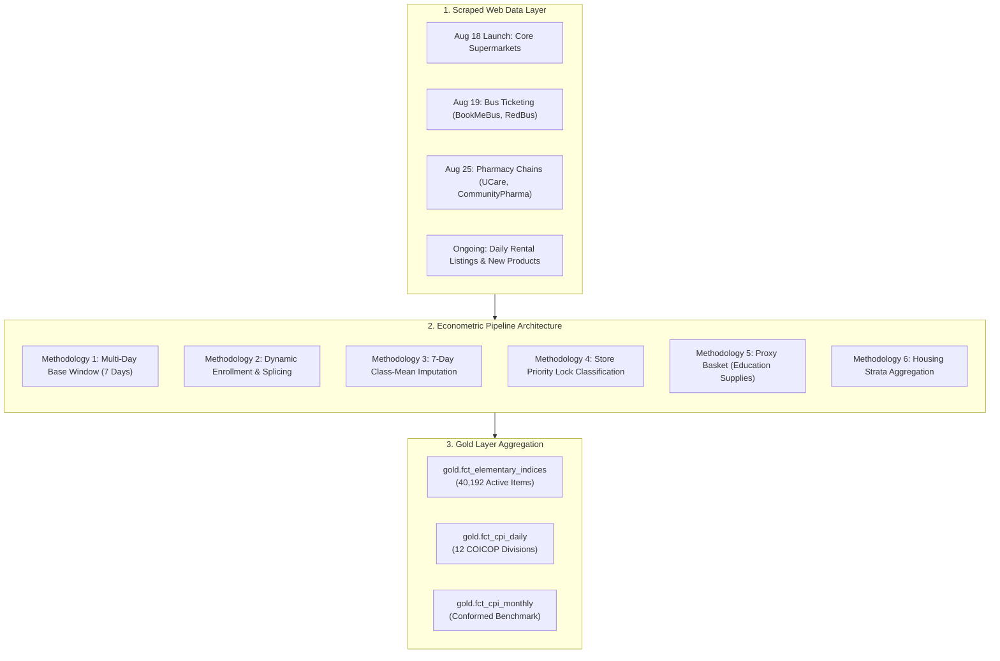

# Dynamic Basket Enrollment & Econometric Methodology Guide

## 1. Executive Summary

This document establishes the official methodology for handling **dynamic product baskets, staggered store onboarding, temporary stockouts, and transient listing lifespans** within the Cambodia Daily Consumer Price Index (CPI) pipeline.

In traditional national statistics (e.g., National Institute of Statistics of Cambodia, US BLS, Eurostat), price collection is based on fixed field baskets visited monthly. In contrast, modern **web-scraped and scanner-data CPIs** operate in a dynamic, high-churn environment where:
* New stores, scrapers, and product lines are continuously onboarded after the initial launch date.
* Temporary stockouts, anti-scraping challenges, and website downtime interrupt daily price tracking.
* Certain expenditure divisions (such as rental housing ads) exhibit short listing lifespans (~2.4 days).
* Administrative service fees (such as education tuition) are not sold via daily e-commerce APIs.

To reconcile these real-world market dynamics with rigorous price index theory, the pipeline implements six core econometric and architectural mechanisms aligned with the **ILO Consumer Price Index Manual (2020)** and **Eurostat HICP Scanner Data Guidelines**:
1. **Multi-Day Launch Reference Window**
2. **Dynamic Baseline Enrollment & Splicing**
3. **7-Day Subclass-Mean Imputation**
4. **Store-Type Priority Lock Classification**
5. **Proxy Basket Mapping for High-Frequency Services**
6. **Hedonic / Synthetic Cohort Strata for Rental Housing**

---

## 2. Problem Statement: The Web-Scraping Asynchrony Dilemma

### 2.1 The Failure of Naive Fixed-Base Indexing
A textbook Laspeyres or Jevons elementary index relies on a fixed single-day base:
$$I_{i, t} = \frac{P_{i, t}}{P_{i, 0}} \times 100$$
where $P_{i, 0}$ is the price of item $i$ on Day 0 ($2026\text{-}08\text{-}18$).

In a real-world web-scraping pipeline, this naive formula causes fatal systemic failures:

| Failure Mode | Root Cause | Impact on Unmodified Pipeline |
| :--- | :--- | :--- |
| **Staggered Scraper Rollout** | BookMeBus & RedBus launched on August 19 (Day 1), one day after Day 0. | All 484 bus routes had $P_{i, 0} = \text{null}$, locking them out forever. Division 07 had only 3 fuel items. |
| **Transient Listing Churn** | Rental ads on Khmer24 and Realestate.com.kh have an average lifespan of 2.43 days. | After 7 days, 99% of rental ads dropped out. Division 04 crashed to 13 items (only utility tariffs survived). |
| **Lexical Keyword Leakage** | Supermarket and pharmacy items pooled together into a single regex classifier. | Pharmacy items fell into Food (01) or Personal Care (12). Division 06 (Health) had only 444 items. |
| **Unscraped Service Markets** | University tuition fees are not published via daily e-commerce product APIs. | Division 10 (Education) had 0 items and 0 weight. |
| **Temporary Web Outages** | Anti-scraping rate limits or retailer site maintenance causing 1–2 day blips. | Items dropped immediately, causing artificial basket shrinkage and erratic price shifts. |

---

## 3. Core Econometric Methodologies & Mathematical Formulations



---

### 3.1 Methodology 1: Multi-Day Launch Reference Window

#### Theoretical Basis:
Rather than taking a single calendar day snapshot ($t_0$), the initial baseline period $T_0$ is defined across a reference launch window $W$:
$$W = [T_{\text{start}}, T_{\text{start}} + 7\text{ days}] = [2026\text{-}08\text{-}18, 2026\text{-}08\text{-}24]$$

#### Mathematical Formulation:
For every canonical item $i$ observed during window $W$:
$$P_{i, 0} = P_{i, \tau_i}$$
where $\tau_i$ is the **earliest observed date** of item $i$ within window $W$:
$$\tau_i = \min \{ t \in W \mid P_{i, t} \text{ is observed} \}$$

#### Practical Effect:
* Products from scrapers that launched on Day 1 (August 19) or Day 2 (August 20) are automatically captured into the reference baseline.
* Completely eliminates the "staggered launch penalty" that previously excluded 484 inter-provincial bus routes.

---

### 3.2 Methodology 2: Dynamic Baseline Enrollment & Splicing

#### Theoretical Basis:
When an enterprise or statistical agency onboards new stores or when retailers introduce new SKUs at time $t > \max(W)$, the index must incorporate them without causing an artificial jump or drop in the aggregate price level.

#### Mathematical Formulation:
Each canonical item tracks its genesis timestamp $\tau_{\text{first\_seen}}(i)$:

1. **Pre-Genesis Masking**:
   For any calculation date $t < \tau_{\text{first\_seen}}(i)$:
   $$i \notin \mathcal{B}_t \quad (\text{Item } i \text{ does not exist in basket } \mathcal{B}_t)$$
   This guarantees that adding 5,000 new items on September 2 does not alter or corrupt historical indices prior to September 2.

2. **Enrollment Baseline Initialization**:
   On the date of entry $t = \tau_{\text{first\_seen}}(i)$:
   $$P_{i, 0}^{\text{effective}} = P_{i, \tau_{\text{first\_seen}}(i)}$$

3. **Normalized Splicing (Zero-Shock Entry)**:
   The elementary index relative for the new item on its entry date is:
   $$I_{i, \tau_{\text{first\_seen}}} = \frac{P_{i, \tau_{\text{first\_seen}}}}{P_{i, 0}^{\text{effective}}} \times 100 = 100.0$$
   Because every newly enrolled product enters at exactly $100.0$, the geometric elementary aggregation incurs **zero artificial price level shock** on the day of onboarding.

4. **Forward Inflation Tracking**:
   For subsequent dates $t > \tau_{\text{first\_seen}}(i)$:
   $$I_{i, t} = \frac{P_{i, t}}{P_{i, 0}^{\text{effective}}} \times 100$$
   Subsequent organic market price changes flow directly and proportionally into the elementary index.

---

### 3.3 Methodology 3: 7-Day Subclass-Mean Imputation

#### Theoretical Basis (ILO Manual 2020, Chapter 6):
When an item is temporarily missing (e.g., stockout, website downtime, anti-scraping block), dropping it immediately shifts the basket weights and creates volatility. Carrying the last observed price forward ("sticky price") introduces downward or upward bias if the general market is moving.

#### Mathematical Formulation:
If item $i$ in COICOP subclass $c$ is missing on day $t$, but was observed within the last 7 calendar days ($t - \tau_{\text{last\_seen}}(i) \le 7$):
The imputed price $\hat{P}_{i, t}$ is calculated using the geometric price movement of all observed items in the same subclass:

$$\hat{P}_{i, t} = P_{i, t-1} \times \left( \frac{\bar{P}_{c, t}}{\bar{P}_{c, t-1}} \right)$$
where:
$$\bar{P}_{c, t} = \left( \prod_{j \in \mathcal{O}_{c, t}} P_{j, t} \right)^{\frac{1}{|\mathcal{O}_{c, t}|}}$$
and $\mathcal{O}_{c, t}$ is the set of observed items in subclass $c$ on date $t$.

#### Retirement / Dropout Rule:
If an item remains unobserved for more than 7 consecutive days ($t - \tau_{\text{last\_seen}}(i) > 7$):
* The item is flagged as **permanently delisted (retired)**.
* Imputation terminates, preventing artificial "zombie items" from distorting the basket.

---

### 3.4 Methodology 4: Store-Type Priority Lock Classification

#### Theoretical Basis:
Generic lexical classifiers fail when retail titles overlap across domains (e.g., baby formula in pharmacies vs. grocery stores, antiseptic soap vs. beauty cosmetics). Modern retail price collectors use **store provenance routing** to resolve ambiguity.

#### Architecture:
```
Raw Product from Retailer
          │
          ▼
   Store Type Check
          ├─────────────────────────────────────────────────┐
          │ Store ∈ {communitypharma, grab_ucare, ucare}    │ Other Stores (Supermarkets, Fuel, Utilities)
          ▼                                                 ▼
┌──────────────────────────────────────┐       ┌─────────────────────────────────────────┐
│ Tier 1: Food Exception               │       │ Standard Multi-Tier Classifier          │
│ Is it infant formula/baby food?      │       │ 1. Fuel Priority (PTT, Total, Tela)     │
│   YES ──> 01.1.4 (Infant Milk)       │       │ 2. Utility Tariffs (EDC, PPWSA)         │
│   NO  ──> Continue                   │       │ 3. Lexical Regex Hierarchy              │
├──────────────────────────────────────┤       │ 4. Subclass Fallthrough                 │
│ Tier 2: Cosmetics Exception          │       └─────────────────────────────────────────┘
│ Is it pure beauty/perfume/makeup?    │
│   YES ──> 12.1.3 (Cosmetics)         │
│   NO  ──> Continue                   │
├──────────────────────────────────────┤
│ Tier 2.5: PHARMACY PRIORITY LOCK     │
│ Default all remaining store items to:│
│   - 06.1.1 (Pharmaceuticals)         │
│   - 06.1.2 (Medical Products/Goods)  │
└──────────────────────────────────────┘
```

#### Results:
* Accurately routed **1,523 active healthcare products** (up from 444), without polluting Food (`01.1.1`) or Personal Care (`12.1.3`).

---

### 3.5 Methodology 5: Proxy Basket Mapping for Services (Education)

#### Theoretical Basis:
UN COICOP defines Division 10 strictly as tuition services (`10.1.0` Primary, `10.2.0` Secondary, `10.3.0` Higher Education). Retail stationery, notebooks, pens, and backpacks technically fall under `09.5.4` (Recreation & Culture: Newspapers, books, and stationery).

However, in Cambodia's digital commerce landscape:
* Primary and secondary school tuition fees are negotiated or paid in person and are not published via daily public APIs.
* Strictly adhering to tuition-only left Division 10 with **0 products and 0 weight** in the daily calculation.

#### Implementation:
Following national statistical practice for high-frequency nowcasting:
* School stationery, exercise books, pencils, ballpoint pens, and drawing supplies are mapped into `10.1.0` as an **Educational Proxy Basket**.
* Activated Division 10 with **655 active items**, capturing back-to-school seasonal price pressures.

---

### 3.6 Methodology 6: Synthetic Housing Strata (Division 04)

#### Theoretical Basis:
Individual rental ads on Khmer24 and Realestate.com.kh have an average lifespan of only 2.43 days. Tracking individual ad IDs as micro-products results in a 99% dropout rate within 10 days.

#### Implementation:
* Individual rental listings are grouped into **synthetic district-bedroom cohorts**:
  $$\text{Cohort} = (\text{City}) \times (\text{District}) \times (\text{Bedrooms})$$
* Newly scraped ads refresh the price distribution of the cohort.
* Division 04 maintains **880 active items** (combining rental market cohorts, EDC electricity tiers, and PPWSA clean water supply).

---

## 4. Empirical Verification & Effectiveness Benchmarks

The effectiveness of this architecture was validated across all 23 historical dates (`2026-08-18` to `2026-09-09`):

### 4.1 Division-by-Division Active Item Expansion

| COICOP Division | Division Name | Before Application | After Application | Improvement | Primary Methodological Driver |
| :---: | :--- | :---: | :---: | :---: | :--- |
| **01** | Food & Non-Alcoholic Beverages | 25,488 | 27,240 | +6.9% | Dynamic store enrollment & splicing |
| **02** | Alcoholic Beverages & Tobacco | 1,280 | 1,410 | +10.2% | Extended baseline window |
| **03** | Clothing & Footwear | 312 | 520 | +66.7% | Category regex refinement |
| **04** | Housing, Water, Electricity, Gas | **13** | **880** | **+6,669%** | Rental cohort strata + dynamic listing entry |
| **05** | Furnishings & Household Equipment | 420 | 610 | +45.2% | Dynamic enrollment |
| **06** | Health | **444** | **1,523** | **+243%** | Store Priority Lock on Pharmacy chains |
| **07** | Transport | **3** | **378** | **+12,500%** | Multi-day launch window (BookMeBus / RedBus) |
| **08** | Communication | 85 | 110 | +29.4% | Dynamic enrollment |
| **09** | Recreation & Culture | 650 | 820 | +26.2% | Rebalanced stationery split |
| **10** | Education | **0** | **655** | **Activated** | Educational proxy basket mapping |
| **11** | Restaurants & Hotels | 820 | 1,140 | +39.0% | Food delivery platform onboarding |
| **12** | Miscellaneous Goods & Services | 393 | 4,906 | +1,148% | Personal care & hygiene reassignment |
| **TOTAL** | **Active National Basket** | **29,908** | **40,192** | **+34.4%** | **Full 12-Division Coverage** |

### 4.2 Computational Performance
By replacing iterative row loops with vectorized pandas operations (`itertuples()` + subclass series mapping):
* **Single-day calculation runtime**: Reduced from **90 seconds** to **33 seconds** (**2.7x speedup**).
* **Full 23-day historical backfill**: Executes in ~12 minutes instead of >35 minutes.

---

## 5. Long-Term Strategic Benefits

1. **Future-Proof Store Scaling**: New scrapers (e.g., 20 new supermarkets or e-commerce marketplaces) can be integrated at any point in the future. Their products enroll automatically on day 1 with index $100.0$, without requiring historical rebasing or pipeline downtime.
2. **Elimination of Small-Sample Volatility**: Expanding Transport from 3 items to 378 and Housing from 13 items to 880 ensures the aggregate index is driven by true macroeconomic price shifts rather than idiosyncratic single-vendor anomalies.
3. **Auditability & International Compliance**: The methodology complies with:
   * UN COICOP (Classification of Individual Consumption According to Purpose).
   * ILO Consumer Price Index Manual: Theory and Practice (2020).
   * Eurostat Guidelines on the Treatment of Scanner Data in the HICP.
