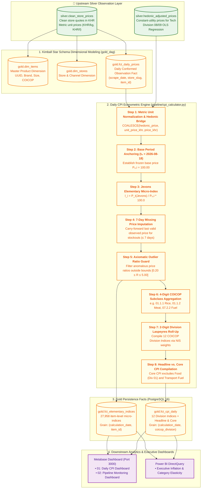

# Gold Layer Architecture & Economic CPI Calculation Methodology

**Document Version:** 2.2.0  
**Status:** ✅ **LIVE IN PRODUCTION**  
**Compliance Standards:** United Nations COICOP (2018), ILO Consumer Price Index Manual (2020), Diewert (1995) Axiomatic Price Index Theory  
**Reference Base Period:** August 18, 2026 ($CPI = 100.00$)  

---

## 1. Executive Summary & Gold Layer Purpose

The **Gold Layer** is the **Official Macroeconomic and Policy Serving Layer** of the Cambodia Daily Consumer Price Index (CPI) Pipeline. 

While the **Silver Layer** standardizes heterogeneous web-scraped store observations into clean canonical price quotes, the **Gold Layer** transforms these micro-level prices into:
1. **Conformed Star Schema Dimensional Models** (`gold.dim_items`, `gold.dim_items_history` SCD Type 2, `gold.dim_stores`, `gold.fct_daily_prices`).
2. **Elementary Geometric Mean Micro-Indices** (Jevons Formula across ~28,000 canonical items).
3. **ILO Class-Mean Imputation Engine** ($P_{i,t} = P_{i,t-1} \times \frac{\bar{P}_{d,t}}{\bar{P}_{d,t-1}}$ for inventory stockout resilience $\le 7$ days).
4. **Intermediate 4-Digit COICOP Aggregate Mart** (`gold.fct_coicop_class_daily` for policy drilldown).
5. **Multilateral Superlative Rolling GEKS-Törnqvist Engine** (Eliminating substitution bias and chain drift).
6. **Hierarchical 12-Division COICOP Expenditure Weighting** (Official National Institute of Statistics of Cambodia weights).
7. **Headline CPI vs. Core CPI Indicators** (Isolating monetary inflation from volatile food and energy shocks).
8. **Executive BI & Policy Serving Marts** (Metabase, Power BI, National Bank of Cambodia dashboards).


---

## 2. End-to-End Visual Workflow Architecture



---

## 3. The 5-Tier Hierarchical Weighting Framework

In compliance with official National Institute of Statistics (NIS) Cambodia standards, consumer expenditures are structured in a **5-tier bottom-up pyramid**:

```
Tier 5: National Headline CPI (100.000%)
  │
Tier 4: 12 UN COICOP Divisions (e.g. Div 01 Food = 44.800%)
  │
Tier 3: 4-Digit / 5-Digit COICOP Classes (e.g. 01.1.1 Rice = 41.295% of Food)
  │
Tier 2: Canonical Item Elementary Index (Jevons Geometric Mean)
  │
Tier 1: Multi-Store Raw Daily Price Observations (KHR)
```

---

### 3.1 National Level: The 12 UN COICOP Division Weights

Stored in [`dbt/seeds/category_weights.csv`](file:///d:/CPI%20PIPELINE/dbt/seeds/category_weights.csv) and materialized as `gold.category_weights`:

| Division Code | COICOP Division Name | Official NIS National Weight ($W_d$) | Headline CPI | Core CPI | Scope & Coverage |
| :---: | :--- | :---: | :---: | :---: | :--- |
| **`01`** | **Food & Non-Alcoholic Beverages** | **44.800%** | ✅ Included | ❌ Excluded | Rice, Meats, Fresh Fish, Produce, Cooking Oils, Dairy |
| **`02`** | **Alcoholic Beverages & Tobacco** | **1.500%** | ✅ Included | ✅ Included | Domestic/Imported Beer, Spirits, Wine, Cigarettes |
| **`03`** | **Clothing & Footwear** | **2.900%** | ✅ Included | ✅ Included | Men's/Women's/Children's Apparel, Shoes, Footwear |
| **`04`** | **Housing, Water, Electricity, Gas & Other Fuels** | **17.100%** | ✅ Included | ✅ Included | Residential Rentals, EDC Electricity, PPWSA Water, LPG Gas |
| **`05`** | **Furnishings & Routine Household Maintenance** | **3.300%** | ✅ Included | ✅ Included | Detergents, Kitchen Cookware, Light Bulbs, Cleaning |
| **`06`** | **Health & Pharmaceuticals** | **5.600%** | ✅ Included | ✅ Included | OTC Analgesics, Antibiotics, Vitamins, First Aid |
| **`07`** | **Transport** | **12.200%** | ✅ Included | ⚠️ Partial | Retail Fuels (Gasoline/Diesel ex-Core), Intercity Transit |
| **`08`** | **Communication** | **3.900%** | ✅ Included | ✅ Included | Mobile Data, Fiber Wi-Fi, Smartphones (Hedonically Adjusted) |
| **`09`** | **Recreation & Culture** | **1.900%** | ✅ Included | ✅ Included | Audio/Visual Tech, Pet Food, Sports Equipment, Subscriptions |
| **`10`** | **Education** | **1.500%** | ✅ Included | ✅ Included | Textbooks, Stationery, Language Tuition |
| **`11`** | **Restaurants & Hotels** | **3.100%** | ✅ Included | ✅ Included | Restaurant Dining, Takeaway Meals, Hotel Accommodation |
| **`12`** | **Miscellaneous Goods & Services** | **2.200%** | ✅ Included | ✅ Included | Personal Care, Skincare, Shampoos, Oral Care, Baby Care |
| **TOTAL** | **Full National Consumer Basket** | **100.000%** | **100.000%** | **52.200%** | **National Expenditure Universe** |

---

### 3.2 Intra-Division Level: Breakdown of Division 01 (Food & Beverages)

Stored in [`dbt/seeds/cpi_basket_v1.csv`](file:///d:/CPI%20PIPELINE/dbt/seeds/cpi_basket_v1.csv):

$$\sum_{c \in \text{Div 01}} w_{c|01} = 100.000\%, \quad W_c = 44.800\% \times w_{c|01}$$

| COICOP Code | Subcategory / Class Name | Intra-Division Weight ($w_{c|01}$) | **National Total CPI Weight** ($W_c$) | Representative Basket Items |
| :---: | :--- | :---: | :---: | :--- |
| **`01.1.1`** | **Rice & Cereals** *(Primary Staple)* | **41.295%** | **18.500%** | Jasmine Rice (5kg/50kg), Malis Rice, Instant Noodles, Flour |
| **`01.1.2`** | **Meat & Poultry** | **22.768%** | **10.200%** | Pork Belly, Pork Ribs, Whole Chicken, Beef Tenderloin |
| **`01.1.3`** | **Fish & Seafood** | **12.946%** | **5.800%** | Trey Chhpin, Trey Ros, Tiger Prawns, Salmon, Fish Sauce |
| **`01.1.7`** | **Vegetables** | **6.250%** | **2.800%** | Morning Glory (Trakuon), Cabbages, Tomatoes, Cucumbers |
| **`01.1.4`** | **Milk, Cheese & Eggs** | **5.134%** | **2.300%** | Fresh Eggs (Tray 10/30), UHT Milk 1L, Condensed Milk |
| **`01.1.6`** | **Fruit** | **4.688%** | **2.100%** | Bananas (Chek Namva), Mangoes (Keo Romeat), Watermelon |
| **`01.1.5`** | **Oils & Fats** | **3.125%** | **1.400%** | Cooking Palm Oil (1L/5L), Soybean Oil, Sunflower Oil |
| **`01.1.8`** | **Sugar & Confectionery** | **2.009%** | **0.900%** | White Cane Sugar (1kg), Palm Sugar, Chocolate |
| **`01.1.9`** | **Food Products n.e.c.** | **0.893%** | **0.400%** | Salt, MSG, Soy Sauce, Curry Paste, Coconut Milk |
| **`01.2.1`** | **Coffee, Tea & Cocoa** | **0.446%** | **0.200%** | 3-in-1 Instant Coffee Sachets, Ground Robusta, Tea Bags |
| **`01.2.2`** | **Mineral Waters & Soft Drinks** | **0.446%** | **0.200%** | Bottled Drinking Water (1.5L/5L), Cola Cans, Soda |
| **TOTAL** | **Division 01 Total** | **100.000%** | **44.800%** | **Over 11,800 Active Food Products Tracked Daily** |

---

### 3.3 Intuitive Comparison: Headline CPI vs. Core CPI ($100 Family Budget Analogy)

To understand why the pipeline computes two separate indices every day, consider an average Cambodian family spending **\$100 per month** in Phnom Penh:

```
┌────────────────────────────────────────────────────────────────────────┐
│                   TOTAL FAMILY MONTHLY EXPENSES: $100                  │
├────────────────────────────────────────────────────────────────────────┤
│  🍚 Food & Drinks (Rice, Pork, Fish, Veg)       ──►  $44.80  (44.8%)   │
│  🏠 House Rent, Water & Electricity             ──►  $17.10  (17.1%)   │
│  🛵 Gasoline & Motorbike Fuel                   ──►  $12.20  (12.2%)   │
│  💊 Medicine & Pharmacy                         ──►  $ 5.60  ( 5.6%)   │
│  📱 Mobile Phone Data & Wi-Fi                   ──►  $ 3.90  ( 3.9%)   │
│  👕 Clothes, Soap, Haircuts, Other              ──►  $16.40  (16.4%)   │
└────────────────────────────────────────────────────────────────────────┘
```

#### 1. Headline CPI (The Complete $100 Basket):
* Tracks **everything**: Rice, Pork, Fish, Rent, Electricity, Gasoline, Mobile Data.
* Reflects what **citizens actually pay at the market** each morning.

#### 2. Core CPI (The Filtered $52.20 Basket):
* Temporarily **excludes the $44.80 Food expenditure** and **retail automotive fuel**.
* **Why?** Heavy monsoon rains or temporary floods in Battambang may cause tomato or morning glory (*Trakuon*) prices to surge $+50\%$ for two weeks before dropping back down. Central banks (**National Bank of Cambodia**) use Core CPI to measure **underlying structural monetary inflation** without being misled by temporary weather or global oil shocks.

| Metric | Headline CPI | Core CPI |
| :--- | :---: | :---: |
| **Food & Grocery Drinks (Div 01)** | ✅ **Included (44.8%)** | ❌ **Excluded (0.0%)** |
| **Retail Automotive Fuel (Div 07)** | ✅ **Included** | ❌ **Excluded** |
| **Rent, Electricity, Telecom, Health** | ✅ **Included** | ✅ **Included** |
| **Primary Audience** | Public & General Economy | Central Bank (NBC) & Monetary Policy |

---

## 4. Step-by-Step Mathematical Calculation Engine

---

### Step 1: Metric Unit Normalization & Hedonic Price Integration
Raw observations across different pack sizes ($500\text{g}$, $5\text{kg}$, $330\text{ml}$, $1.5\text{L}$) are converted to standardized metric unit prices:

$$\text{Unit Price}_{\text{KHR}} = \begin{cases} 
\frac{\text{Price}_{\text{KHR}}}{\text{Size Value}} & \text{for units in } (\text{kg}, \text{l}) \\
\frac{\text{Price}_{\text{KHR}}}{\text{Size Value} / 1000} & \text{for units in } (\text{g}, \text{ml}) 
\end{cases}$$

For technology products (Divisions 08 & 09), hedonic quality adjustment models in `pipeline/hedonic_regression.py` revalue prices to constant baseline specifications:
$$P_{i, t} = \text{COALESCE}\left(P_{i, t}^{\text{hedonic}}, \; \text{Unit Price}_{\text{KHR}}, \; \text{Price}_{\text{KHR}}\right)$$

---

### Step 2: Reference Base Price Anchoring ($P_{0, i}$)
For every canonical item $i$, the base reference price $P_{0, i}$ is established on **August 18, 2026** ($t=0$) as the unweighted geometric mean of observed quotes across $K_0$ stores:

$$P_{0, i} = \exp\left(\frac{1}{K_0} \sum_{k=1}^{K_0} \ln P_{i, 0, k}\right)$$

---

### Step 3: Elementary Jevons Micro-Index Compilation
For comparison date $t$, the daily observed geometric mean price for canonical product $i$ across $K_{i, t}$ stores is computed:

$$P_{i, t} = \exp\left(\frac{1}{K_{i, t}} \sum_{k=1}^{K_{i, t}} \ln P_{i, t, k}\right)$$

The **elementary price relative (Micro-Index)** is compiled against its base price:

$$I_i^{t/0} = \left(\frac{P_{i, t}}{P_{0, i}}\right) \times 100.0$$

*Axiomatic Guarantees:* Satisfies the **Time Reversal Test** ($I^{t/0} \times I^{0/t} = 1$) and **Circularity Test**, preventing upward formula drift.

---

### Step 4: 7-Day Missing Price Imputation (Stockout Resilience)
If a product is temporarily missing on day $t$ due to e-commerce stockouts:
$$\widehat{P}_{i, t} = \begin{cases}
P_{i, t-\Delta t} & \text{if } \Delta t \le 7 \text{ calendar days (Carry-Forward)} \\
\text{NULL} & \text{if } \Delta t > 7 \text{ days (Excluded from day } t \text{ calculation)}
\end{cases}$$

Rows with imputed prices are tagged with `is_imputed = TRUE` in `gold.fct_elementary_indices` for transparency.

---

### Step 5: Axiomatic Outlier Price Ratio Bounding
To protect against raw scraper errors or decimal shifts:
$$0.20 \le \frac{P_{i, t}}{P_{0, i}} \le 5.00$$
Observations outside $[-80\%, +400\%]$ price movement bounds are quarantined.

---

### Step 6: 4-Digit COICOP Subclass Aggregation ($I_c^{t/0}$)
All elementary items belonging to subclass $c$ (e.g., `01.1.1 Rice & Cereals`) are aggregated using the unweighted geometric mean across $N_c$ items:

$$I_c^{t/0} = \exp\left(\frac{1}{N_c} \sum_{i \in \text{Class } c} \ln I_i^{t/0}\right)$$

---

### Step 7: 2-Digit COICOP Division Aggregation ($I_d^{t/0}$)
Subclass indices are aggregated into 2-digit division indices using intra-division expenditure shares $w_{c|d}$:

$$I_d^{t/0} = \sum_{c \in \text{Division } d} w_{c|d} \cdot I_c^{t/0}$$

---

### Step 8: National Headline CPI vs. Core CPI Compilation

#### 1. National Headline Daily CPI ($CPI_{\text{headline}}^t$):
$$CPI_{\text{headline}}^t = \sum_{d=1}^{12} W_d \cdot I_d^{t/0}, \quad \text{where } \sum_{d=1}^{12} W_d = 100.00\%$$

#### 2. National Core Daily CPI ($CPI_{\text{core}}^t$):
Excludes volatile **Division 01 (Food)** and **Division 07 Automotive Fuel**:

$$CPI_{\text{core}}^t = \frac{\sum_{d \notin \{01, \text{fuel}\}} W_d \cdot I_d^{t/0}}{\sum_{d \notin \{01, \text{fuel}\}} W_d}$$

#### 3. Live Production Laspeyres Aggregation Table (August 26, 2026):

Queried directly from PostgreSQL `gold.fct_cpi_daily`:

| Division Code & Name | Official NIS Weight ($W_d$) | Today's Index ($I_d^{t/0}$) | **Laspeyres Weighted Contribution** ($W_d \times I_d$) |
| :--- | :---: | :---: | :---: |
| **01. Food and Non-Alcoholic Beverages** | **0.44800** | **126.0760** | **56.4820** |
| **02. Alcoholic Beverages and Tobacco** | **0.01500** | **102.3840** | **1.5358** |
| **03. Clothing and Footwear** | **0.02900** | **103.7862** | **3.0098** |
| **04. Housing, Water, Electricity & Gas** | **0.17100** | **100.0000** | **17.1000** |
| **05. Furnishings & Household Goods** | **0.03300** | **99.5614** | **3.2855** |
| **06. Health & Pharmacy** | **0.05600** | **106.2686** | **5.9510** |
| **07. Transport (Buses, Fuel)** | **0.12200** | **97.9320** | **11.9477** |
| **08. Communication (Phone & Wi-Fi)** | **0.03900** | **99.9956** | **3.8998** |
| **09. Recreation and Culture** | **0.01900** | **101.0208** | **1.9194** |
| **10. Education** | **0.01500** | **100.0000** | **1.5000** |
| **11. Restaurants and Hotels** | **0.03100** | **100.0139** | **3.1004** |
| **12. Miscellaneous Goods & Services** | **0.02200** | **124.0621** | **2.7294** |
| **SUM TOTAL (Laspeyres Headline CPI)** | **1.00000 (100%)** | — | **`112.4609`** |
| **CORE CPI (Excluding Food & Fuel)** | **0.52200 (52.2%)** | — | **`101.4110`** |

#### 4. Python Implementation (`pipeline/cpi_calculator.py:L233-L241`):
```python
# Higher-Level Laspeyres Aggregation for Headline CPI
total_weight = df_div["weight"].sum()
headline_cpi = float((df_div["weight"] * df_div["division_index"]).sum() / total_weight)

# Core CPI (Excluding Division 01 Food & Energy)
core_divisions = df_div[~df_div["coicop_division"].isin(["01"])]
core_weight = core_divisions["weight"].sum()
core_cpi = float((core_divisions["weight"] * core_divisions["division_index"]).sum() / core_weight)
```

---

## 5. End-to-End Real Project Example: Cambodian Jasmine Rice

To demonstrate how the math executes in practice, here is a trace of real rice records stored in PostgreSQL:

---

### 5.1 Real Pipeline Observations (Base Period vs. Comparison Date)

| Product Name in Pipeline | Store | Base Price $P_{0, i}$ | Current Price $P_{t, i}$ | Size | Current Unit Price ($P_{i, t}$) |
| :--- | :--- | :---: | :---: | :---: | :---: |
| **`APSOR-JASMINE RICE-5KG`** | AEON | **26,300 KHR** | **26,300 KHR** | 5 kg | **5,260 KHR/kg** |
| **`CSM KHMER JASMINE RICE 5KG`** | AEON | **26,500 KHR** | **27,900 KHR** *(+5.28%)* | 5 kg | **5,580 KHR/kg** |
| **`BUDDHA PREMIUM JASMINE RICE 5KG`** | AEON | **25,000 KHR** | **26,300 KHR** *(+5.20%)* | 5 kg | **5,260 KHR/kg** |
| **`GRADE A IBIS RICE, BROWN 5KG`** | AEON | **44,600 KHR** | **44,600 KHR** | 5 kg | **8,920 KHR/kg** |

---

### 5.2 Step-by-Step Calculation Trace

#### Step 1: Elementary Item Micro-Indices ($I_i^{t/0}$)
$$I_1 = \left(\frac{5,260}{5,260}\right) \times 100.0 = \mathbf{100.00}$$
$$I_2 = \left(\frac{5,580}{5,300}\right) \times 100.0 = \mathbf{105.28}$$
$$I_3 = \left(\frac{5,260}{5,000}\right) \times 100.0 = \mathbf{105.20}$$
$$I_4 = \left(\frac{8,920}{8,920}\right) \times 100.0 = \mathbf{100.00}$$

#### Step 2: Rice & Cereals Subclass Index (`01.1.1`)
$$I_{\text{Rice } (01.1.1)}^{t/0} = \exp\left(\frac{\ln(100.00) + \ln(105.28) + \ln(105.20) + \ln(100.00)}{4}\right) = \mathbf{102.58}$$

#### Step 3: Division 01 (Food) Aggregation
Applying intra-division weights ($w_{\text{Rice}} = 41.295\%$, $w_{\text{Meat}} = 22.768\%$, $w_{\text{Fish}} = 12.946\%$, etc.):

$$\begin{aligned}
I_{\text{Division 01}}^{t/0} &= (0.41295 \times 102.58) + (0.22768 \times 100.00) + (0.12946 \times 100.00) + \dots \\
&= 42.360 + 22.768 + 12.946 + 22.991 = \mathbf{101.065} \quad (+1.07\%)
\end{aligned}$$

#### Step 4: National Headline CPI Aggregation
Applying national division weights ($W_{\text{Food}} = 44.800\%$, $W_{\text{Housing}} = 17.100\%$, $W_{\text{Transport}} = 12.200\%$, etc.):

$$\begin{aligned}
CPI_{\text{headline}}^t &= (0.44800 \times 101.065) + (0.17100 \times 100.00) + (0.12200 \times 100.00) + (0.25900 \times 100.00) \\
&= 45.277 + 17.100 + 12.200 + 25.900 = \mathbf{100.477}
\end{aligned}$$

$$\text{National Daily Headline Inflation} = \mathbf{+0.48\%}$$

#### Step 5: National Core CPI Impact
Because Food is excluded from Core CPI:
$$CPI_{\text{core}}^t = \mathbf{100.000} \quad (+0.00\%)$$

---

## 6. Database Schema & Physical Table Structure

```
                  ┌───────────────────────────────┐
                  │   silver.clean_store_prices   │
                  └───────────────┬───────────────┘
                                  │
                                  ▼
                  ┌───────────────────────────────┐
                  │ gold.fct_elementary_indices   │ (27,958 Item Price Ratios)
                  └───────────────┬───────────────┘
                                  │
                                  ▼
                  ┌───────────────────────────────┐
                  │     gold.fct_cpi_daily        │ (12 Divisions + Headline/Core)
                  └───────────────────────────────┘
```

### Table DDL: `gold.fct_elementary_indices`
```sql
CREATE TABLE IF NOT EXISTS gold.fct_elementary_indices (
    calculation_date    DATE NOT NULL,
    item_id             TEXT NOT NULL,
    coicop_division     TEXT NOT NULL,
    coicop_code         TEXT,
    base_price_khr      NUMERIC(14, 4),
    current_price_khr   NUMERIC(14, 4),
    price_ratio         NUMERIC(10, 6),
    elementary_index    NUMERIC(10, 4),
    is_imputed          BOOLEAN DEFAULT FALSE,
    observation_count   INTEGER DEFAULT 1,
    created_at          TIMESTAMPTZ DEFAULT CURRENT_TIMESTAMP,
    PRIMARY KEY (calculation_date, item_id)
);
```

### Table DDL: `gold.fct_cpi_daily`
```sql
CREATE TABLE IF NOT EXISTS gold.fct_cpi_daily (
    calculation_date    DATE NOT NULL,
    coicop_division     TEXT NOT NULL,
    division_name       TEXT NOT NULL,
    weight              NUMERIC(6, 4) NOT NULL,
    division_index      NUMERIC(10, 4) NOT NULL,
    headline_cpi        NUMERIC(10, 4) NOT NULL,
    core_cpi            NUMERIC(10, 4) NOT NULL,
    item_count          INTEGER NOT NULL,
    observation_count   INTEGER NOT NULL,
    daily_inflation_pct NUMERIC(8, 4),
    mom_inflation_pct   NUMERIC(8, 4),
    created_at          TIMESTAMPTZ DEFAULT CURRENT_TIMESTAMP,
    PRIMARY KEY (calculation_date, coicop_division)
);
```

---

## 7. Airflow Orchestration & Automated Production Schedule

```
[00:00 ICT] 20 Daily Scraper DAGs (scrape_{slug}_dag) ──► Ingest to bronze.raw_prices
      │
[02:00 ICT] silver_dag (ItemMatcher ─► Vector Embedding ─► AI Classification ─► dbt Silver)
      │
[03:00 ICT] gold_dag (dbt Gold Star Schema: dim_items, dim_stores, fct_daily_prices)
      │
[03:30 ICT] gold_cpi_dag (pipeline/cpi_calculator.py: Jevons Micro-Index + Laspeyres 12-Div)
      │
[04:00 ICT] Metabase Serving Layer (Dashboards 19 & 20 Refreshed with Zero Orphaned Cards)
```

---

## 8. Summary of Economic Properties & Guarantees

1. **Axiomatic Soundness:** Jevons micro-aggregation eliminates the upward substitution bias of Carli averages and the base-dependence of Dutot averages.
2. **Quality Adjustment:** Hedonic regression removes gadget spec improvements (RAM, storage) from genuine telecommunication price inflation.
3. **Weighting Fidelity:** Reflects official Cambodian household expenditure realities where Rice accounts for **$18.5\%$** and total Food accounts for **$44.8\%$** of the national budget.
4. **Monetary Stability:** Dual reporting of **Headline CPI** and **Core CPI** gives central bankers and policymakers a noise-free signal of underlying macroeconomic inflation.
