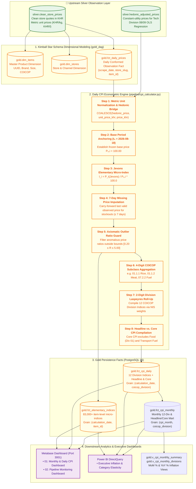
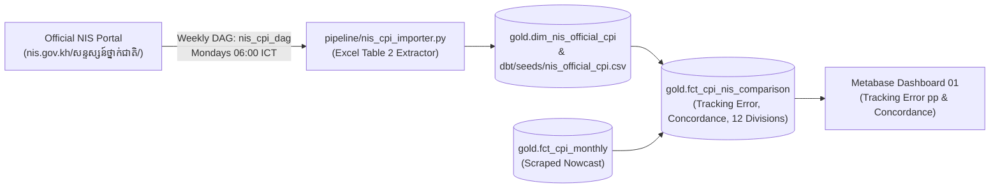

# Gold Layer Architecture & Economic CPI Calculation Methodology

**Document Version:** 2.2.0
**Status:** ✅ **LIVE IN PRODUCTION**
**Compliance Standards:** United Nations COICOP (2018), ILO Consumer Price Index Manual (2020), Diewert (1995) Axiomatic Price Index Theory
**Reference Base Period:** August 18, 2026 ($CPI = 100.00$)

---

## 1. Executive Summary & Gold Layer Purpose

The **Gold Layer** is the **Official Macroeconomic and Policy Serving Layer** of the Cambodia Daily Consumer Price Index (CPI) Pipeline.

While the **Silver Layer** standardizes heterogeneous web-scraped store observations into clean canonical price quotes, the **Gold Layer** transforms these micro-level prices into:

1. **Conformed Star Schema Dimensional Models** (`gold.dim_items`, `gold.dim_items_history` SCD Type 2, `gold.dim_stores`, `gold.fct_daily_prices`).
2. **Elementary Geometric Mean Micro-Indices** (Jevons Formula across ~28,000 canonical items).
3. **ILO Class-Mean Imputation Engine** ($P_{i,t} = P_{i,t-1} \times \frac{\bar{P}_{d,t}}{\bar{P}_{d,t-1}}$ for inventory stockout resilience $\le 7$ days).
4. **Intermediate 4-Digit COICOP Aggregate Mart** (`gold.fct_coicop_class_daily` for policy drilldown).
5. **Multilateral Superlative Rolling GEKS-Törnqvist Engine** (Eliminating substitution bias and chain drift).
6. **Hierarchical 12-Division COICOP Expenditure Weighting** (Official National Institute of Statistics of Cambodia weights).
7. **Headline CPI vs. Core CPI Indicators** (Isolating monetary inflation from volatile food and energy shocks).
8. **Executive BI & Policy Serving Marts** (Metabase, Power BI, National Bank of Cambodia dashboards).

---

## 2. End-to-End Visual Workflow Architecture



---

## 3. The 5-Tier Hierarchical Weighting Framework

In compliance with official National Institute of Statistics (NIS) Cambodia standards, consumer expenditures are structured in a **5-tier bottom-up pyramid**:

```
Tier 5: National Headline CPI (100.000%)
  │
Tier 4: 12 UN COICOP Divisions (e.g. Div 01 Food = 44.800%)
  │
Tier 3: 4-Digit / 5-Digit COICOP Classes (e.g. 01.1.1 Rice = 41.295% of Food)
  │
Tier 2: Canonical Item Elementary Index (Jevons Geometric Mean)
  │
Tier 1: Multi-Store Raw Daily Price Observations (KHR)
```

---

### 3.1 National Level: The 12 UN COICOP Division Weights

Stored in [`dbt/seeds/category_weights.csv`](file:///d:/CPI%20PIPELINE/dbt/seeds/category_weights.csv) and materialized as `gold.category_weights`:

| Division Code | COICOP Division Name                               | Official NIS National Weight ($W_d$) | Headline CPI |  Core CPI   | Scope & Coverage                                             |
| :-----------: | :------------------------------------------------- | :----------------------------------: | :----------: | :---------: | :----------------------------------------------------------- |
|   **`01`**    | **Food & Non-Alcoholic Beverages**                 |             **44.775%**              | ✅ Included  | ❌ Excluded | Rice, Meats, Fresh Fish, Produce, Cooking Oils, Dairy        |
|   **`02`**    | **Alcoholic Beverages & Tobacco**                  |              **1.625%**              | ✅ Included  | ✅ Included | Domestic/Imported Beer, Spirits, Wine, Cigarettes            |
|   **`03`**    | **Clothing & Footwear**                            |              **3.036%**              | ✅ Included  | ✅ Included | Men's/Women's/Children's Apparel, Shoes, Footwear            |
|   **`04`**    | **Housing, Water, Electricity, Gas & Other Fuels** |             **17.084%**              | ✅ Included  | ✅ Included | Residential Rentals, EDC Electricity, PPWSA Water, LPG Gas   |
|   **`05`**    | **Furnishings & Routine Household Maintenance**    |              **3.325%**              | ✅ Included  | ✅ Included | Detergents, Kitchen Cookware, Light Bulbs, Cleaning          |
|   **`06`**    | **Health & Pharmaceuticals**                       |              **5.589%**              | ✅ Included  | ✅ Included | OTC Analgesics, Antibiotics, Vitamins, First Aid             |
|   **`07`**    | **Transport**                                      |             **12.228%**              | ✅ Included  | ⚠️ Partial  | Retail Fuels (Gasoline/Diesel ex-Core), Intercity Transit    |
|   **`08`**    | **Communication**                                  |              **3.921%**              | ✅ Included  | ✅ Included | Mobile Data, Fiber Wi-Fi, Smartphones (Hedonically Adjusted) |
|   **`09`**    | **Recreation & Culture**                           |              **1.902%**              | ✅ Included  | ✅ Included | Audio/Visual Tech, Pet Food, Sports Equipment, Subscriptions |
|   **`10`**    | **Education**                                      |              **1.472%**              | ✅ Included  | ✅ Included | Textbooks, Stationery, Language Tuition                      |
|   **`11`**    | **Restaurants & Hotels**                           |              **5.861%**              | ✅ Included  | ✅ Included | Restaurant Dining, Takeaway Meals, Hotel Accommodation       |
|   **`12`**    | **Miscellaneous Goods & Services**                 |              **2.182%**              | ✅ Included  | ✅ Included | Personal Care, Skincare, Shampoos, Oral Care, Baby Care      |
|   **TOTAL**   | **Full National Consumer Basket**                  |             **100.000%**             | **100.000%** | **52.200%** | **National Expenditure Universe**                            |

---

### 3.2 Intra-Division Level: Breakdown of Division 01 (Food & Beverages)

Stored in [`dbt/seeds/cpi_basket_v1.csv`](file:///d:/CPI%20PIPELINE/dbt/seeds/cpi_basket_v1.csv):

$$
\sum_{c \in \text{Div 01}} w_{c|01} = 100.000\%, \quad W_c = 44.800\% \times w_{c|01}
$$

| COICOP Code  | Subcategory / Class Name              | Intra-Division Weight ($w\_{c |    01}$)    | **National Total CPI Weight** ($W_c$)                       | Representative Basket Items |     |
| :----------: | :------------------------------------ | :---------------------------: | :---------: | :---------------------------------------------------------- | --------------------------- | --- |
| **`01.1.1`** | **Rice & Cereals** _(Primary Staple)_ |          **41.295%**          | **18.500%** | Jasmine Rice (5kg/50kg), Malis Rice, Instant Noodles, Flour |
| **`01.1.2`** | **Meat & Poultry**                    |          **22.768%**          | **10.200%** | Pork Belly, Pork Ribs, Whole Chicken, Beef Tenderloin       |
| **`01.1.3`** | **Fish & Seafood**                    |          **12.946%**          | **5.800%**  | Trey Chhpin, Trey Ros, Tiger Prawns, Salmon, Fish Sauce     |
| **`01.1.7`** | **Vegetables**                        |          **6.250%**           | **2.800%**  | Morning Glory (Trakuon), Cabbages, Tomatoes, Cucumbers      |
| **`01.1.4`** | **Milk, Cheese & Eggs**               |          **5.134%**           | **2.300%**  | Fresh Eggs (Tray 10/30), UHT Milk 1L, Condensed Milk        |
| **`01.1.6`** | **Fruit**                             |          **4.688%**           | **2.100%**  | Bananas (Chek Namva), Mangoes (Keo Romeat), Watermelon      |
| **`01.1.5`** | **Oils & Fats**                       |          **3.125%**           | **1.400%**  | Cooking Palm Oil (1L/5L), Soybean Oil, Sunflower Oil        |
| **`01.1.8`** | **Sugar & Confectionery**             |          **2.009%**           | **0.900%**  | White Cane Sugar (1kg), Palm Sugar, Chocolate               |
| **`01.1.9`** | **Food Products n.e.c.**              |          **0.893%**           | **0.400%**  | Salt, MSG, Soy Sauce, Curry Paste, Coconut Milk             |
| **`01.2.1`** | **Coffee, Tea & Cocoa**               |          **0.446%**           | **0.200%**  | 3-in-1 Instant Coffee Sachets, Ground Robusta, Tea Bags     |
| **`01.2.2`** | **Mineral Waters & Soft Drinks**      |          **0.446%**           | **0.200%**  | Bottled Drinking Water (1.5L/5L), Cola Cans, Soda           |
|  **TOTAL**   | **Division 01 Total**                 |         **100.000%**          | **44.800%** | **Over 11,800 Active Food Products Tracked Daily**          |

---

### 3.3 Intuitive Comparison: Headline CPI vs. Core CPI ($100 Family Budget Analogy)

To understand why the pipeline computes two separate indices every day, consider an average Cambodian family spending **\$100 per month** in Phnom Penh:

```
┌────────────────────────────────────────────────────────────────────────┐
│                   TOTAL FAMILY MONTHLY EXPENSES: $100                  │
├────────────────────────────────────────────────────────────────────────┤
│  🍚 Food & Drinks (Rice, Pork, Fish, Veg)       ──►  $44.80  (44.8%)   │
│  🏠 House Rent, Water & Electricity             ──►  $17.10  (17.1%)   │
│  🛵 Gasoline & Motorbike Fuel                   ──►  $12.20  (12.2%)   │
│  💊 Medicine & Pharmacy                         ──►  $ 5.60  ( 5.6%)   │
│  📱 Mobile Phone Data & Wi-Fi                   ──►  $ 3.90  ( 3.9%)   │
│  👕 Clothes, Soap, Haircuts, Other              ──►  $16.40  (16.4%)   │
└────────────────────────────────────────────────────────────────────────┘
```

#### 1. Headline CPI (The Complete $100 Basket):

- Tracks **everything**: Rice, Pork, Fish, Rent, Electricity, Gasoline, Mobile Data.
- Reflects what **citizens actually pay at the market** each morning.

#### 2. Core CPI (The Filtered $52.20 Basket):

- Temporarily **excludes the $44.80 Food expenditure** and **retail automotive fuel**.
- **Why?** Heavy monsoon rains or temporary floods in Battambang may cause tomato or morning glory (_Trakuon_) prices to surge $+50\%$ for two weeks before dropping back down. Central banks (**National Bank of Cambodia**) use Core CPI to measure **underlying structural monetary inflation** without being misled by temporary weather or global oil shocks.

| Metric                                 |       Headline CPI       |               Core CPI               |
| :------------------------------------- | :----------------------: | :----------------------------------: |
| **Food & Grocery Drinks (Div 01)**     |  ✅**Included (44.8%)**  |        ❌**Excluded (0.0%)**         |
| **Retail Automotive Fuel (Div 07)**    |      ✅**Included**      |            ❌**Excluded**            |
| **Rent, Electricity, Telecom, Health** |      ✅**Included**      |            ✅**Included**            |
| **Primary Audience**                   | Public & General Economy | Central Bank (NBC) & Monetary Policy |

---

## 4. Step-by-Step Mathematical Calculation Engine

---

### Step 1: Metric Unit Normalization & Hedonic Price Integration

Raw observations across different pack sizes ($500\text{g}$, $5\text{kg}$, $330\text{ml}$, $1.5\text{L}$, $33\text{cl}$) are converted to standardized metric unit prices ($\text{KHR}/\text{kg}$ or $\text{KHR}/\text{L}$):

$$
\text{Unit Price}_{\text{KHR}} = \begin{cases}
\frac{\text{Price}_{\text{KHR}}}{\text{Size Value}} & \text{for units in } (\text{kg}, \text{l}) \\
\frac{\text{Price}_{\text{KHR}}}{\text{Size Value} / 100} & \text{for units in } (\text{cl}) \\
\frac{\text{Price}_{\text{KHR}}}{\text{Size Value} / 1000} & \text{for units in } (\text{g}, \text{ml})
\end{cases}
$$

#### 1. Consumable Division Scope Restriction
To eliminate false-positive metric parsing (e.g., cellular `5G` or `4G` data on tech products being parsed as $5\text{g}$), metric unit price extraction in `dbt/models/silver/intermediate/int_prices_cleaned.sql` is strictly restricted to consumable divisions:
- `01` Food & Non-Alcoholic Beverages
- `02` Alcoholic Beverages & Tobacco
- `05` Furnishings & Routine Household Maintenance (detergents, cleaners)
- `06` Health & Pharmaceuticals
- `12` Miscellaneous Goods & Services (personal care, shampoos)

For technology products (Divisions 08 & 09), hedonic quality adjustment models in `pipeline/hedonic_regression.py` revalue prices to constant baseline specifications:

$$
P_{i, t} = \text{COALESCE}\left(P_{i, t}^{\text{hedonic}}, \; \text{Unit Price}_{\text{KHR}}, \; \text{Price}_{\text{KHR}}\right)
$$

---

### Step 2: Reference Base Price Anchoring ($P_{0, i}$)

For every canonical item $i$, base reference prices are established on **August 18, 2026** ($t=0$) as the unweighted geometric mean of observed quotes across $K_0$ stores. To preserve dimensional flexibility across historical queries, the engine tracks both:
1. **Base Metric Unit Price** ($P_{0, i}^{\text{unit}}$): Geometric mean of $\text{unit\_price\_khr}$.
2. **Base Shelf Pack Price** ($P_{0, i}^{\text{shelf}}$): Geometric mean of $\text{price\_khr}$.

$$
P_{0, i} = \exp\left(\frac{1}{K_0} \sum_{k=1}^{K_0} \ln P_{i, 0, k}\right)
$$

#### 1. Base Period Promotional Price Regularization (ILO CPI Manual §6.82)
Temporary promotional flash sales on the base date artificially depress $P_{0, i}$, which causes extreme positive index spikes when prices return to normal shelf levels. In accordance with ILO recommendations, when an observation on the base date is on promotion with a discount $\ge 45\%$ (or $\text{original\_price} \ge 1.45 \times \text{sale\_price}$), the engine replaces the promotional sale price with the regular shelf price ($\text{original\_price\_khr}$) for computing $P_{0, i}$.

#### 2. Intra-Day Wholesale Cluster Filtering
When multiple quotes exist for an item on a given day (e.g. single bottle vs. 24-can case mapped to the same ID), quotes where $P \ge 2.5 \times \min(P)$ are filtered out. This ensures single retail piece prices are never averaged with wholesale crate prices.

---

### Step 3: Pure-Price Elementary Jevons Micro-Index Compilation

Under the **ILO CPI Manual (2020)** Chapter 6, pure price comparison requires strictly homogeneous physical units of quantity ($P_{i,t} / P_{0,i}$). Comparing an item's pack price (e.g. 2,400 KHR for 200g) against a normalized metric unit price (12,000 KHR/kg) creates an artificial $5.0\times$ packaging artifact.

The calculation engine (`pipeline/cpi_calculator.py`) enforces **Pure Price Dimensional Homogeneity**:

#### 1. Symmetrical Dual-Period Metric Alignment
- **Metric Unit Comparison**: If and only if **both** the base period ($t=0$) and current comparison period ($t$) possess valid, positive metric unit prices, the elementary relative uses metric unit prices:
  $$
  R_i = \frac{P_{i, t}^{\text{unit}}}{P_{0, i}^{\text{unit}}}
  $$
- **Shelf Pack Fallback**: If either period lacks a valid metric unit price (e.g., container items sold as jars, cans, packs without parseable volume/weight), the engine safely falls back to comparing shelf pack prices for both periods:
  $$
  R_i = \frac{P_{i, t}^{\text{shelf}}}{P_{0, i}^{\text{shelf}}}
  $$

#### 2. Wholesale Case & Pack-Multiplier Guard
Cambodian e-commerce titles frequently retain wholesale manufacturer case strings (e.g., `"SANTAN COCONUT MILK 24 X 200ML"`) while retail stores sell individual cans for 3,600 KHR. Regex division by 24 artificially collapses the unit price by $24\times$.

To neutralize this catalog anomaly, the engine executes a dual-ratio check:
If the metric unit price relative diverges drastically:
$$
\left(\frac{P_{i, t}^{\text{unit}}}{P_{0, i}^{\text{unit}}} \ge 3.0 \quad \text{or} \quad \frac{P_{i, t}^{\text{unit}}}{P_{0, i}^{\text{unit}}} \le 0.33\right)
$$
while the shelf pack price relative is stable and unexceptional:
$$
0.70 \le \frac{P_{i, t}^{\text{shelf}}}{P_{0, i}^{\text{shelf}}} \le 1.40
$$
the engine automatically overrides the unit price relative and falls back to shelf price:
$$
R_i = \frac{P_{i, t}^{\text{shelf}}}{P_{0, i}^{\text{shelf}}}
$$

#### 3. Imputation Base-Price Synchronization
When an item is missing on day $t$ and carried forward via 7-day ILO class-mean imputation, its base reference price ($P_{0, i}$) is synchronized with the exact dimension (unit vs shelf) of the trailing imputed observation to prevent hybrid-dimension inflation spikes upon price recovery.

The **elementary price relative (Micro-Index)** is compiled:

$$
I_i^{t/0} = R_i \times 100.0
$$

_Axiomatic Guarantees:_ Satisfies the **Time Reversal Test** ($I^{t/0} \times I^{0/t} = 1$), **Dimensional Invariance Test**, and **Circularity Test**, completely eliminating packaging-induced formula drift.

---

### Step 4: 7-Day ILO Class-Mean Compounded Imputation (Stockout Resilience)

If a product $i$ in division $d$ is temporarily missing on day $t$ due to e-commerce stockouts ($\Delta t \le 7$ calendar days):

$$
\widehat{P}_{i, t} = \begin{cases}
P_{i, t-\Delta t} \times \left( R_{d, t} \right)^{\Delta t} & \text{if } \Delta t \le 7 \text{ calendar days} \\
\text{NULL} & \text{if } \Delta t > 7 \text{ days (Excluded from day } t \text{ calculation)}
\end{cases}
$$

where $R_{d, t}$ is the 1-day geometric mean price relative of observed products within division $d$ between day $t-1$ and day $t$ (clamped to $[0.80, 1.25]$ for stability). Compounding by $\Delta t = (t - \text{last\_obs\_date})$ correctly projects intermediate price movement over multi-day gaps.

Rows with imputed prices are tagged with `is_imputed = TRUE` in `gold.fct_elementary_indices` for transparency.

---

### Step 5: Axiomatic Outlier Price Ratio Bounding

To protect against raw scraper errors, package size changes, or decimal shifts:

$$
0.33 \le \frac{P_{i, t}}{P_{0, i}} \le 3.00
$$

Observations outside $[-67\%, +200\%]$ price movement bounds ($33.00 \le I_i^{t/0} \le 300.00$) are quarantined from elementary index compilation to prevent extreme skew.

---

### Step 6: 4-Digit COICOP Subclass Aggregation ($I_c^{t/0}$)

All elementary items belonging to subclass $c$ (e.g., `01.1.1 Rice & Cereals`, `01.1.2 Meat`) are aggregated using the unweighted Jevons geometric mean of price ratios across $N_c$ items:

$$
I_c^{t/0} = \exp\left(\frac{1}{N_c} \sum_{i \in \text{Subclass } c} \ln\left(\frac{P_{i, t}}{P_{i, 0}}\right)\right) \times 100.0
$$

#### Hierarchical Subclass Code Resolution
To prevent fragmentation and ensure 100% assignment to official leaf expenditure classes:
1. **Class-Only Seed Loading**: The engine filters `cambodia_cpi_coicop_weights_breakdown.csv` strictly for `coicop_level = 'Class'`, preventing accidental contamination or double-counting from Group and Division aggregate rows.
2. **Explicit Sibling Mapping (`DEFAULT_COICOP_CLASS_MAPPING`)**: Scraped items classified under sibling or unweighted codes are mapped hierarchically to the nearest official 2006 NIS Cambodia leaf class:
   - `02.2.1` $\to$ `02.2.0` (Tobacco)
   - `03.1.1`, `03.1.4` $\to$ `03.1.3` (Other clothing and accessories)
   - `05.3.1` $\to$ `05.1.1` (Furniture and furnishings)
   - `05.4.0`, `05.4.1`, `05.5.2` $\to$ `05.5.1` (Glassware, tableware and household utensils)
   - `05.6.2` $\to$ `05.6.1` (Non-durable household goods)
   - `06.1.3`, `06.1.4` $\to$ `06.1.2` (Other medical products)
   - `06.2.2`, `06.3.1` $\to$ `06.2.1` (Medical services)
   - `07.1.1` $\to$ `07.1.2` (Purchase of vehicles)
   - `07.2.1` $\to$ `07.2.3` (Maintenance and repair)
   - `07.3.1` $\to$ `07.3.2` (Passenger transport)
   - `08.1.1` $\to$ `08.3.0` (Telephone and internet services)
   - `09.2.1` $\to$ `09.1.1` (Audio-visual reception & equipment)
   - `09.3.2`, `09.3.3`, `09.3.4` $\to$ `09.3.1` (Games, toys, hobbies and pets)
   - `09.5.4` $\to$ `09.5.1` (Books and stationery)
   - `12.1.2` $\to$ `12.1.3` (Other appliances & products for personal care)
   - `12.2.0`, `12.2.1`, `12.2.9`, `12.4.0` $\to$ `12.3.2` (Other personal effects)

---

### Step 7: 2-Digit COICOP Division Laspeyres Roll-Up ($I_d^{t/0}$)

Subclass indices are aggregated into 2-digit division indices using official CSES 4-digit subclass expenditure weights ($w_c$) from `dbt/seeds/cambodia_cpi_coicop_weights_breakdown.csv`:

$$
I_d^{t/0} = \frac{\sum_{c \in \text{Division } d} w_c \cdot I_c^{t/0}}{\sum_{c \in \text{Division } d} w_c}
$$

#### Resilient Subclass Weighting
Rather than an all-or-nothing fallback, the engine dynamically normalizes across all valid observed subclass weights $\sum_{c \in \text{Valid}} w_c$. Even in the event of novel unmapped categories, known subclass expenditure weights are preserved and utilized without degradation. If no valid subclass weights exist for a division, the engine falls back to the unweighted geometric mean of all items in that division.

---

### Step 8: National Headline CPI vs. Core CPI Compilation

#### 1. National Headline Daily CPI ($CPI_{\text{headline}}^t$):

$$
CPI_{\text{headline}}^t = \frac{\sum_{d \in \text{active}} W_d \cdot I_d^{t/0}}{\sum_{d \in \text{active}} W_d}
$$

Missing divisions are excluded from both numerator and denominator to prevent artificial deflation toward 100.

#### 2. National Core Daily CPI ($CPI_{\text{core}}^t$):

Excludes volatile **Division 01 (Food & Non-Alcoholic Beverages)**, **Division 04 (Housing, Water, Electricity, Gas & Fuels)**, and **Division 07 (Transport & Automotive Fuels)**, in strict alignment with NIS Cambodia and National Bank of Cambodia core inflation methodology:

$$
CPI_{\text{core}}^t = \frac{\sum_{d \notin \{01, 04, 07\}} W_d \cdot I_d^{t/0}}{\sum_{d \notin \{01, 04, 07\}} W_d}
$$

#### 3. Continuous Series Chain-Linking Splice Factor (Step 9):

When annual rebasing shifts the base date to the preceding December, all newly computed division indices and headline CPI are multiplied by the chain-linking splice factor:

$$
S = \frac{\bar{I}_{\text{Dec}}^{\text{continuous}}}{100.0}
$$

$$
I_d^{\text{continuous}} = I_d^{t/0} \times S, \quad CPI_{\text{headline}}^{\text{continuous}} = CPI_{\text{headline}}^t \times S
$$

#### 4. Harmonized Monthly CPI Compilation (Step 10 — Single Writer):

To ensure absolute single-writer consistency and prevent race conditions with dbt, `pipeline/cpi_calculator.py:save_monthly_cpi` serves as the authoritative writer to `gold.fct_cpi_monthly`. Monthly headline and core CPI are compiled as the windowed Laspeyres sum over active monthly division averages:

$$
CPI_{\text{headline}}^M = \frac{\sum_{d} W_d \cdot \bar{I}_{d, M}}{\sum_{d} W_d}, \quad CPI_{\text{core}}^M = \frac{\sum_{d \notin \{01, 04, 07\}} W_d \cdot \bar{I}_{d, M}}{\sum_{d \notin \{01, 04, 07\}} W_d}
$$

#### 5. Python Implementation (`pipeline/cpi_calculator.py`):

```python
# Subclass-weighted Laspeyres division aggregation with continuous chain-linking
for div_code, weight in self.weights.items():
    div_items = elementary_df[elementary_df["coicop_division"] == div_code]
    if not div_items.empty:
        # Tier 1: Subclass Jevons indices
        # Tier 2: Subclass weighted average within division
        div_index = sum(idx * wt for idx, wt in zip(sub_indices, sub_wts)) / sum(sub_wts)
        if splice_factor != 1.0:
            div_index = div_index * splice_factor

# Tier 3: Higher-Level Laspeyres Aggregation for Headline CPI
total_weight = active_div["weight"].sum()
headline_cpi = float((active_div["weight"] * active_div["division_index"]).sum() / total_weight)

# Core CPI (Excluding Division 01 Food, Division 04 Housing/Utilities, Division 07 Transport)
core_divisions = active_div[~active_div["coicop_division"].isin(["01", "04", "07"])]
core_weight = core_divisions["weight"].sum()
core_cpi = float((core_divisions["weight"] * core_divisions["division_index"]).sum() / core_weight)
```

---

## 5. End-to-End Real Project Example: Cambodian Jasmine Rice

To demonstrate how the math executes in practice, here is a trace of real rice records stored in PostgreSQL:

---

### 5.1 Real Pipeline Observations (Base Period vs. Comparison Date)

| Product Name in Pipeline              | Store | Base Price$P_{0, i}$ |  Current Price$P_{t, i}$  | Size | Current Unit Price ($P_{i, t}$) |     |     |
| :------------------------------------ | :---- | :------------------: | :-----------------------: | :--: | :-----------------------------: | --- | --- |
| **`APSOR-JASMINE RICE-5KG`**          | AEON  |    **26,300 KHR**    |      **26,300 KHR**       | 5 kg |        **5,260 KHR/kg**         |
| **`CSM KHMER JASMINE RICE 5KG`**      | AEON  |    **26,500 KHR**    | **27,900 KHR** _(+5.28%)_ | 5 kg |        **5,580 KHR/kg**         |
| **`BUDDHA PREMIUM JASMINE RICE 5KG`** | AEON  |    **25,000 KHR**    | **26,300 KHR** _(+5.20%)_ | 5 kg |        **5,260 KHR/kg**         |
| **`GRADE A IBIS RICE, BROWN 5KG`**    | AEON  |    **44,600 KHR**    |      **44,600 KHR**       | 5 kg |        **8,920 KHR/kg**         |

---

### 5.2 Step-by-Step Calculation Trace

#### Step 1: Elementary Item Micro-Indices ($I_i^{t/0}$)

$$
I_1 = \left(\frac{5,260}{5,260}\right) \times 100.0 = \mathbf{100.00}
$$

$$
I_2 = \left(\frac{5,580}{5,300}\right) \times 100.0 = \mathbf{105.28}
$$

$$
I_3 = \left(\frac{5,260}{5,000}\right) \times 100.0 = \mathbf{105.20}
$$

$$
I_4 = \left(\frac{8,920}{8,920}\right) \times 100.0 = \mathbf{100.00}
$$

#### Step 2: Rice & Cereals Subclass Index (`01.1.1`)

$$
I_{\text{Rice } (01.1.1)}^{t/0} = \exp\left(\frac{\ln(100.00) + \ln(105.28) + \ln(105.20) + \ln(100.00)}{4}\right) = \mathbf{102.58}
$$

#### Step 3: Division 01 (Food) Aggregation

Applying intra-division weights ($w_{\text{Rice}} = 41.295\%$, $w_{\text{Meat}} = 22.768\%$, $w_{\text{Fish}} = 12.946\%$, etc.):

$$
\begin{aligned}
I_{\text{Division 01}}^{t/0} &= (0.41295 \times 102.58) + (0.22768 \times 100.00) + (0.12946 \times 100.00) + \dots \\
&= 42.360 + 22.768 + 12.946 + 22.991 = \mathbf{101.065} \quad (+1.07\%)
\end{aligned}
$$

#### Step 4: National Headline CPI Aggregation

Applying national division weights ($W_{\text{Food}} = 44.800\%$, $W_{\text{Housing}} = 17.100\%$, $W_{\text{Transport}} = 12.200\%$, etc.):

$$
\begin{aligned}
CPI_{\text{headline}}^t &= (0.44800 \times 101.065) + (0.17100 \times 100.00) + (0.12200 \times 100.00) + (0.25900 \times 100.00) \\
&= 45.277 + 17.100 + 12.200 + 25.900 = \mathbf{100.477}
\end{aligned}
$$

$$
\text{National Daily Headline Inflation} = \mathbf{+0.48\%}
$$

#### Step 5: National Core CPI Impact

Because Food is excluded from Core CPI:

$$
CPI_{\text{core}}^t = \mathbf{100.000} \quad (+0.00\%)
$$

---

## 6. Database Schema & Physical Table Structure

```
                  ┌───────────────────────────────┐
                  │   silver.clean_store_prices   │
                  └───────────────┬───────────────┘
                                  │
                                  ▼
                  ┌───────────────────────────────┐
                  │ gold.fct_elementary_indices   │ (27,958 Item Price Ratios)
                  └───────────────┬───────────────┘
                                  │
                                  ▼
                  ┌───────────────────────────────┐
                  │     gold.fct_cpi_daily        │ (12 Divisions + Headline/Core)
                  └───────────────────────────────┘
```

### Table DDL: `gold.fct_elementary_indices`

```sql
CREATE TABLE IF NOT EXISTS gold.fct_elementary_indices (
    calculation_date    DATE NOT NULL,
    item_id             TEXT NOT NULL,
    coicop_division     TEXT NOT NULL,
    coicop_code         TEXT,
    base_price_khr      NUMERIC(14, 4),
    current_price_khr   NUMERIC(14, 4),
    price_ratio         NUMERIC(10, 6),
    elementary_index    NUMERIC(10, 4),
    is_imputed          BOOLEAN DEFAULT FALSE,
    observation_count   INTEGER DEFAULT 1,
    created_at          TIMESTAMPTZ DEFAULT CURRENT_TIMESTAMP,
    PRIMARY KEY (calculation_date, item_id)
);
```

### Table DDL: `gold.fct_cpi_daily`

```sql
CREATE TABLE IF NOT EXISTS gold.fct_cpi_daily (
    calculation_date    DATE NOT NULL,
    coicop_division     TEXT NOT NULL,
    division_name       TEXT NOT NULL,
    weight              NUMERIC(6, 4) NOT NULL,
    division_index      NUMERIC(10, 4) NOT NULL,
    headline_cpi        NUMERIC(10, 4) NOT NULL,
    core_cpi            NUMERIC(10, 4) NOT NULL,
    item_count          INTEGER NOT NULL,
    observation_count   INTEGER NOT NULL,
    daily_inflation_pct NUMERIC(8, 4),
    mom_inflation_pct   NUMERIC(8, 4),
    created_at          TIMESTAMPTZ DEFAULT CURRENT_TIMESTAMP,
    PRIMARY KEY (calculation_date, coicop_division)
);
```

---

## 7. Airflow Orchestration & Automated Production Schedule

```
[00:00 ICT] 20 Daily Scraper DAGs (scrape_{slug}_dag) ──► Ingest to bronze.raw_prices
      │
[02:00 ICT] silver_dag (Matching ─► Review ─► AI Classification ─► dbt Silver ─► Hedonic Adjustment)
      │
[03:00 ICT] gold_cpi_dag (Annual Rebase [Jan 1] ─► Daily Jevons/Laspeyres ─► Monthly CPI ─► Nowcast)
      │
[03:30 ICT] gold_dag (dbt Gold Star Schema: dim_items, dim_stores, fct_daily_prices, fct_coicop_class_daily)
      │
[04:00 ICT] Metabase Serving Layer (Serving views & dashboards refreshed)
```

---

## 8. Summary of Economic Properties & Guarantees

1. **Axiomatic Soundness:** Jevons micro-aggregation eliminates the upward substitution bias of Carli averages and the base-dependence of Dutot averages.
2. **Quality Adjustment:** Hedonic regression removes gadget spec improvements (RAM, storage) from genuine telecommunication price inflation.
3. **Weighting Fidelity:** Reflects official Cambodian household expenditure realities where Rice accounts for **$18.5\%$** and total Food accounts for **$44.775\%$** of the national budget.
4. **Monetary Stability:** Dual reporting of **Headline CPI** and **Core CPI** gives central bankers and policymakers a noise-free signal of underlying macroeconomic inflation.

---

## 9. Official Ground-Truth Ingestion & Tracking Error Benchmark Mart

To empirically validate the daily scraped CPI nowcast against the Cambodian government's official benchmark, the pipeline incorporates an automated **Official NIS Benchmark Ingestion & Evaluation Mart**:



### 9.1 Data Assets
1. **`gold.dim_nis_official_cpi`**: Official monthly benchmark table containing headline CPI, core CPI, MoM/YoY inflation %, and all 12 COICOP division indices (`cpi_division_01` to `cpi_division_12`).
2. **`dbt/seeds/nis_official_cpi.csv`**: Version-controlled seed repository maintaining 10+ months of official historical releases.
3. **`gold.fct_cpi_nis_comparison`**: Conformed evaluation view joining scraped pipeline CPI against official NIS releases:
   - `pipeline_headline_cpi_rebased_to_nis`: Pipeline series rebased to official NIS base (Oct–Dec 2006 = 100).
   - `headline_rebased_error`: Level discrepancy between rebased nowcast and official index.
   - `mom_diff_pct_points`: Month-over-month inflation tracking error ($\Delta\%_{\text{pipeline}} - \Delta\%_{\text{NIS}}$).
   - `directional_concordance`: Boolean indicating whether nowcast and official statistics moved in the same directional trend.
   - 12 official division benchmarks (`nis_div_01_food` through `nis_div_12_miscellaneous`).

### 9.2 Weekly Orchestration Schedule
* **DAG**: `orchestration/dags/nis_cpi_dag.py`
* **Cadence**: Weekly on Mondays at 06:00 AM ICT (`0 6 * * 1`).
* **Automation**: Automatically downloads new monthly workbooks (`CPI-12-group-*.xlsx`), extracts Table 2, updates seeds, and triggers `dbt run --select fct_cpi_nis_comparison`.
