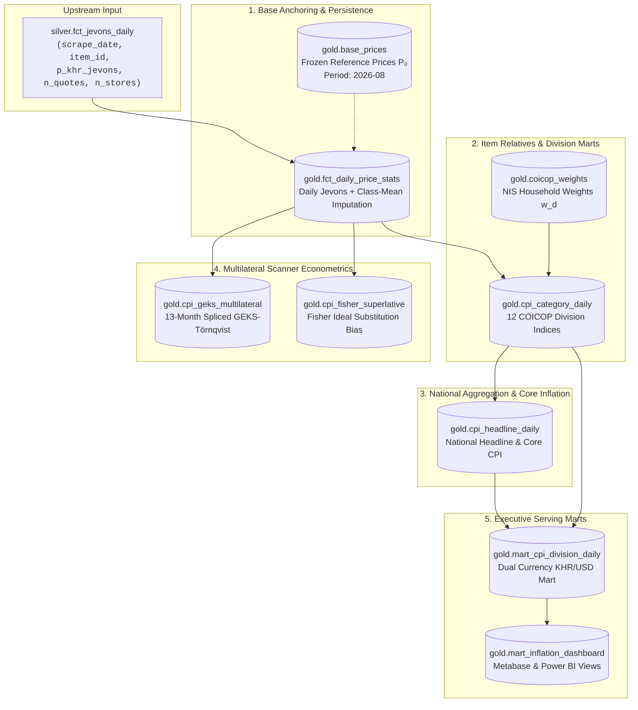
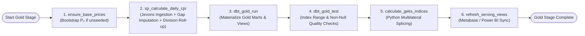

# Gold Layer Implementation Plan: Cambodia CPI Pipeline

**Document Version:** 1.0.0  
**Target Architecture:** Medallion Architecture (PostgreSQL 16 + dbt + Apache Airflow + Python Econometrics)  
**Upstream Prerequisite:** `silver.fct_jevons_daily` (Pure Elementary Unweighted Geometric Mean Prices)  
**Status:** **PLANNING ONLY — DO NOT IMPLEMENT YET**

---

## 1. Executive Summary & Objective

The **Gold Layer** serves as the **Official Economic Index and Policy Serving Layer** of the Cambodia CPI Pipeline. 

While the Silver Layer outputs cleaned, unweighted elementary geometric mean prices ($P_{\text{Jevons}, i, t}$) across multi-store observations, the Gold Layer transforms these micro-level prices into:
1. **Official Time-Series Indexes**: Base-anchored item price relatives, 12 COICOP division indices, and the National All-Items Headline CPI.
2. **Statistical Resilience**: Class-Mean Imputation for missing items ($\le 7$ days) adhering to ILO/IMF standards.
3. **Advanced E-Commerce Econometrics**: Rolling 13-month multilateral GEKS-Törnqvist (with Movement Splicing) and Superlative Fisher Ideal indices.
4. **BI & Policy Marts**: Optimized analytical models for Metabase, Power BI, and Ministry stakeholders.

---

## 2. End-to-End Gold Architecture Lineage



---

## 3. Detailed Implementation Phases

### Phase 1: Reference Period Anchoring (`gold.base_prices`)
* **Objective:** Anchor all canonical items to an official baseline price $P_0$ (e.g., August 2026 = 100.00).
* **Freeze Semantics (Idempotency):**
  * Base prices are generated **once** for the reference period (`BASE_PERIOD = '2026-08'`).
  * If rows already exist for the period, the bootstrap procedure skips execution to guarantee historical index stability.
* **Math Formulation:**
  $$P_{0, i} = \exp\left(\frac{1}{T_0} \sum_{t \in \text{Base Period}} \ln P_{\text{Jevons}, i, t}\right)$$

---

### Phase 2: Missing Price Imputation (`gold.fct_daily_price_stats`)
* **Objective:** Ensure daily index continuity when items are temporarily out-of-stock or unquoted ($n\_quotes = 0$).
* **Methodology (ILO Class-Mean Imputation):**
  * When item $i$ is missing on day $t$ (gap $\le 7$ days), impute its price movement using the geometric average rate of change of observed items in the same COICOP division $d$:
    $$\text{Movement Ratio}_{d, t} = \exp\left(\frac{1}{|S_{d, t}|} \sum_{j \in S_{d, t}} \ln\left(\frac{P_{\text{Jevons}, j, t}}{P_{\text{Jevons}, j, t-1}}\right)\right)$$
    $$P_{\text{Imputed}, i, t} = P_{i, t-1} \times \text{Movement Ratio}_{d, t}$$
* **Guardrails:**
  * Imputation ratio clamped to $[0.50, 2.00]$ to prevent outlier compounding.
  * Maximum carry forward: 7 consecutive days. After 7 days, item drops out until newly observed.

---

### Phase 3: Item Price Relatives & 12 COICOP Divisions (`gold.cpi_category_daily`)
* **Objective:** Measure item-level price changes against baseline and aggregate into 12 COICOP divisions.
* **Math Formulation:**
  1. **Item Price Relative:**
     $$R_{i, t} = \left(\frac{P_{\text{Jevons}, i, t}}{P_{0, i}}\right) \times 100$$
     *(Bounded to $[0.10, 10.0]$ ratio to eliminate scraper error spikes).*
  2. **Division Index (Modified Laspeyres / Geometric Aggregate):**
     $$I_{d, t} = \exp\left(\frac{1}{N_{d, t}} \sum_{i \in d} \ln(R_{i, t})\right)$$
* **COICOP Divisions Covered (12 NIS Divisions):**
  * `01`: Food and non-alcoholic beverages ($44.800\%$)
  * `02`: Alcoholic beverages and tobacco ($1.500\%$)
  * `03`: Clothing and footwear ($2.900\%$)
  * `04`: Housing, water, electricity, gas ($17.100\%$)
  * `05`: Furnishings & household equipment ($3.600\%$)
  * `06`: Health ($5.600\%$)
  * `07`: Transport ($8.100\%$)
  * `08`: Communication ($3.200\%$)
  * `09`: Recreation and culture ($1.900\%$)
  * `10`: Education ($2.200\%$)
  * `11`: Restaurants and hotels ($4.800\%$)
  * `12`: Miscellaneous goods and services ($4.300\%$)

---

### Phase 4: National Headline CPI & Core Inflation (`gold.cpi_headline_daily`)
* **Objective:** Compute national inflation metrics and division contribution breakdowns.
* **Formulas:**
  1. **All-Items Headline CPI:**
     $$\text{CPI}_{\text{Headline}, t} = \sum_{d=1}^{12} W_d \times I_{d, t} \quad \text{where } \sum W_d = 1.0$$
  2. **Core CPI (Ex-Food & Energy):**
     $$\text{CPI}_{\text{Core}, t} = \frac{\sum_{d \notin \{01, 04.5, 07.2\}} W_d \times I_{d, t}}{\sum_{d \notin \{01, 04.5, 07.2\}} W_d}$$
  3. **Inflation Rates:**
     * Day-on-Day ($\%\text{DoD}$): $\left(\frac{\text{CPI}_t}{\text{CPI}_{t-1}} - 1\right) \times 100$
     * Month-on-Month ($\%\text{MoM}$): $\left(\frac{\text{CPI}_t}{\text{CPI}_{t-\text{30d}}} - 1\right) \times 100$
     * Year-on-Year ($\%\text{YoY}$): $\left(\frac{\text{CPI}_t}{\text{CPI}_{t-\text{365d}}} - 1\right) \times 100$
  4. **Percentage Point Contribution:**
     $$\text{Contribution}_{d, t} = W_d \times (I_{d, t} - I_{d, t-1})$$

---

### Phase 5: Multilateral Scanner Econometrics (GEKS & Fisher)
* **Objective:** Address product churn and substitution bias inherent in daily web-scraped data.
* **Models:**
  * **Multilateral GEKS-Törnqvist (`gold.cpi_geks_multilateral`):**
    * 13-month rolling window with Movement Splicing / Half-Splice.
    * Ensures transitivity: $I_{j, k} \times I_{k, l} = I_{j, l}$ (eliminates chain drift).
  * **Superlative Fisher Ideal Index (`gold.cpi_fisher_superlative`):**
    * Geometric mean of Laspeyres and Paasche indices: $I_{\text{Fisher}} = \sqrt{I_{\text{Laspeyres}} \times I_{\text{Paasche}}}$.
    * Quantifies substitution bias: $\text{Bias}_t = I_{\text{Laspeyres}, t} - I_{\text{Fisher}, t}$.

---

### Phase 6: Dual Currency Serving Marts (`gold.mart_cpi_division_daily`)
* **Objective:** Enable multi-currency analysis (KHR and USD) using daily MEF FX rates.
* **Metrics:**
  * KHR Index ($I_{\text{KHR}}$) and USD Index:
    $$I_{\text{USD}, t} = I_{\text{KHR}, t} \times \left(\frac{\text{Rate}_{\text{Base}}}{\text{Rate}_t}\right)$$
  * Active tracked item counts per division.
  * Store presence count and promotion share percentage ($\%\text{ items on discount}$).

---

## 4. Proposed Database Schema (Target Tables)

```sql
-- 1. Base Prices
CREATE TABLE IF NOT EXISTS gold.base_prices (
    base_period VARCHAR(7) NOT NULL,
    product_key UUID NOT NULL,
    coicop_division VARCHAR(16) NOT NULL,
    base_price_khr NUMERIC(14, 2) NOT NULL,
    n_observations INT NOT NULL,
    frozen_at TIMESTAMPTZ NOT NULL DEFAULT NOW(),
    PRIMARY KEY (base_period, product_key)
);

-- 2. Daily Price Stats & Imputations
CREATE TABLE IF NOT EXISTS gold.fct_daily_price_stats (
    scrape_date DATE NOT NULL,
    item_id UUID NOT NULL,
    coicop_division VARCHAR(16) NOT NULL,
    p_khr_jevons NUMERIC(14, 2) NOT NULL,
    p_khr_unit NUMERIC(14, 2),
    n_quotes INT NOT NULL,
    n_stores INT NOT NULL,
    is_imputed BOOLEAN NOT NULL DEFAULT FALSE,
    gap_days INT NOT NULL DEFAULT 0,
    PRIMARY KEY (scrape_date, item_id)
);

-- 3. Daily Category / Division Index
CREATE TABLE IF NOT EXISTS gold.cpi_category_daily (
    scrape_date DATE NOT NULL,
    coicop_division VARCHAR(16) NOT NULL,
    index_value NUMERIC(10, 4) NOT NULL,
    base_period VARCHAR(7) NOT NULL,
    n_items INT NOT NULL,
    weight_pct NUMERIC(6, 3) NOT NULL,
    PRIMARY KEY (scrape_date, coicop_division)
);

-- 4. National Headline & Core CPI
CREATE TABLE IF NOT EXISTS gold.cpi_headline_daily (
    scrape_date DATE PRIMARY KEY,
    cpi_headline_khr NUMERIC(10, 4) NOT NULL,
    cpi_headline_usd NUMERIC(10, 4) NOT NULL,
    cpi_core_khr NUMERIC(10, 4) NOT NULL,
    dod_change_pct NUMERIC(6, 3),
    mom_change_pct NUMERIC(6, 3),
    yoy_change_pct NUMERIC(6, 3),
    fx_rate_khr_usd NUMERIC(10, 2) NOT NULL,
    calculated_at TIMESTAMPTZ NOT NULL DEFAULT NOW()
);

-- 5. Multilateral GEKS Time Series
CREATE TABLE IF NOT EXISTS gold.cpi_geks_multilateral (
    scrape_date DATE NOT NULL,
    coicop_division VARCHAR(16) NOT NULL,
    geks_index NUMERIC(10, 4) NOT NULL,
    window_length_months INT NOT NULL DEFAULT 13,
    splice_method VARCHAR(32) NOT NULL DEFAULT 'movement_splice',
    calculated_at TIMESTAMPTZ NOT NULL DEFAULT NOW(),
    PRIMARY KEY (scrape_date, coicop_division)
);
```

---

## 5. Proposed Airflow Orchestration DAG (`gold_dag`)

When ready to implement, the execution graph within `orchestration/dags/gold_dag.py` will follow this sequential pipeline:



---

## 6. Verification & Quality Gates Checklist

Prior to activating the Gold Layer in production, the following criteria must pass:
* [ ] **Base Price Coverage**: $\ge 80\%$ of active items in Silver have verified baseline prices in `gold.base_prices`.
* [ ] **Weight Sum Integrity**: Total COICOP division weights strictly equal $100.000\%$.
* [ ] **Bound Validation**: All division indices satisfy $50.0 \le I_{d, t} \le 200.0$ (no negative or runaway indices).
* [ ] **Imputation Limit Test**: No item is carried forward via imputation for $>7$ days.
* [ ] **Idempotent Re-runs**: Running Gold twice for the same date produces bit-for-bit identical index outputs.
