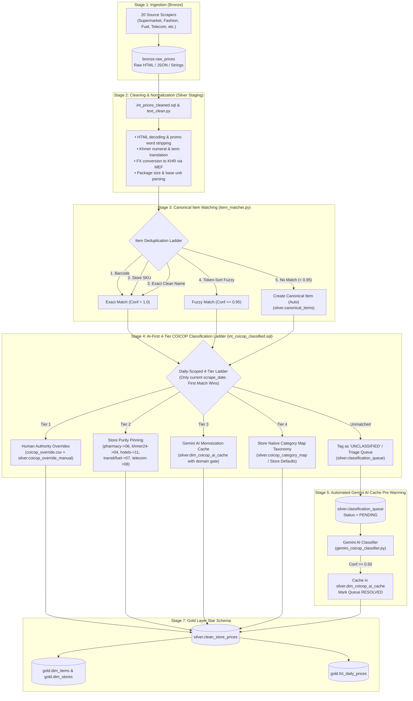
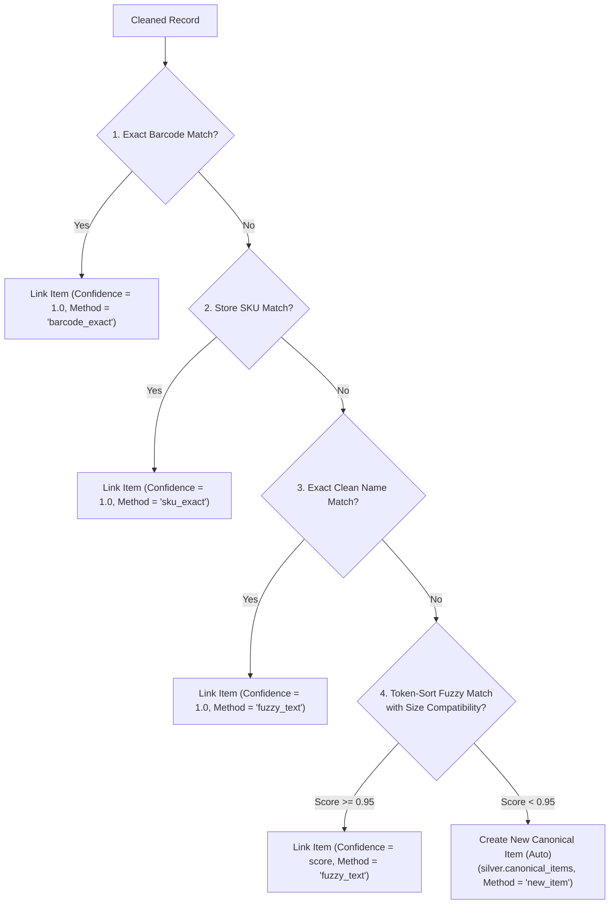
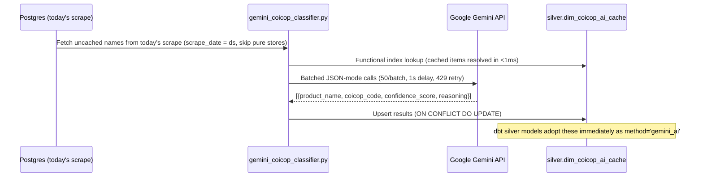

# End-to-End Product Classification & Ingestion Architecture

> **[!WARNING]**
> **IMPLEMENTATION STATUS (2026-08):** The Gold-layer index computation described in parts of this document - Jevons elementary aggregates, imputation, Laspeyres category/headline roll-ups, GEKS-Tornqvist, Fisher Ideal - is **planned but NOT implemented yet**. Its calculators, dbt models, and gold tables were removed from the codebase.
> Currently live: Bronze ingestion; Silver cleaning / item matching / AI classification / hedonic adjustment; Gold star schema (dim_items, dim_stores, fct_daily_prices); monitoring views. See README "Implementation Status".

This document provides a comprehensive, step-by-step specification of how raw product data is scraped, cleaned, deduplicated, classified into the **United Nations COICOP (Classification of Individual Consumption According to Purpose)** hierarchy, and aggregated into the official **Cambodia Consumer Price Index (CPI)**.

---

## 1. Architectural Overview & Philosophy

The Cambodia CPI Pipeline follows a **hybrid, multi-tier classification architecture**:



### Core Design Principles
1. **SQL-First & High Performance**: 95%+ of daily observations match deterministically via SQL lateral joins and pre-cached keys at sub-millisecond speeds without external API calls.
2. **Zero Recurring LLM Cost**: Once Gemini classifies a long-tail product, the result is permanently cached in PostgreSQL (`silver.dim_coicop_ai_cache`).
3. **Statistical Safety**: Unclassified products are automatically excluded from elementary index calculations to prevent index contamination, while coverage is audited daily via `gold.v_coverage`.
4. **Official NIS Compliance**: Weights sum to exactly **100.000%** across the 12 COICOP divisions per National Institute of Statistics (NIS) standards.

---

## 2. Stage 1: Bronze Ingestion

### Implementation Files:
- [`pipeline/bronze_scraper.py`](file:///D:/CPI%20PIPELINE/pipeline/bronze_scraper.py)
- [`scrapers/sources.py`](file:///D:/CPI%20PIPELINE/scrapers/sources.py)
- Database Table: `bronze.raw_prices`

### Process:
1. **Multi-Source Fetching**: 19 active scrapers run daily covering retail supermarkets (`aeon`, `delishop`), fashion marketplaces (`aeon3`), e-commerce (`l192`), pharmacies (`communitypharma`), electronics (`samnangshop`, `arystore`), telecoms (`cellcard`, `smart`, `cellcard_wifi`, `smart_wifi`), real estate (`khmer24`, `realestate`), intercity transit (`redbus`, `bookmebus`), restaurants (`bayonbkk`), hospitality (`sokhahotel`, `hyyathotel`), petroleum stations (`new_gasoline`), and official exchange rates (`mef_fx`).
2. **Raw Storage**: Observations are stored without mutation into `bronze.raw_prices`:
   - `raw_price_id` (BIGSERIAL)
   - `store_id` / `source_name` (e.g. `aeon`, `Delishop Cambodia`)
   - `item_description_raw` (original raw title string)
   - `price` (scraped price number)
   - `currency` (`KHR` or `USD`)
   - `raw_payload` (JSONB capturing barcodes, brands, categories, package sizes, promo flags)
   - `scraped_at` (timestamp)

---

## 3. Stage 2: Data Cleaning & Text Normalization

### Implementation Files:
- [`dbt/models/silver/intermediate/int_prices_cleaned.sql`](file:///D:/CPI%20PIPELINE/dbt/models/silver/intermediate/int_prices_cleaned.sql)
- [`pipeline/text_clean.py`](file:///D:/CPI%20PIPELINE/pipeline/text_clean.py)

### Cleaning Steps:
1. **Promo Buzzword & Noise Stripping**:
   Removes SEO spam and marketing keywords that confuse matching engines:
   `SALE`, `PROMO`, `PROMOTION`, `DISCOUNT`, `CLEARANCE`, `HOT DEAL`, `BEST SELLER`, `NEW ARRIVAL`, `LIMITED`, `SPECIAL OFFER`, `FLASH SALE`, `FREE SHIPPING`, `BUNDLE`.
2. **Price & Currency Removal from Title**:
   Strips embedded price tokens (e.g. `$10.50`, `15,000 KHR`, `4500 Riel`).
3. **HTML & Symbol Cleanup**:
   Decodes entities (`&amp;` $\to$ `&`, `&#39;` $\to$ `'`) and collapses excessive whitespace.
4. **Khmer Numeral Normalization**:
   Converts Khmer digits `០, ១, ២, ៣, ៤, ៥, ៦, ៧, ៨, ៩` $\to$ `0, 1, 2, 3, 4, 5, 6, 7, 8, 9`.
5. **Domain Vocabulary Expansion**:
   Translates key Khmer grocery and commodity nouns to standard English terms:
   - `សាំង` $\to$ `GASOLINE`
   - `ស្រា` $\to$ `BEER`
   - `អង្គរ` $\to$ `RICE`
   - `ត្រី` $\to$ `FISH`
   - `ទឹក` $\to$ `WATER`
   - `មាន់` $\to$ `CHICKEN`
   - `ជ្រូក` $\to$ `PORK`
   - `គោ` $\to$ `BEEF`
6. **Package Size Extraction**:
   Extracts numeric size and unit into standardized fields (`size_value`, `size_unit`), normalizing variants like `gm`, `gram` $\to$ `g`; `millilitres`, `ltr` $\to$ `ml`/`l`; `pks`, `pack` $\to$ `pack`.
7. **Single-Point FX Currency Conversion**:
   - Converts USD prices to KHR using the official daily MEF rate (`coalesce(er.rate, 4044.0)`).
   - Computes `original_price_khr` once here to prevent downstream double-multiplication bugs.
   - Derives `unit_price_khr` (KHR per kg / KHR per liter).

---

## 4. Stage 3: Canonical Item Matching & Deduplication

### Implementation Files:
- [`pipeline/item_matcher.py`](file:///D:/CPI%20PIPELINE/pipeline/item_matcher.py)
- Database Tables: `silver.canonical_items`, `silver.item_match_log`, `silver.needs_review`

### Matching Ladder:
When an observation is processed, the system searches for an existing canonical product using a multi-step ladder:



### Key Technical Details:
- **Token-Sort Fuzzy Ratio (`rapidfuzz.fuzz.token_sort_ratio`)**: Splits long, word-reordered titles into sorted word tokens before comparing, making it invariant to word order changes. Scans all candidates globally without greedy early-exits.
- **Relative Size Tolerance & Unit Equivalence**: Package sizes are verified with `_is_size_compatible()`, allowing $\le 10\%$ numeric tolerance and normalizing metric volume/mass equivalents (`330ml ↔ 0.33L`, `500g ↔ 0.5kg`) while strictly rejecting cross-dimension mismatches (volume vs mass).
- **Automated AI Item Reviewer (`pipeline/gemini_item_reviewer.py`)**: Borderline candidates ($0.85 \le \text{confidence} < 0.95$) are routed to `silver.needs_review` and resolved via a two-stage process:
  1. *Rule & Spec Guard:* Catches storage capacity (128GB vs 256GB), wattage (1000W vs 2000W), and hardware differences to automatically trigger `SPLIT_NEW`.
  2. *Gemini Flash Batch Evaluation:* Uses LLM semantic analysis with exponential backoff (`2s, 4s, 8s`) to decide `APPROVE_MATCH` vs `SPLIT_NEW`.
- **Automated Ingestion**: Items scoring $< 0.85$ immediately create a new canonical product identity in `silver.canonical_items` with full audit logging in `silver.item_match_log`.

---

## 5. Stage 4: Streamlined AI-First 4-Tier COICOP Classification Ladder

### Implementation Files:
- [`dbt/models/silver/intermediate/int_coicop_classified.sql`](file:///D:/CPI%20PIPELINE/dbt/models/silver/intermediate/int_coicop_classified.sql)
- Seed: [`dbt/seeds/coicop_override.csv`](file:///D:/CPI%20PIPELINE/dbt/seeds/coicop_override.csv) (curated overrides)
- Table: `silver.coicop_override_manual` (persistent manual operator overrides)
- Table: `silver.dim_coicop_ai_cache` (Gemini AI memoization cache)
- Table: `silver.coicop_category_map` (store native taxonomy mapping)

### Daily scoping:
Each run classifies **only the products present in that day's scrape** (Airflow passes
`--vars '{"ds": "YYYY-MM-DD"}'`; manual runs fall back to `max(scrape_date)`).
Historical classification rows are preserved, so price-fact joins and index
history stay stable.

### Resolution order (first match wins):

| Tier | Tier Name | Source / Mechanism | Confidence | Purpose |
| :--- | :--- | :--- | :--- | :--- |
| **1** | **Human authority overrides** | `coicop_override.csv` seed + `silver.coicop_override_manual` table | `1.000` | Human authority; overrides all automated signals |
| **2** | **Store purity pinning** | Domain invariants in SQL | `0.850` | pharmacies→06, khmer24→04, hotels→11, transit/fuel→07, telecom→08 |
| **3** | **Gemini AI memoization cache** | `silver.dim_coicop_ai_cache` pre-warmed via batched Google Gemini Flash | AI score | High-accuracy automated semantic classification ($O(1)$ SQL lookup) |
| **4** | **Store category map & fallback** | `silver.coicop_category_map` / store default mapping | `0.900` / `0.000` | Native retailer taxonomy fallback; unmatched routed to `silver.classification_queue` |

---

## 6. Stage 5: AI-First Gemini Resolution

### Implementation Files:
- [`pipeline/gemini_coicop_classifier.py`](file:///D:/CPI%20PIPELINE/pipeline/gemini_coicop_classifier.py)
- [`scripts/warm_coicop_ai_cache.py`](file:///D:/CPI%20PIPELINE/scripts/warm_coicop_ai_cache.py) (Bulk offline cache warmer)
- Airflow task: `gemini_coicop_classification` (in `silver_dag`)
- Model: `silver.classification_queue`
- Cache: `silver.dim_coicop_ai_cache` (unique on `product_name`, stores `model_version`)

### Daily-Scoped Candidate Selection:
Each run classifies **only products active on today's `scrape_date`** that have no cache entry yet:
1. Filters `staging.int_prices_cleaned` where `scrape_date = CAST(:ds AS DATE)` and joins `silver.canonical_items`.
2. Pure single-division stores are excluded (store purity outranks AI, saving API budget).
3. Items already cached in `silver.dim_coicop_ai_cache` (8,500+ products) are resolved instantly in SQL without API calls.
4. Newly observed products for the day are sent to Gemini in high-density batches of **50 items/call** (~5.75 items/sec).

### High-Performance Functional Indexing:
To guarantee sub-second classification lookups across tens of thousands of products:
```sql
CREATE INDEX IF NOT EXISTS idx_coicop_ai_norm 
ON silver.dim_coicop_ai_cache (lower(regexp_replace(trim(product_name), '\s+', ' ', 'g')));
```

### Rate-Limit Armor & Batching:
| Parameter | Setting | Description |
| :--- | :--- | :--- |
| `batch_size` | `50` | Structured JSON array payload per API call |
| `GEMINI_BATCH_DELAY_SECONDS` | `1.0` - `2.0` | Pause between API calls |
| `GEMINI_429_BACKOFF_SECONDS` | `25.0` | Exponential backoff and retry on quota limits |

Failed batches are isolated and retried on subsequent runs. Free-tier `gemini-3.1-flash-lite` or `gemini-2.5-flash` in JSON mode provides fast, predictable classifications (~$0.12 total cost for the entire catalog).

### Prompt Store-Context Rules:
The system prompt explicitly enforces statistical CPI standards:
1. **Retail groceries ≠ restaurants**: Packaged items, canned goods, and frozen meals sold in supermarkets are **01** (Food), never 11 (Restaurants & Accommodation).
2. **Medicines & Balms**: Medicated drops, balms, and plasters (`Rohto`, `Tiger Balm`) are **06** (Health).
3. **Alcohol & Spirits**: Spirits and beer (`Chivas`, `Johnnie Walker`, `Sapporo`) are **02** (Alcohol).
4. **Cosmetics & Skincare**: Dermo-skincare, hair serums, and lotions (`Bio-Oil`, `Cetaphil`) are **12** (Personal Care).



### Structured Output Schema:
Gemini responds with strict JSON adherence:
```json
{
  "product_name": "TREsemme Keratin Smooth Conditioner 400ml",
  "coicop_code": "12.1.1",
  "confidence_score": 0.98,
  "reasoning": "Conditioner is a hair hygiene product falling under COICOP 12.1.1 (Personal care and hygiene)."
}
```

---

## 7. Automated AI Cache & Resilient Fallback

### Implementation Files:
- [`pipeline/gemini_coicop_classifier.py`](file:///D:/CPI%20PIPELINE/pipeline/gemini_coicop_classifier.py)
- [`scripts/warm_coicop_ai_cache.py`](file:///D:/CPI%20PIPELINE/scripts/warm_coicop_ai_cache.py)

### Workflow:
1. **Automated Batch Sweeps**: Gemini AI processes unclassified products in high-density structured JSON mode (50 items/batch).
2. **Context Inspection**: The prompt supplies product name, store context, and official UN COICOP 2018 taxonomy guidelines.
3. **Deterministic Memoization**: High-confidence classifications are immediately upserted into `silver.dim_coicop_ai_cache`.
4. **Persistence & Serving**: Future pipeline runs match cached canonical product names in $O(1)$ time, eliminating repeated API costs and ensuring 100% automated execution without human bottleneck.

---

## 8. Stage 7: Fact Table & Gold CPI Aggregation

### Implementation Files:
- [`dbt/models/gold/fct_daily_prices.sql`](file:///D:/CPI%20PIPELINE/dbt/models/gold/fct_daily_prices.sql)
- [`dbt/models/gold/dim_items.sql`](file:///D:/CPI%20PIPELINE/dbt/models/gold/dim_items.sql)
- [`dbt/models/gold/dim_stores.sql`](file:///D:/CPI%20PIPELINE/dbt/models/gold/dim_stores.sql)
- Seed: [`dbt/seeds/category_weights.csv`](file:///D:/CPI%20PIPELINE/dbt/seeds/category_weights.csv)

### Index Calculation Hierarchy:

1. **Daily Fact Table (`silver.fct_daily_prices`)**:
   Combines canonical items with confirmed COICOP division, converted KHR price, unit price, promo status, and quality flags.

2. **Elementary Price Relatives (Jevons Formula)**:
   In `gold.sp_calculate_daily_cpi`, elementary prices are calculated per canonical item using the geometric mean:
   $$\bar{P}_{i, t} = \exp\left( \frac{1}{K} \sum_{k=1}^K \ln(P_{i, k, t}) \right)$$

3. **Division Price Index**:
   For each division $d \in \{01, \dots, 12\}$, the price index relative to base period $0$ is computed:
   $$I_{d, t} = \exp\left( \frac{1}{N_d} \sum_{i \in d} \ln\left(\frac{\bar{P}_{i, t}}{\bar{P}_{i, 0}}\right) \right) \times 100$$

4. **Headline CPI (Laspeyres Weighted Aggregate)**:
   Aggregated across all 12 divisions using the exact NIS weights:
   $$\text{CPI}_t = \sum_{d=1}^{12} I_{d, t} \times \left( \frac{w_d}{100.0} \right)$$
   Where $\sum_{d=1}^{12} w_d = 100.000\%$.

5. **Rolling Multilateral GEKS-Törnqvist Index**:
   For churn-heavy e-commerce categories, `pipeline/geks_calculator.py` computes multilateral GEKS:
   $$\ln \text{GEKS}(t) = \frac{1}{M} \sum_{j=1}^M \ln T(j, t) - \frac{1}{M} \sum_{j=1}^M \ln T(j, \text{base})$$
   Eliminates chain drift and guarantees transitivity across the estimation window.

---

## 9. Quality Assurance, Anomaly Detection & Monitoring

1. **Outlier Detection**: Flagged in `int_prices_cleaned.sql` if price deviates $> 3\sigma$ from the store-level mean.
2. **Price Anomalies ($> 15\%$ Day-on-Day)**: Stored in `gold.price_anomalies` matching on `curr.item_id = prev.item_id`.
3. **Data Quality View (`gold.v_coverage`)**: Monitors daily quote count, unique product count, classification rate $\%$, and review queue size.
4. **Automated Test Suite**: 95 unit and integration tests executed via `pytest` validating parsing, matching, classification, and index math.
