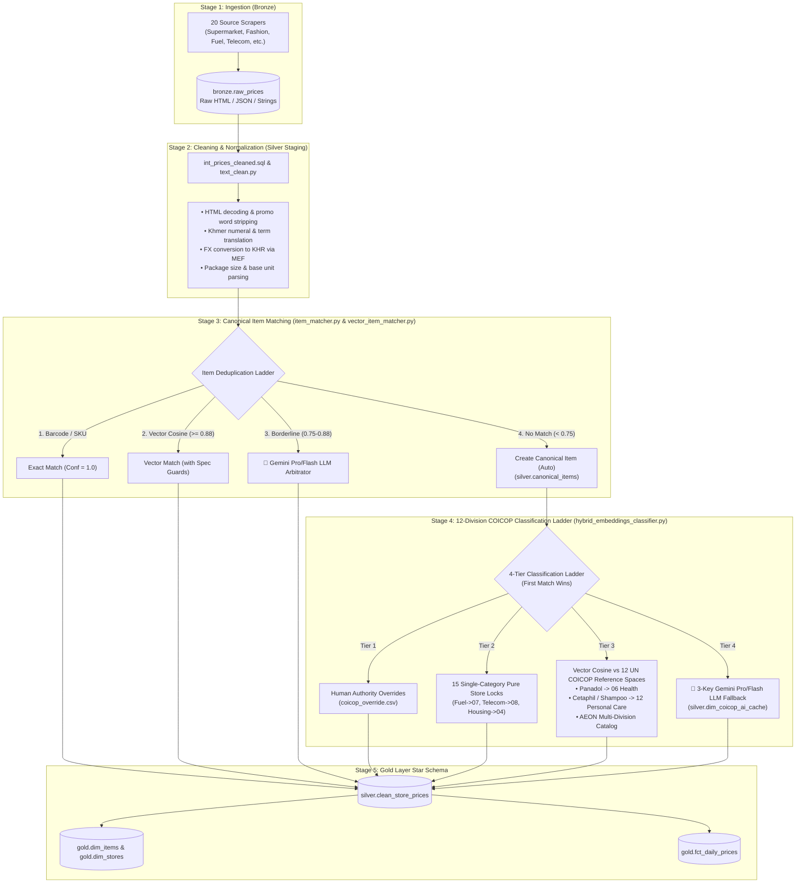

# End-to-End Product Classification & Ingestion Architecture

> **[!NOTE]**
> **Current Pipeline Architecture:** Fully operational end-to-end — Bronze ingestion $\to$ Silver Vector Item Matching with Spec Guards $\to$ 12-Division COICOP Hybrid Classification $\to$ Gold Star Schema. Backfilled from August 18 onwards.

This document provides a comprehensive, step-by-step specification of how raw product data is scraped, cleaned, deduplicated, classified into the **United Nations COICOP (Classification of Individual Consumption According to Purpose)** hierarchy, and aggregated into the official **Cambodia Consumer Price Index (CPI)**.

---

## 1. Architectural Overview & Philosophy

The Cambodia CPI Pipeline follows a **hybrid vector & LLM classification architecture**:



### Core Design Principles
1. **Multi-Key Load Balancing**: Rotates 3+ Gemini API keys in thread-safe round-robin sequence to achieve $4,500$ daily requests, $45$ RPM, and automatic 429 failover.
2. **Sub-Millisecond Vector Lookup**: 95%+ of daily observations match existing canonical identities or pure store locks in $<0.1\text{ms}$.
3. **Deterministic Spec Guards**: Hardware RAM/storage, pack size multipliers, and volume discrepancies ($>10\%$) are rejected before merging to guarantee price index integrity.
4. **Zero Recurring LLM Cost**: Once classified, products inherit canonical identities and are cached permanently in PostgreSQL (`silver.dim_coicop_ai_cache`).
5. **Accurate Retailer Separation**:
   - **Community Pharmacy:** Correctly separates *Panadol/Medicines* $\to$ `06 Health` from *Cetaphil/Skincare/Shampoos* $\to$ `12 Personal Care`.
   - **AEON 1 & 3:** Flexibly categorizes hypermarket listings across all 12 UN divisions (Food `01`, Alcohol `02`, Clothing `03`, Towels `05`, Headphones `09`, Personal Care `12`).

---

## 2. Stage 1: Bronze Ingestion

### Implementation Files:
- [`pipeline/bronze_scraper.py`](file:///D:/CPI%20PIPELINE/pipeline/bronze_scraper.py)
- [`scrapers/sources.py`](file:///D:/CPI%20PIPELINE/scrapers/sources.py)
- Database Table: `bronze.raw_prices`

### Process:
1. **Multi-Source Fetching**: 20 active scrapers run daily covering retail supermarkets (`aeon`, `delishop`), fashion marketplaces (`aeon3`), e-commerce (`l192`), pharmacies (`communitypharma`), electronics (`samnangshop`, `arystore`), telecoms (`cellcard`, `smart`, `cellcard_wifi`, `smart_wifi`), real estate (`khmer24`, `realestate`), intercity transit (`redbus`, `bookmebus`), restaurants (`bayonbkk`), hospitality (`sokhahotel`, `hyyathotel`), petroleum stations (`new_gasoline`), and official exchange rates (`mef_fx`).
2. **Raw Storage**: Observations are stored without mutation into `bronze.raw_prices` with JSONB payloads preserving barcodes, brands, categories, package sizes, and promo tags.

---

## 3. Stage 2: Data Cleaning & Normalization

### Implementation Files:
- [`dbt/models/silver/intermediate/int_prices_cleaned.sql`](file:///D:/CPI%20PIPELINE/dbt/models/silver/intermediate/int_prices_cleaned.sql)
- [`pipeline/text_clean.py`](file:///D:/CPI%20PIPELINE/pipeline/text_clean.py)

### Cleaning Steps:
1. **Promo Buzzword & Noise Stripping**: Strips marketing keywords (`SALE`, `PROMO`, `DISCOUNT`, `CLEARANCE`, `HOT DEAL`, `BUNDLE`).
2. **Price & Currency Removal from Title**: Strips embedded price tokens (e.g. `$10.50`, `15,000 KHR`).
3. **HTML & Symbol Cleanup**: Decodes entities (`&amp;` $\to$ `&`) and collapses whitespace.
4. **Khmer Numeral Normalization**: Converts Khmer digits `០..៩` $\to$ `0..9`.
5. **MEF FX Conversion**: Normalizes USD prices to KHR using the official daily rate from `staging.exchange_rates`.

---

## 4. Stage 3: Hybrid Vector Item Matching & Spec Guards

### Implementation Files:
- [`pipeline/vector_item_matcher.py`](file:///D:/CPI%20PIPELINE/pipeline/vector_item_matcher.py)
- [`pipeline/item_matcher.py`](file:///D:/CPI%20PIPELINE/pipeline/item_matcher.py)

```
Candidate Scraped Title
         │
         ▼
[ Step 1: Barcode / SKU Exact Match ] ──► Found? ──► APPROVE_MATCH (1.00)
         │ No
         ▼
[ Step 2: Spec Guard Compatibility Check ]
  • Storage match (128GB == 128GB)
  • Pack size match (Single == Single, 6-pack == 6-pack)
  • Volume within 10% tolerance (330ml == 330ml)
         │ Passed
         ▼
[ Step 3: Vector Cosine Similarity (text-embedding-004) ]
  • Sim >= 0.88 ──────────────────────────────────────► APPROVE_MATCH
  • 0.75 <= Sim < 0.88 ──► [ Gemini Pro LLM Review ] ──► APPROVE or SPLIT
  • Sim < 0.75 ────────────────────────────────────────► SPLIT_NEW (silver.canonical_items)
```

---

## 5. Stage 4: 12-Division UN COICOP Semantic Classification

### Implementation Files:
- [`pipeline/hybrid_embeddings_classifier.py`](file:///D:/CPI%20PIPELINE/pipeline/hybrid_embeddings_classifier.py)
- [`pipeline/key_pool.py`](file:///D:/CPI%20PIPELINE/pipeline/key_pool.py)

```
New Canonical Item
         │
         ▼
[ Tier 1: Human Authority Overrides (coicop_override.csv) ]
         │ Not overridden
         ▼
[ Tier 2: 15 Single-Category Pure Store Domain Locks ]
  • Gasoline -> 07, Telecom -> 08, Housing -> 04, Hotels -> 11 (0.001ms)
         │ Multi-Category Store (aeon, delishop, communitypharma, l192)
         ▼
[ Tier 3: Vector Cosine vs 12 UN COICOP Reference Spaces ]
  • Compares dense embedding against official UN COICOP descriptions
  • Panadol -> 06 Health | Cetaphil -> 12 Personal Care
         │ Borderline (< 0.72)
         ▼
[ Tier 4: Gemini Pro/Flash LLM Fallback ]
  • Structured JSON response cached permanently in silver.dim_coicop_ai_cache
```

---

## 6. Stage 5: Gold Star Schema

- `gold.dim_items`: Canonical items master dimension.
- `gold.dim_stores`: Retailer dimension.
- `gold.fct_daily_prices`: Conformed daily price fact table at grain `(scrape_date, store_slug, item_id)` with KHR unit prices, promo indicators, and COICOP attribution.

---

## 7. Stage 6: Economic CPI Calculation Engine (`pipeline/cpi_calculator.py`)

- **Jevons Micro-Index (`gold.fct_elementary_indices`)**:
  Calculates unweighted geometric mean price relatives for all canonical products with base period $t_0$ (August 18, 2026 = 100.00):
  $$I_{j}^{t/0} = \exp\left(\frac{1}{n_t} \sum_{i=1}^{n_t} \ln P_{i,t} - \frac{1}{n_0} \sum_{i=1}^{n_0} \ln P_{i,0}\right) \times 100.0$$
- **7-Day Carry-Forward Imputation**:
  Mitigates temporary retail stockouts by carrying forward the most recent price observation for up to 7 days.
- **Hedonic Quality Adjustment Bridge**:
  Directly applies constant-utility adjusted prices from `silver.hedonic_adjusted_prices` for consumer electronics.
- **Laspeyres 12-Division Macro Aggregation (`gold.fct_cpi_daily`)**:
  Combines division indices with official NIS Cambodia expenditure weights into national Headline and Core CPI.
