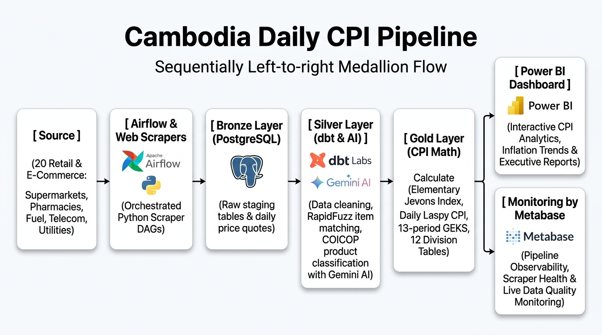

# Silver Layer Design — Store-Level Cleaned Tables for CPI

> **[!WARNING]**
> **IMPLEMENTATION STATUS (2026-08):** The Gold-layer index computation described in parts of this document - Jevons elementary aggregates, imputation, Laspeyres category/headline roll-ups, GEKS-Tornqvist, Fisher Ideal - is **planned but NOT implemented yet**. Its calculators, dbt models, and gold tables were removed from the codebase.
> Currently live: Bronze ingestion; Silver cleaning / item matching / AI classification / hedonic adjustment; Gold star schema (dim_items, dim_stores, fct_daily_prices); monitoring views. See README "Implementation Status".

**Status:** ✅ Active — 1 Store 1 Table Cleaned Model in PostgreSQL 16 (`cpi_db`)  
**Schema:** `silver.*` (Clean Store Tables & System Control) + `staging.*` (Intermediate Transformations) + `gold.*` (Conformed Star Schema & Marts)



---

## 1. Core Architectural Principle

The Medallion architecture strictly separates store-level observation data hygiene (Silver) from conformed multidimensional star schema analytics (Gold):
- **Silver Layer (Clean Store Prices & Resolution):** Preserves source grain and isolation. Scraped prices are parsed, currency-converted to KHR, promo-clamped, outlier-tagged, unit-standardized, and classified into standardized clean store observations (`silver.clean_store_prices`).
- **Gold Layer (Conformed Star Schema & Marts):** Houses the conformed dimensional model (`gold.dim_items`, `gold.dim_stores`, `gold.fct_daily_prices`), monitoring views, and planned downstream CPI index calculation engines.

```
┌─────────────────────────────────────────────────────────────────────────────┐
│                             SILVER ARCHITECTURE                             │
├───────────────────────────────┬─────────────────────────────────────────────┤
│ 1. SYSTEM & OPERATIONAL       │ 2. CLEAN STORE-LEVEL PRICE TABLES           │
│    (Audit & Control Tables)   │    (Clean Store Quotes & Observations)      │
├───────────────────────────────┼─────────────────────────────────────────────┤
│ • silver.canonical_items      │ ──► silver.clean_store_prices               │
│ • silver.item_match_log       │     (Per-store clean quotes & observations) │
│ • silver.dim_coicop_ai_cache  │                                             │
│ • silver.classification_queue │ ──► Feeds Gold Star Schema (gold.*)         │
│ • silver.needs_review         │                                             │
│ • silver.hedonic_adjusted_    │                                             │
│   prices                      │                                             │
├───────────────────────────────┴─────────────────────────────────────────────┤
│ 3. INTERMEDIATE TRANSFORMATIONS (Built in staging schema)                    │
│ • staging.int_prices_cleaned (USD->KHR, promo clamping, unit standardization)│
│ • staging.int_coicop_classified (4-tier AI-first COICOP classification ladder)│
└─────────────────────────────────────────────────────────────────────────────┘
```

---

## 2. Silver Layer Clean Price Tables

### `silver.clean_store_prices`
Unified clean daily store price observations table:
- Preserves raw observation granularity (`raw_price_id`, `store_slug`, `scrape_date`, `item_id`).
- Standardized KHR pricing via official daily MEF exchange rates.
- Promotion indicators (`discount_pct`, `on_promo`), standardized package units (`size_value`, `size_unit`, `unit_price_khr`), and quality flags (`is_outlier`, `cpi_eligible`).
- Assigned COICOP division (`coicop_division`, `coicop_code`, `coicop_method`, `coicop_confidence`).

---

## 3. Gold Layer: Conformed Star Schema (Downstream)

The star schema is materialized in the **Gold layer** (`gold.*`) for business intelligence, operational monitoring, and downstream index aggregation:
- `gold.dim_items`: Canonical product master dimension across all retailers.
- `gold.dim_stores`: Curated store dimension for Cambodian retailers and utility providers.
- `gold.fct_daily_prices`: Conformed daily price fact table at `(scrape_date, store_slug, item_id)` grain.
- *(Planned / Deferred)*: CPI calculation marts (Jevons elementary indices, headline Laspeyres index, multilateral GEKS).

---

## 4. System & Operational Tables

These tables manage entity matching, AI memoization, and automated AI classification caches:

### `silver.canonical_items`
Deterministic UUID canonical identity master maintained automatically by `pipeline/item_matcher.py`. Indexed with a PostgreSQL `pg_trgm` Generalized Inverted Index (`idx_canonical_name_trgm`) for sub-millisecond trigram candidate filtering. Unmatched items ($\text{score} < 0.95$) automatically create new canonical items.

### `silver.item_match_log`
Full audit trail mapping `raw_price_id` $\to$ `item_id` with match method (`barcode_exact`, `sku_exact`, `fuzzy_text`, `new_item`) and confidence score ($0.000$–$1.000$). Fully automated with zero manual intervention.

### `silver.dim_coicop_ai_cache`
Persistent memoization cache for Gemini AI classifications (`gemini-3.1-flash-lite` / `gemini-2.5-flash`). Prevents duplicate LLM API calls across daily runs.

### `silver.needs_review`
Dedicated table for borderline fuzzy item match candidates ($0.85 \le \text{confidence} < 0.95$). Auto-reviewed by `pipeline/gemini_item_reviewer.py` via a two-stage process:
1. **Rule & Spec Guard:** Checks hardware/spec conflicts (Storage GB, Wattage, mAh, Screen size, Camera MP, 5G support, pack size) to deterministically reject (`SPLIT_NEW`) false merges.
2. **Gemini AI Batch Evaluation:** Resolves ambiguous variants (`APPROVE_MATCH` vs `SPLIT_NEW`) with exponential backoff and updates `silver.item_match_log`.
Guarded by a PostgreSQL `UNIQUE (raw_price_id)` constraint to prevent duplicate review entries during Airflow retries.

### `silver.hedonic_adjusted_prices`
Stores quality-adjusted constant-specification prices for Division 08 and 09 electronics. Evaluates multi-attribute characteristics (`ram_gb`, `storage_gb`, `screen_inches`, `camera_mp`, `is_5g`) against a trailing baseline to purge pure technological progress from genuine price inflation.

### `silver.classification_queue`
Active triage queue capturing unclassified items for automated Gemini AI batch pre-warming and manual tagging.

---

## 5. Intermediate Transformation Layer (`staging.*`)

To keep the `silver` schema clean for BI tools:
- **`int_prices_cleaned`**: Performs USD $\to$ KHR currency conversion, promo clamping ($[0\%, 95\%]$), unit pricing math (per kg / per L), and $\pm 3\sigma$ outlier detection.
- **`int_coicop_classified`**: Runs the streamlined AI-First 4-tier classification ladder (Human overrides $\to$ Store purity mapping $\to$ Gated Gemini AI memoization cache `silver.dim_coicop_ai_cache` $\to$ Native category map / Unclassified fallback). Replaces unindexed keyword/regex rules with high-accuracy Gemini AI batch classification while preserving historical stability and sub-second SQL performance.

---

## 6. Daily Data Management & Quality Policy

- **Idempotency**: Incremental models declare `unique_key` and use the `delete+insert` strategy (`on_schema_change='append_new_columns'`), along with defensive classification CTE deduplication (`DISTINCT ON (item_id, store_slug)`), so re-runs are strictly idempotent. dbt-postgres defaults to `append`, which silently ignores `unique_key` - every incremental model must set the strategy explicitly.
- **Strict Grain Enforcement**: Primary keys tested via dbt (`unique`, `not_null`, `test_idempotency`).
- **Immutability of Bronze**: `bronze.raw_prices` is append-only per observation, backed since migration 011 by a DB-level unique index (`uq_raw_prices_observation`) matching the scraper's re-scrape dedup key; `staging.raw_scrapes` keeps one upserted batch record per store per day. Corrections occur downstream in Silver.
