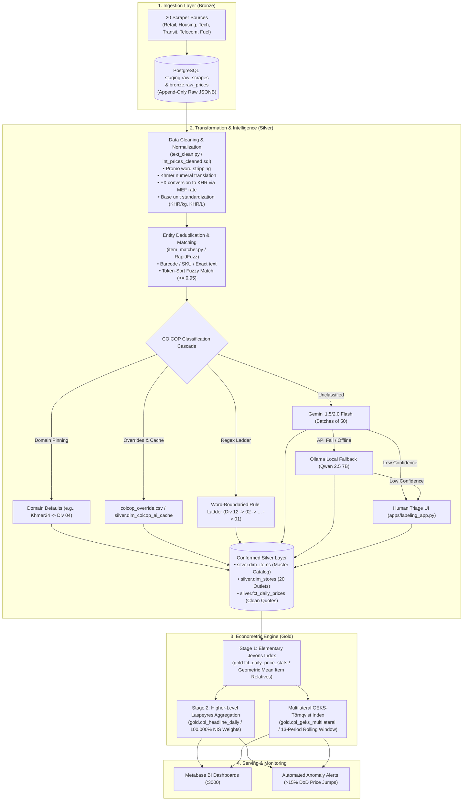
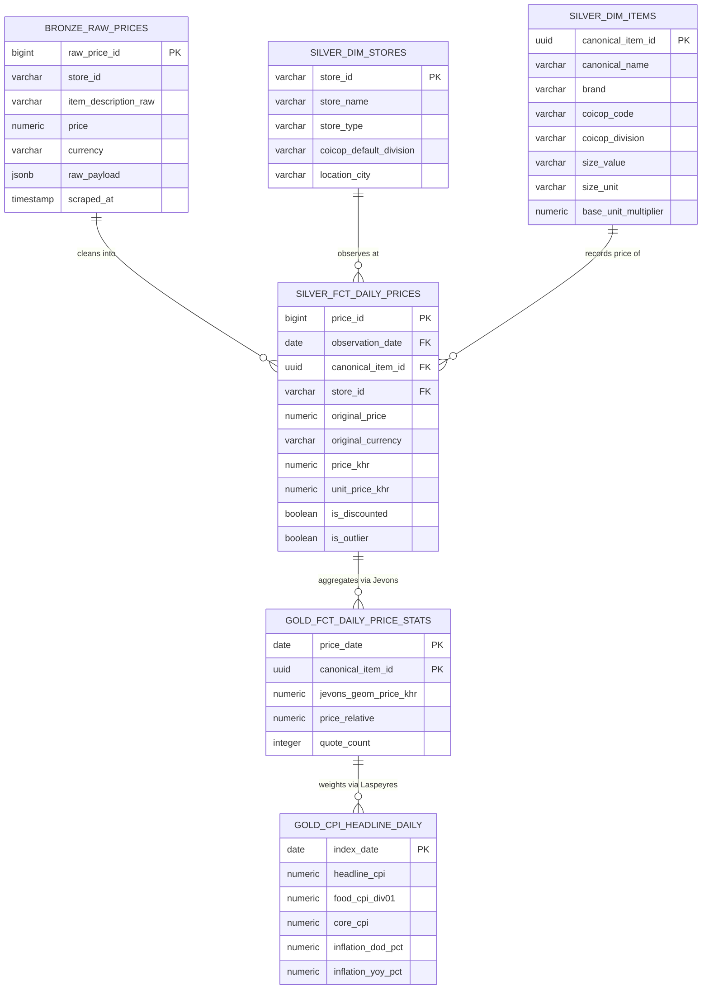

# Week 3 Progress Report
# Automated Price Collection for CPI and Inflation Estimation

**Project:** Cambodia National Consumer Price Index (CPI) Pipeline  
**Period:** Week 3 Progress Report  
**Domain:** Automated Web Scraping, Medallion Architecture, COICOP Machine Learning Classification, and Econometric Inflation Indexing  

---

## Table of Contents
1. [Executive Summary](#1-executive-summary)
2. [Updated End-to-End Architecture](#2-updated-end-to-end-architecture)
3. [Source Expansion: 12 COICOP Divisions Coverage](#3-source-expansion-12-coicop-divisions-coverage)
4. [Medallion Database Design (Star Schema)](#4-medallion-database-design-star-schema)
5. [Current Work: Multi-Tier Product Classification Engine](#5-current-work-multi-tier-product-classification-engine)
6. [Challenges Encountered & Technical Solutions](#6-challenges-encountered--technical-solutions)
7. [Next Milestones](#7-next-milestones)
8. [Literature Review & Academic References](#8-literature-review--academic-references)

---

## 1. Executive Summary

During Week 3, the project transitioned from initial single-source scraping experiments to a production-grade, end-to-end automated pipeline architecture. Key milestones achieved include:

- **Architectural Modernization:** Adopted a strict **Medallion Architecture** (Bronze raw JSON staging $\to$ Silver normalized conformed star schema $\to$ Gold econometric aggregation engine).
- **Comprehensive Coverage:** Expanded web scrapers across **20 live Cambodian sources**, fully covering all **12 United Nations COICOP Divisions** (Classification of Individual Consumption According to Purpose).
- **Hybrid Classification Cascade:** Designed a 7-tier classification engine combining domain-level source pinning, word-boundaried regex rules, PostgreSQL AI memoization, Cloud LLMs (Google Gemini), local offline LLMs (**Ollama / Qwen 2.5** fallback), and human-in-the-loop triage.
- **Econometric Formulation:** Prepared the mathematical formulas for elementary geometric mean aggregation (**Jevons Index**) and upper-level category rollups (**Laspeyres Index** with 100.000% National Institute of Statistics weights).

---

## 2. Updated End-to-End Architecture



---

## 3. Source Expansion: 12 COICOP Divisions Coverage

The pipeline collects data across 20 distinct market channels to reflect the consumption basket of Cambodian households:

| COICOP Division | Division Title | Primary Sources / Retailers | Representative Items Tracked |
| :--- | :--- | :--- | :--- |
| **01** | Food & Non-Alcoholic Beverages | AEON 1, AEON 3, DeliShop Cambodia, L192 | Jasmine rice, pork belly, chicken breast, fresh fish, vegetables, cooking oil, bottled water |
| **02** | Alcoholic Beverages & Tobacco | AEON 1, DeliShop Cambodia | Angkor beer, Cambodia beer, spirits, red/white wine, cigarettes |
| **03** | Clothing & Footwear | AEON 3 Mean Chey, L192 Marketplace | Men's t-shirts/jeans, women's dresses/skirts, children's clothes, sandals, running shoes |
| **04** | Housing, Water, Electricity, Gas | Khmer24 Real Estate, Realestate.com.kh | Monthly apartment rentals (BKK1, Toul Kork), condominium leases, residential LPG gas |
| **05** | Furnishings & Household Maintenance | AEON 1, AEON 3, L192 Marketplace | Laundry detergent, dish soap, cookware, dining tables, small appliances (rice cookers, fans) |
| **06** | Health | Community Pharmacy | Paracetamol, amoxicillin, cough syrup, multivitamins, digital thermometers, surgical masks |
| **07** | Transport | redBus Cambodia, BookMeBus, MOC Gasoline | Intercity bus/van fares (Phnom Penh–Siem Reap), retail Gasoline 95, Regular, Diesel |
| **08** | Communication | Cellcard, Smart Axiata, Khmer Samnang, Ary Store | Monthly 4G/5G data plans, Home Fiber WiFi subscriptions, smartphones (Samsung Galaxy, iPhone) |
| **09** | Recreation & Culture | AEON 1, Ary Store, L192 Marketplace | Cat/dog food, audio headphones, television screens, children's toys, school exercise books |
| **10** | Education | AEON 1, L192 Marketplace | Textbooks, stationery sets, drawing materials, notebooks |
| **11** | Restaurants & Hotels | Sokha Phnom Penh Hotel, Hyatt Regency, Bayon Restaurant | Restaurant meals (Bai Cha, beef lok lak, noodle soup), hotel nightly room tariffs |
| **12** | Miscellaneous Goods & Services | AEON 1, Community Pharmacy, DeliShop, MEF FX | Shampoo, body wash, dental toothpaste, skincare, baby diapers, official MEF USD/KHR rate |

---

## 4. Medallion Database Design (Star Schema)

The database schema is structured into three discrete layers inside PostgreSQL:



### Table Definitions:

1. **Bronze Layer (`bronze.raw_prices`)**:
   - Raw, immutable append-only storage capturing original HTML strings, raw prices, currency symbols, and unstructured metadata.
2. **Silver Layer (Conformed Star Schema)**:
   - `silver.dim_items`: Canonical product master catalog with standardized names, brands, package sizes, and COICOP classifications.
   - `silver.dim_stores`: Dimension metadata for all 20 outlets including channel type and default division defaults.
   - `silver.fct_daily_prices`: Clean daily price quotes converted to KHR via daily MEF official exchange rates, unit prices (KHR/kg or KHR/L), and discount normalization.
   - `silver.dim_coicop_ai_cache`: Permanent memoization table storing AI classifications to eliminate duplicate API cost.
   - `silver.classification_queue`: Triage queue for unclassified products or items with confidence scores $< 0.50$.
3. **Gold Layer (Econometric Indices)**:
   - `gold.fct_daily_price_stats`: Elementary item-level Jevons geometric mean prices across stores.
   - `gold.cpi_category_daily`: Daily index for each of the 12 COICOP divisions.
   - `gold.cpi_headline_daily`: National headline CPI aggregated across all 12 divisions using Cambodia National Institute of Statistics (NIS) 2004 expenditure weights summing to $100.000\%$.
   - `gold.cpi_geks_multilateral`: Rolling 13-period GEKS-Törnqvist transitive multilateral index preventing chain drift in churn-heavy e-commerce categories.

---

## 5. Current Work: Multi-Tier Product Classification Engine

To assign thousands of daily scraped SKUs into the correct COICOP category, a 7-tier classification hierarchy is deployed:

```
Tier 1: Domain-Specific Source Assignment (e.g., Khmer24 -> 04, RedBus -> 07, MOC -> 07)
  └── Tier 2: Manual Overrides & Ground Truth (dbt/seeds/coicop_override.csv) [Conf = 1.0]
        └── Tier 3: PostgreSQL AI Cache Memoization (silver.dim_coicop_ai_cache) [Conf = 0.95]
              └── Tier 4: Word-Boundaried Regex Keyword Ladder (Div 12 -> 02 -> ... -> 01) [Conf = 0.90]
                    └── Tier 5: Cloud LLM Classifier (Gemini 1.5/2.0 Flash in Batches of 50)
                          └── Tier 6: Local Offline LLM Fallback (Ollama Qwen 2.5 7B)
                                └── Tier 7: Human Review Queue (Streamlit Labeling App)
```

### Keyword Ladder Precedence:
The rule engine evaluates divisions in a protective order so that ingredients or materials do not steal non-food goods:
1. **Division 12 (Personal Care & Cosmetics):** Checked first (shampoo containing "coconut oil" or "honey" is correctly classified as Division 12, not Division 01 Food).
2. **Division 02 (Alcohol & Tobacco):** Captures beers, spirits, and cigarettes.
3. **Division 05 (Furnishings & Household Maintenance):** Captures cleaning agents and appliances.
4. **Divisions 03, 06, 07, 08, 09, 10, 11, 04.**
5. **Division 01 (Food & Beverages):** Default destination for remaining groceries and fresh commodities.

---

## 6. Challenges Encountered & Technical Solutions

### Challenge 1: Long, Noisy E-commerce Titles Causing Misclassification
- **Problem:** E-commerce vendors include extensive marketing spam in titles (e.g., `"[HOT DEAL 50% OFF] Men Cotton T-Shirt Breathable Quick-Dry Free Gift 2026"`). This confuses keyword engines and pollutes LLM context.
- **Implemented Solution:**
  1. **Pre-Processing Title Distillation (`pipeline/text_clean.py`):** Strips marketing buzzwords (`HOT DEAL`, `PROMOTION`, `SALE`, `BEST SELLER`, `DISCOUNT`, `CLEARANCE`).
  2. **Khmer Numeral Normalization:** Converts Khmer digits (`០–៩`) to Arabic digits (`0–9`).
  3. **Head/Tail Truncation:** For titles exceeding 15 words, the pipeline isolates the first 8 tokens (brand and core noun) and the last 3 tokens (variant attributes) before passing them to the classifier.

### Challenge 2: Gemini API Rate Limits (429) & Token Exhaustion
- **Problem:** Scraped catalogs contain tens of thousands of items daily. Calling Gemini sequentially for each product causes HTTP 429 rate limit errors and exhausts token quotas.
- **Implemented Solution:**
  1. **Permanent PostgreSQL Caching (`silver.dim_coicop_ai_cache`):** Items are cached by normalized string. In practice, $>90\%$ of products scraped daily are re-scrapes of existing SKUs, requiring zero API calls.
  2. **Micro-Batching (50 Items / Call):** Grouping 50 unclassified products into a single structured JSON prompt reduces network round-trips by $98\%$.
  3. **Context-Pruned Prompting:** Prompts only supply relevant division subsets based on the store domain rather than the entire 138-code COICOP dictionary.

### Challenge 3: Pipeline Failure During Cloud API Outages $\to$ Local LLM Fallback (Ollama)
- **Problem:** If external API quotas run out or Internet connectivity drops, the automated classification DAG halts.
- **Implemented Solution:**
  - Implemented an automated fallback to **Ollama** running locally.
  - **Selected Model:** **Qwen 2.5 (7B-Instruct)**, chosen for its strong multilingual performance (Khmer + English) and native JSON generation capabilities.
  - If Gemini returns status 429 or network timeout, the batch is seamlessly rerouted to the local Ollama REST endpoint (`http://localhost:11434/api/generate`).

---

## 7. Next Milestones

1. **Item-to-Basket Validation Audit:**
   - Run classification confidence audits across all 20 sources to verify that no misclassified products contaminate the core CPI basket.
2. **Implementation of 2-Stage Econometric Index Calculation:**
   - **Stage 1 (Elementary Jevons):** Compute unweighted geometric mean item prices across store outlets:
     $$\bar{P}_{i, t} = \exp\left( \frac{1}{K} \sum_{k=1}^K \ln P_{i, k, t} \right)$$
   - **Stage 2 (Higher-Level Laspeyres):** Aggregate division indices using official Cambodia NIS 2004 expenditure weights:
     $$\text{CPI}_t = \sum_{d=1}^{12} w_d \times \left( \frac{1}{N_d} \sum_{i \in d} \frac{\bar{P}_{i, t}}{\bar{P}_{i, 0}} \times 100 \right)$$
3. **Multilateral GEKS-Törnqvist Index Pipeline:**
   - Implement rolling 13-month window GEKS aggregation to handle e-commerce product churn without chain drift.
4. **Literature Review Chapter Completion:**
   - Complete Chapter 2 of the thesis referencing international web scraping and machine learning standards in official statistics.

---

## 8. Literature Review & Academic References

The methodology adopted in this project directly implements the principles established in the following foundational literature:

1. **Cavallo, A., & Rigobon, R. (2016)**  
   *The Billion Prices Project: Using Online Prices for Measurement and Research.*  
   **Journal of Economic Perspectives**, 30(2), 151–178.  
   *Key Application:* Validates that high-frequency web-scraped prices accurately anticipate official consumer inflation without collection lag.

2. **IMF, ILO, OECD, Eurostat, UN (2020)**  
   *Consumer Price Index Manual: Concepts and Methods.* International Monetary Fund, Washington, D.C.  
   *Key Application:* Governs our choice of the unweighted Jevons formula for elementary items and weighted Laspeyres for higher-level rollups.

3. **Eurostat (2022)**  
   *Practical Guide on the Use of Web Scraping for the Calculation of the Harmonised Index of Consumer Prices (HICP).*  
   *Key Application:* Informs our multi-store scraping hygiene, unit price standardization, discount clamping, and product replacement rules.

4. **Polidoro, F., Giannini, R., Lo Conte, R., & Rossetti, S. (2015)**  
   *Web scraping techniques to collect data on consumer prices and machine learning for product classification.*  
   **Statistical Journal of the IAOS**, 31(3), 447–461.  
   *Key Application:* Establishes the methodology of using automated NLP and machine learning classifiers to map web titles to official COICOP hierarchies.

5. **Diewert, W. E., & Fox, K. J. (2020)**  
   *Substitution Bias and Scanner Data: Measuring Price Change with Scanner Data.*  
   **Journal of Econometrics**, 217(2), 268–284.  
   *Key Application:* Guides the deployment of the multilateral GEKS-Törnqvist index for e-commerce categories with high SKU churn.

---
